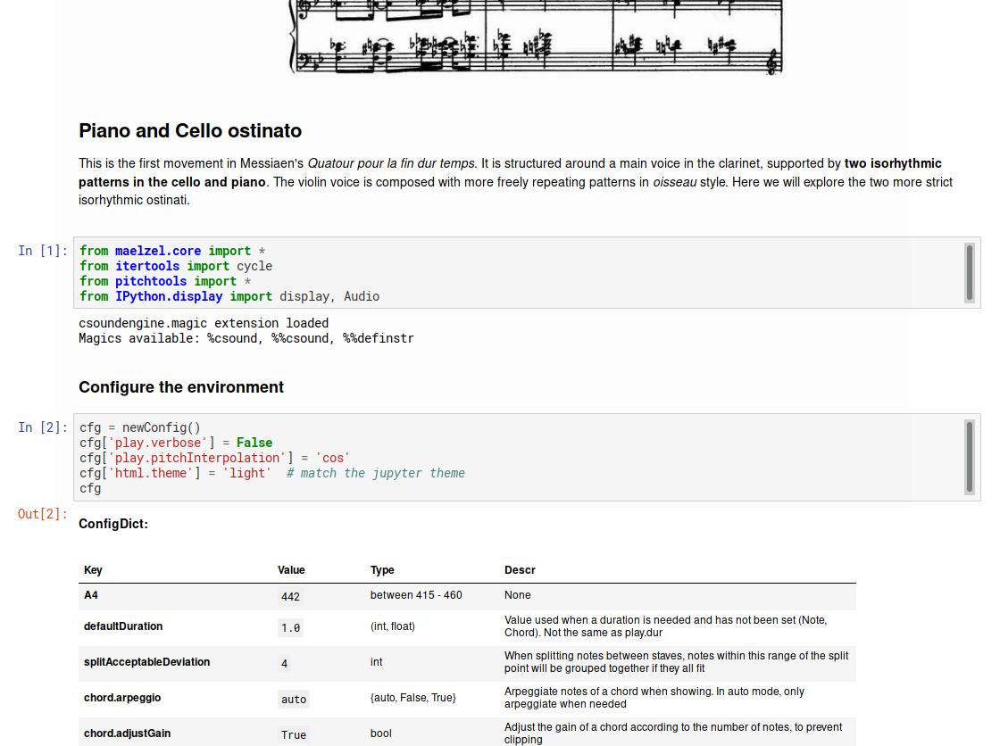
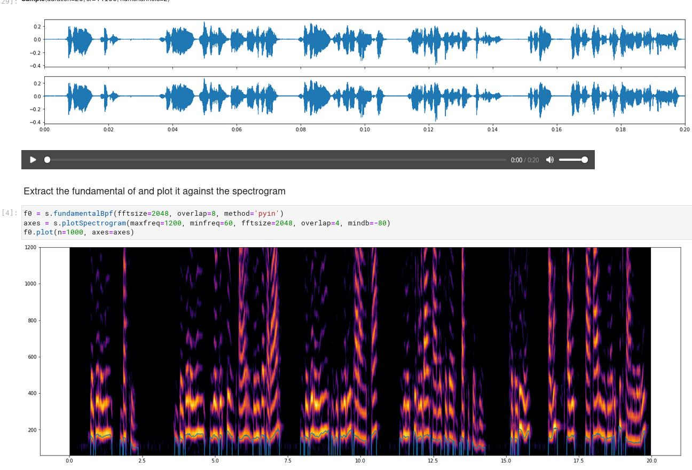

maelzel
=======

**maelzel** is a framework for doing computer music in python. It is
 based on a **core** package, which provides datatypes to define notes,
 chords, sequences, lines, voices, scores, etc. Other modules provide
 functionality for working with sound (loading soundfiles, working
 with samples, applying filters, fading, mixing, playback), 
 sound analysis, music, acoustics, music notation, etc.

Structure
---------
 

- **core**: core module defining basic classes for computer music
  (Note, Chord, Voice, Score, etc). Any of these objects can be
  representated as notation and played back. 
- **snd**: read/write soundfiles, process samples, apply filters,
  fades, etc.
- **music**: music representation, algorithmic music, etc
- **scoring**: music representation. Offers support for microtones (up
  to 1/8 tones or any cent deviation), very refined cotrol of
  automatic quantization, glissandi, grace-notes, annotations,
  etc. Supports multiple backends (lilypond and musicxml at the
  moment).
- **acoustics**: formulas for helmholtz resonators, speed of sound, etc.
- **midi**: read/write midi files, general midi
- **ext**: wrappers around external software, like sonic-visualizer,
  audacity, reaper

Installation
------------

::

    pip install maelzel

Dependencies
~~~~~~~~~~~~

- csound (>= 6.16)

Optional Dependencies
~~~~~~~~~~~~~~~~~~~~~

* MuseScore (for rendering musicxml to pdf when using the musicxml backend)

-------------

Examples
--------

Messiaen - Quatour pour la fin du temps - La liturgie de Cristal
~~~~~~~~~~~~~~~~~~~~~~~~~~~~~~~~~~~~~~~~~~~~~~~~~~~~~~~~~~~~~~~~

`Notebook: Analysis and reconstruction of the piano and cello isorhythmic structures <https://nbviewer.jupyter.org/github/gesellkammer/maelzel/blob/master/examples/Messiaen-La%20Liturgie%20de%20Cristal.ipynb>`_

Audiosample
~~~~~~~~~~~

Example of the `audiosample` module

`Notebook: spectrogram and fundamental analysis / resynthesis using the pyin method <https://nbviewer.org/github/gesellkammer/maelzel/blob/master/examples/audiosample.ipynb?flush_cache=true>`_
