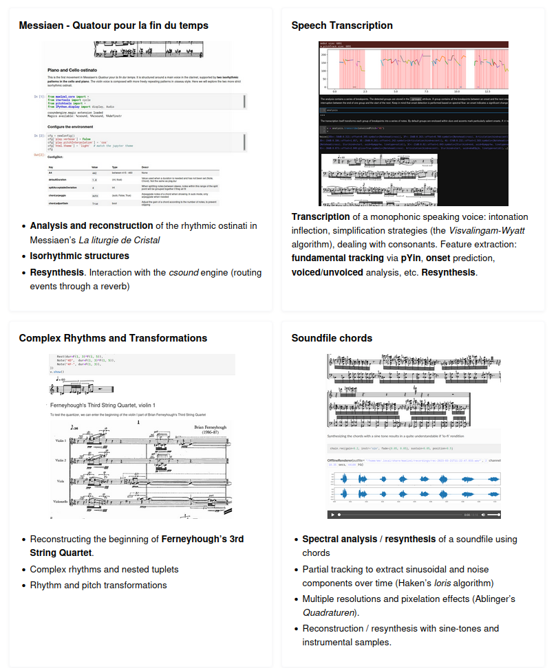

-----------------

|sh-pypi| |sh-license| |sh-docs| |sh-month|

.. |sh-pypi| image:: https://img.shields.io/pypi/v/maelzel?color=green
.. |sh-license| image:: https://img.shields.io/badge/license-lgpl__2__1-blue
.. |sh-docs| image:: https://readthedocs.org/projects/maelzel/badge/?version=latest
    :target: http://maelzel.readthedocs.io/?badge=latest

.. |sh-month| image:: https://static.pepy.tech/badge/maelzel/month

maelzel
=======

**maelzel** is a framework for computer music in python. It provides
datatypes to define notes, chords, sequences, lines, voices and entire scores.
These objects can be combined with soundfiles and samples, rendered as notation
and recorded or synthesized in realtime.

It provides functionality for composition, music notation, sound analysis
and synthesis, feature extraction, transcription and machine learning

Documentation
-------------

https://maelzel.readthedocs.io/en/latest/index.html

--------------

Installation
------------

::

    pip install maelzel

Dependencies
~~~~~~~~~~~~

- python >= 3.9
- csound (>= 6.18)

In macos/arm64 lilypond needs to be installed. The recommended way is to first install ``homebrew``, then install
lilypond via ``brew install lilypond``

-------------

Demos
-----

https://maelzel.readthedocs.io/en/latest/Introduction.html#demo-notebooks

Or check the example notebooks:

https://github.com/gesellkammer/maelzel/tree/master/docs/notebooks
