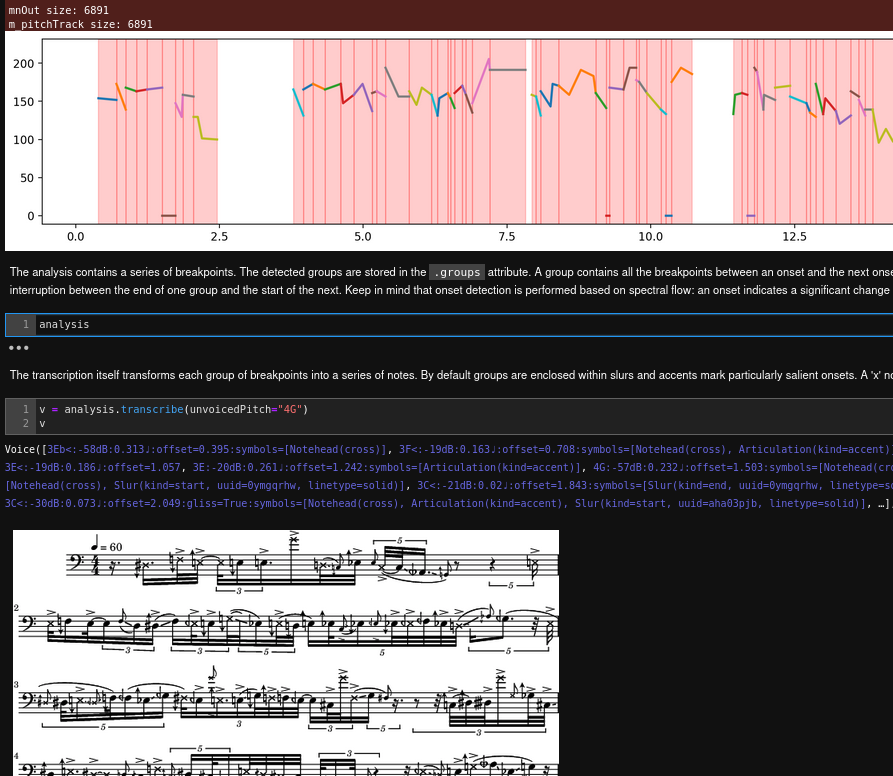
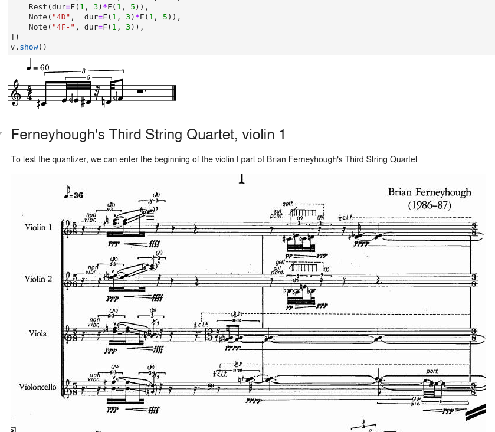
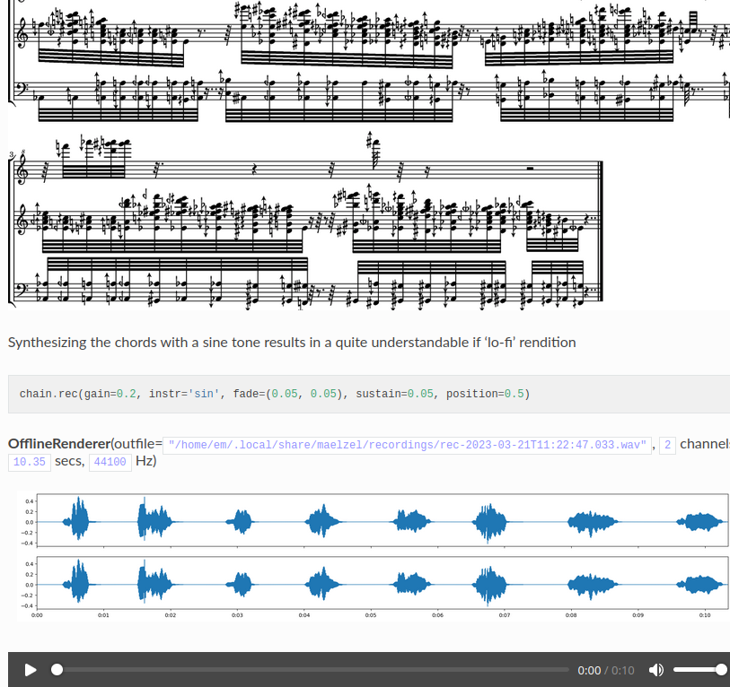

Introduction
============

**maelzel** provides a framework to work with both *symbolic* (music) and *concrete*
(audio) sound. Here are some short demonstrations of some of its features

1. `Messiaen - Quatour pur la fin du temps <messiaen-la-liturgie>`
2. `Speech Transcription <demo-transcribe>`
3. `Complex Rhythms (Ferneyhough's 3rd String Quartet) <demo-complex-rhythms>`
4. `Soundfile chords <clip-chords>`

Demos
-----

1. Messiaen - Quatour pur la fin du temps
~~~~~~~~~~~~~~~~~~~~~~~~~~~~~~~~~~~~~~~~~

.. image:: assets/messiaen-notebook.jpg
  :width: 400px
  :target: messiaen-la-liturgie.html

Analysis and reconstruction of the rhythmic ostinati in Messiaen's "La liturgie de Cristal"

-----------------------------------------------------------------------------------------------------------

2. Speech Transcription
~~~~~~~~~~~~~~~~~~~~~~~

Transcription of a monophonic speaking voice combining fundamental tracking (using
the pYin algorithm), onset/offset detection and other extracted features.

-----------------------------------------------------------------------------------------------------------

3. Complex Rhythms - Ferneyhough's 3rd String Quartet
~~~~~~~~~~~~~~~~~~~~~~~~~~~~~~~~~~~~~~~~~~~~~~~~~~~~~

Complex rhythms and rhythmic transformations

4. Soundfile chords
~~~~~~~~~~~~~~~~~~~

Spectral analysis / resynthesis of a soundfile using chords