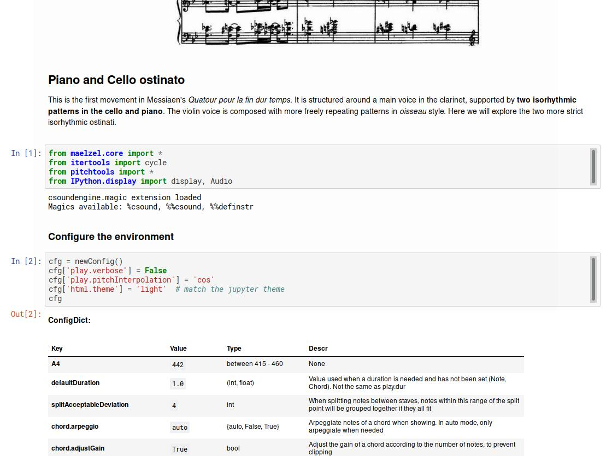
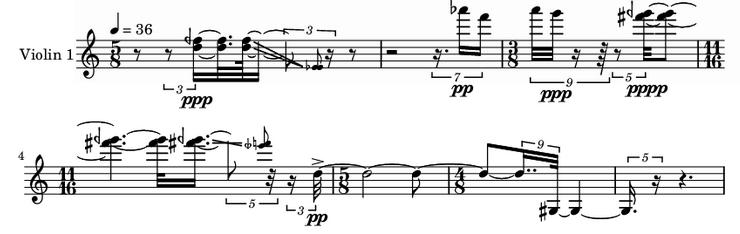

Introduction 
============

Introduction text

Examples
--------

Messiaen - Quatour pour la fin du temps - La liturgie de Cristal
~~~~~~~~~~~~~~~~~~~~~~~~~~~~~~~~~~~~~~~~~~~~~~~~~~~~~~~~~~~~~~~~

This example contains an analysis and reconstruction of the rhythmic ostinati in Messiaen's "La liturgie de Cristal"

`Notebook: Analysis and reconstruction of the piano and cello isorhythmic structures <https://nbviewer.jupyter.org/github/gesellkammer/maelzel/blob/master/examples/Messiaen-La%20Liturgie%20de%20Cristal.ipynb>`_

----

Audiosample - Fundamental analysis and resynthesis
~~~~~~~~~~~~~~~~~~~~~~~~~~~~~~~~~~~~~~~~~~~~~~~~~~

Example of the `audiosample` module. It analyzes an audio file to
extract its fundamental, later plays the soundfile and the synthesized
fundamental simultaneously to validate the analysis

.. image:: assets/audiosample-notebook.jpg
  :target: https://nbviewer.org/github/gesellkammer/maelzel/blob/master/examples/audiosample.ipynb
  :alt: Screenshot of audiosample notebook

`Notebook: spectrogram and fundamental analysis / resynthesis using the pyin method <https://nbviewer.org/github/gesellkammer/maelzel/blob/master/examples/audiosample.ipynb?flush_cache=true>`_

----------------------

maelzel.core
------------

**maelzel.core** provides a set of classes to define notes, chords,
lines, sequences, voices and entire scores. These classes all derive
from a base class MusicObj. Any of these objects can be synthesized
and displayed as notation. When converting to notation a score is
quantized following a score structure. Since Notes and Chords define
pitch as an absolute value (a fractional midinote), independent of the
enharmonic variant, an optimization pass takes place prior to rendering,
where a suitable enharmonic spelling is determined for each note/chord.

Ferneyhough's Third String Quartet, violin 1
~~~~~~~~~~~~~~~~~~~~~~~~~~~~~~~~~~~~~~~~~~~~

.. image:: assets/ferney1-orig.jpg

.. code-block:: python

    from maelzel.core import *
    from fractions import Fraction as F
    struct = ScoreStruct.fromString(r'''
        5/8, 36
        .
        3/8
        11/16
        5/8
        4/8
        .
    ''')
    struct.title = "Third String Quartet"
    setScoreStruct(struct)

    v1 = [
        Rest(0.25*1.5 + 0.25*F(3, 5)),
        Chord("5G 5E+", dur=0.25*1.5*F(3, 5), tied=True, dynamic='ppp'),
        Chord("5G 5E+", dur=0.25+0.25*F(2, 3), gliss="6Gb 6F"),
        Note("4C#", start=struct.locationToBeat(1, 0.5), dur=1/8*F(2,3), dynamic='pp',
             label='sul pont'),
        Note("4E", dur=1/8*F(2,3)),
        Note("4C", dur=1/8*F(2,3)),
        Note("4D", dur=1/8*F(2,3), dynamic='ppp'),
        Chord("4Eb 4D+", start=struct.locationToBeat(1, 1.25), dur=1+0.25+0.25*F(2,3), tied=True,
              dynamic='pppp'),
        Chord("4Eb 4D+", dur=0.5*F(2,3)+0.25*F(2, 3), gliss="4G- 4E"),
        Note("5G", start=struct.locationToBeat(2, 0.5+0.5*F(2,3)), 
             dur=F(2,3)*0.25+0.5+1.5+1/16*F(2, 3),
             dynamic='pp'        
             ).setSymbol('articulation', 'accent'),
        Note("7C#", 1/8*F(2,3)+0.25*1.5+0.25*1.75)   
    ]

    V1 = Voice(v1, 'Violin 1')
    V1

.. image:: assets/ferney1.jpg

Any `MusicObj` can be subjected to multiple operations. For example::

    V1.timeScale(4/3)

Or::

    V1.invertPitch("5F-").timeScale(11/7)

