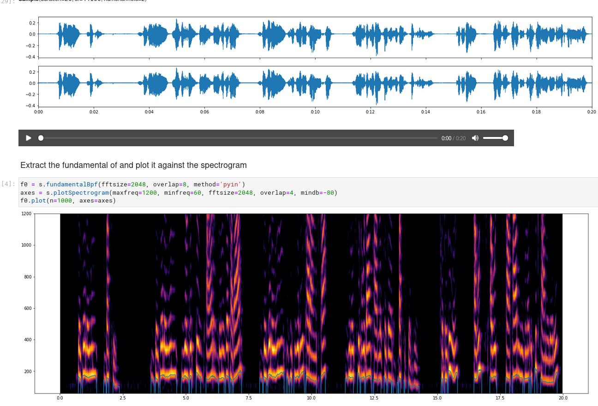

Introduction 
============

Introduction text

Example Notebooks
-----------------

Messiaen - Quatour pour la fin du temps - La liturgie de Cristal
~~~~~~~~~~~~~~~~~~~~~~~~~~~~~~~~~~~~~~~~~~~~~~~~~~~~~~~~~~~~~~~~

This notebook contains an analysis and reconstruction of the rhythmic ostinati in Messiaen's "La liturgie de Cristal"

.. image:: assets/messiaen-notebook.jpg
  :target: https://nbviewer.jupyter.org/github/gesellkammer/maelzel/blob/master/examples/Messiaen-La%20Liturgie%20de%20Cristal.ipynb
  :alt: Screenshot of jupyter notebook

`Notebook: Analysis and reconstruction of the piano and cello isorhythmic structures <https://nbviewer.jupyter.org/github/gesellkammer/maelzel/blob/master/examples/Messiaen-La%20Liturgie%20de%20Cristal.ipynb>`_

----

Audiosample - Fundamental analysis and resynthesis
~~~~~~~~~~~~~~~~~~~~~~~~~~~~~~~~~~~~~~~~~~~~~~~~~~

Example of the `audiosample` module. It analyzes an audio file to
extract its fundamental, later plays the soundfile and the synthesized
fundamental simultaneously to validate the analysis

`Notebook: spectrogram and fundamental analysis / resynthesis using the pyin method <https://nbviewer.org/github/gesellkammer/maelzel/blob/master/examples/audiosample.ipynb?flush_cache=true>`_

----------------------

maelzel.core
------------

**maelzel.core** provides a set of classes to define notes, chords,
lines, sequences, voices and entire scores. Any of these objects can
be played in real time, recorded and displayed as notation. When
converting to notation a score is quantized following a score
structure.

**maelzel.core**'s main purpose is to represent musical ideas, reason
about aspects of pitch, rhythms, etc., and be of help while composing,
analyzing or preparing a performance. Even if it is possible to
construct a score, notation is in this context a tool to visualize
results and it is not a goal to be able to produce final
scores.

Here are examples that showcase some of the features of **maelzel.core**

Complex Rhythms: Ferneyhough's Third String Quartet, violin 1
~~~~~~~~~~~~~~~~~~~~~~~~~~~~~~~~~~~~~~~~~~~~~~~~~~~~~~~~~~~~~

Within **maelzel.core** notes/chords have a duration in
quarternotes. There is no concept of tuplet or any idea of
encapsulation of a note within a group of notes. The notational aspect
of rhythm (how a note is represented as notation) is determined by a
quantization step and is outside the control of the user.

Nevertheless, it is possible to input rather complex music, and the
quantizer will try to render an accurate rhythmic transcription of
it. In the case of this fragment by Ferneyhough, the transcription can
help understand more precisely how to play a certain passage while, on
the other hand, there are certainly some aspects of it which are lost
(regarding mostly the phrasing but also traces of the compositional
processes involved).

.. image:: assets/ferney1-orig.jpg
           
.. code-block:: python

    from maelzel.core import *
    from fractions import Fraction as F
    struct = ScoreStruct.fromString(r'''
        5/8, 36
        .
        3/8
        11/16
        5/8
        4/8
        .
    ''')
    struct.title = "Third String Quartet"
    setScoreStruct(struct)

    v1 = [
        Rest(0.25*1.5 + 0.25*F(3, 5)),
        Chord("5G 5E+", dur=0.25*1.5*F(3, 5), tied=True, dynamic='ppp'),
        Chord("5G 5E+", dur=0.25+0.25*F(2, 3), gliss="6Gb 6F"),
        Note("4C#", start=struct.locationToBeat(1, 0.5), dur=1/8*F(2,3), dynamic='pp',
             label='sul pont'),
        Note("4E", dur=1/8*F(2,3)),
        Note("4C", dur=1/8*F(2,3)),
        Note("4D", dur=1/8*F(2,3), dynamic='ppp'),
        Chord("4Eb 4D+", start=struct.locationToBeat(1, 1.25), dur=1+0.25+0.25*F(2,3), tied=True,
              dynamic='pppp'),
        Chord("4Eb 4D+", dur=0.5*F(2,3)+0.25*F(2, 3), gliss="4G- 4E"),
        Note("5G", start=struct.locationToBeat(2, 0.5+0.5*F(2,3)), 
             dur=F(2,3)*0.25+0.5+1.5+1/16*F(2, 3),
             dynamic='pp'        
             ).setSymbol('articulation', 'accent'),
        Note("7C#", 1/8*F(2,3)+0.25*1.5+0.25*1.75)   
    ]

    V1 = Voice(v1, 'Violin 1')
    V1

Any `MusicObj` (a Note, Chord, Voice, etc) can be subjected to multiple operations.
For example::

    V1.timeScale(4/3)

.. image:: assets/ferney1-timescale.jpg

Or::

    V1.invertPitch("5F-").timeScale(11/7)

.. image:: assets/ferney1-invert-timescale.jpg

           
