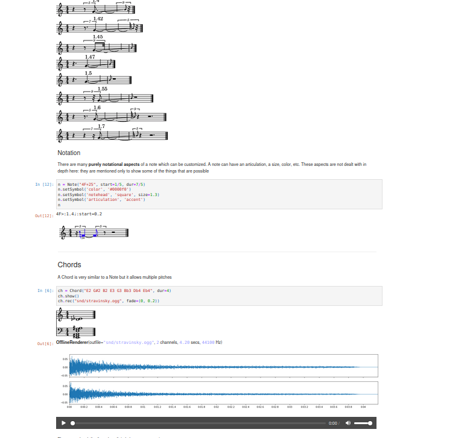
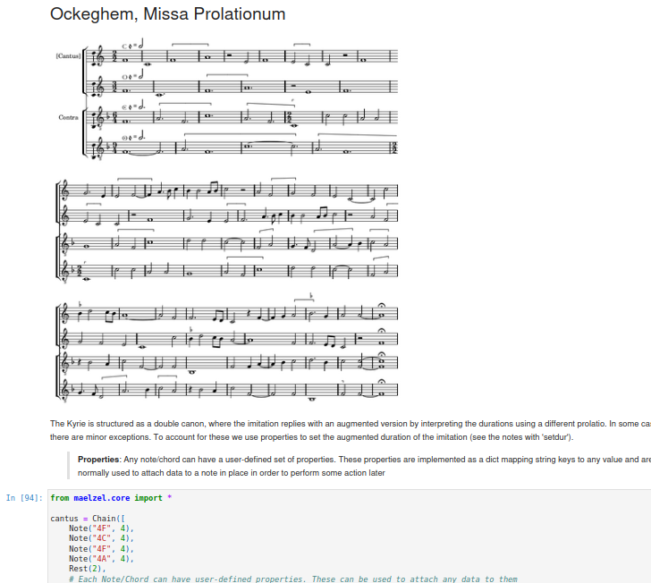
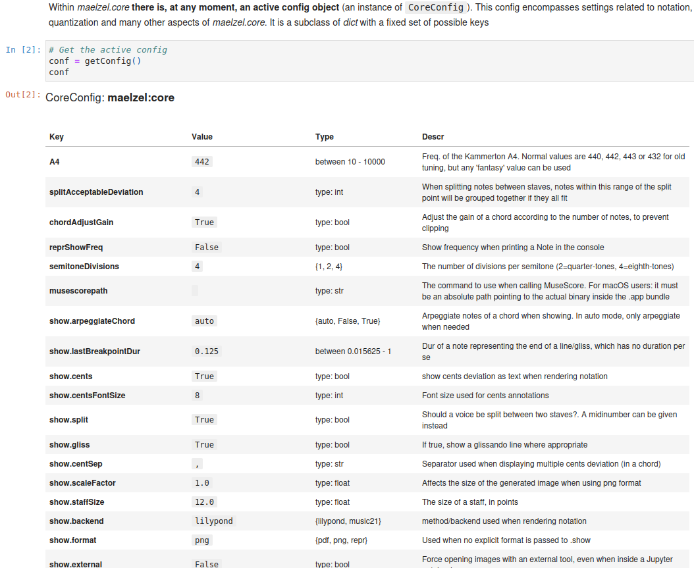
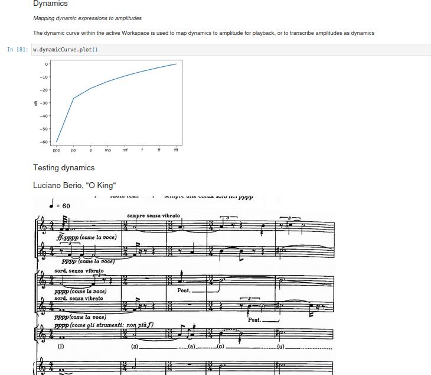
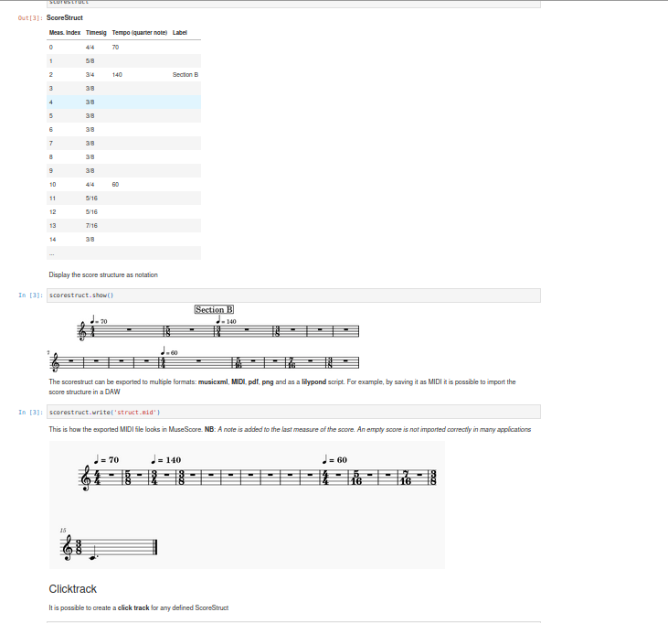
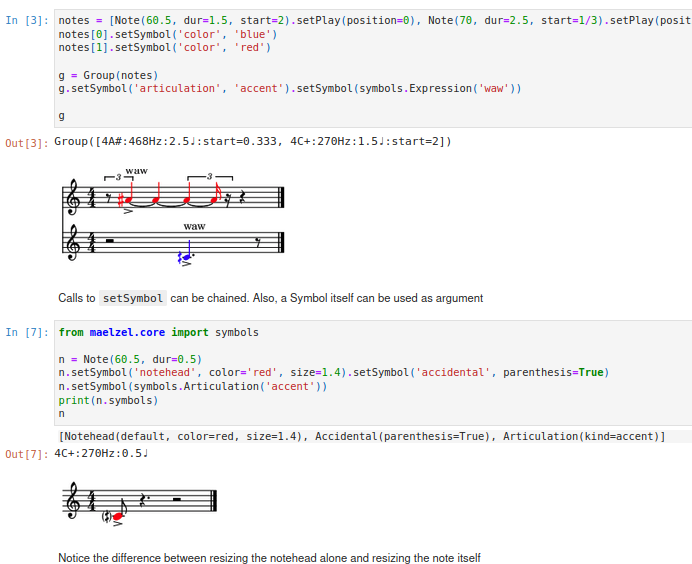

.. _core_jupyter_tutorial:

Tutorial (Jupyter Notebooks)
============================

1. `First Steps <https://nbviewer.org/github/gesellkammer/maelzel/blob/master/notebooks/firststeps.ipynb>`_
-----------------------------------------------------------------------------------------------------------

Introduction to notes, chords, voices, etc. Notation and playback

..  rst-class::  clear-both

2. `Durations: Ockeghem's Missa Prolationum <https://nbviewer.org/github/gesellkammer/maelzel/blob/master/notebooks/ockeghem.ipynb>`_
-------------------------------------------------------------------------------------------------------------------------------------

A recreation of Ockeghem's Missa Prolationum showcasing how durations work

3. `Configuration <https://nbviewer.org/github/gesellkammer/maelzel/blob/master/notebooks/maelzel.core%20-%20Configuration.ipynb>`_
------------------------------------------------------------------------------------------------------------------------------------

Most aspects of how **maelzel** handles notation and playback can be customized by modifying or creating
a configuration object (an instance of :class:`~maelzel.core.config.CoreConfig`)

4. `Workspace <https://nbviewer.org/github/gesellkammer/maelzel/blob/master/notebooks/maelzel.core%20-%20Workspace.ipynb>`_
---------------------------------------------------------------------------------------------------------------------------

A workspace contains the current state: the active config, the active scorestrucutre, a playback engine, etc.
Many actions, like note playback, notation, etc., use the active workspace to determine tempo, score structure,
default playback instrument, etc.

5. `Score Structure <https://nbviewer.org/github/gesellkammer/maelzel/blob/master/notebooks/maelzel.core%20-%20Score%20Structure.ipynb>`_
-----------------------------------------------------------------------------------------------------------------------------------------

In maelzel.core there is a division of concerns between music data (notes, chords, lines, voices, etc) and a
score structure (:class:`~maelzel.scorestruct.ScoreStruct`). The score structure consists of a set of measure
definitions (time signature, tempo).

6. `Notation Refinements <https://nbviewer.org/github/gesellkammer/maelzel/blob/master/notebooks/maelzel.core%20-%20Symbols.ipynb>`_
------------------------------------------------------------------------------------------------------------------------------------

Most aspects of **maelzel.core**'s notation output can be modified. Not only is it possible to add spanners
(slurs, brackets, lines), articulations, dynamics and many other symbols to notes and chords. Also color,
size, text style, etc. can be customized.
