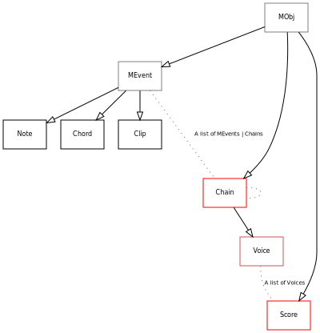

.. _core:

Core - Overview
===============

**maelzel.core** provides a set of classes to define notes, chords,
lines, sequences, voices or entire scores. Any of these objects can
be played in real time, recorded and displayed as notation. When
converting to notation, objects are quantized following a score
structure.

**maelzel.core**'s main purpose is to represent musical ideas, reason
about aspects of pitch, rhythms, etc., and be of help while composing,
analyzing or preparing a performance.

.. admonition:: Notation as display vs engraving

    The objects defined in **maelzel.core** can have many attributes
    within the realm of notation which do not have a well defined
    acoustic translation: articulations, text labels, size. Although
    such symbolic attributes are very important for composing or analyzing
    **maelzel.core** does not seek to provide the level of customization
    needed to produce a finished engraved score.
    **The notation produced is to be understood as a means of visualization**
    of musical and / or acoustic processes.

Key Concepts
------------

MObj
    All classes defined in **maelzel.core** inherit from :class:`~maelzel.core.mobj.MObj` (*Maelzel Object*, or
    *Music Object*). A :class:`~maelzel.core.mobj.MObj` **exists in time** (it has a duration and a
    time offset), it **can be displayed as notation** (:meth:`~maelzel.core.mobj.MObj.show`)
    and **played as audio** (:meth:`~maelzel.core.mobj.MObj.play`)

Explicit / Implicit Time
    A :class:`~maelzel.core.mobj.MObj` always has an explicit duration (the *dur* attribute). The
    *offset* can be undetermined (``None``), meaning that it is **not explicitely set** and depends
    on the context. A :class:`~maelzel.core.event.Note` without an explicit offset
    will be stacked left to the previous event.

Absolute Time / Relative Time
    The time attributes (*offset*, *dur*, *end*) of a :class:`~maelzel.core.mobj.MObj` refer to a
    relative time, measured in quarternotes. To map from *relative* time to *absolute* time
    (measured in *seconds*) a score structure (:class:`~maelzel.scorestruct.ScoreStruct`)
    is needed (:ref:`see below<KeyConceptsScoreStructure>`)

Workspace
    At any moment there is an active :ref:`Workspace <workspace_mod>` (an
    instance of :class:`~maelzel.core.workspace.Workspace`). It contains the current
    configuration (:attr:`~maelzel.core.workspace.Workspace.config`,
    an instance of :class:`~maelzel.core.config.CoreConfig`, see below
    :ref:`Configuration <KeyConceptsConfiguration>`) and the default score structure
    (:attr:`~maelzel.core.workspace.Workspace.scorestruct`, a
    :class:`~maelzel.scorestruct.ScoreStruct`, see below :ref:`Score Structure <KeyConceptsScoreStructure>`)

.. _KeyConceptsConfiguration:

Configuration
    The active configuration (an instance of :class:`~maelzel.core.config.CoreConfig`,
    see :ref:`config`) controls multiple aspects of **maelzel.core** and enables the user to
    customize the rendering process, quantization, playback, etc. The active config can be
    accessed via :func:`~maelzel.core.workspace.getConfig` or

.. _KeyConceptsScoreStructure:

Score Structure
    A Score Structure (:class:`~maelzel.scorestruct.ScoreStruct`) is a timeline built from
    a sequence of measure definitions. Each measure defines a time signature and tempo.
    A ScoreStruct **does not contain any material itself**: it is only
    the "skeleton" of a score. At any moment there is always an **active score structure**
    (:func:`~maelzel.core.workspace.getScoreStruct`, :func:`~maelzel.core.workspace.setScoreStruct`),
    the default being an endless score with a *4/4* time-signature and a tempo of *60 bpm*.

Playback
    For playback **maelzel** uses `csound <https://csound.com/>`_ as an audio engine embedded
    in python (see `csoundengine <https://csoundengine.readthedocs.io>`_).
    When the :meth:`~maelzel.core.MObj.play` method is called, a
    :class:`~maelzel.core.MObj` generates a list of
    :class:`~maelzel.core.synthevent.SynthEvent`, which tell *csound* how
    to play a :class:`Note`, :class:`Chord`, or an entire :class:`Score`. Using csound it is
    possible to define instrumental presets using any kind of synthesis or by simply loading
    a set of samples or a soundfont (see also :py:mod:`the maelzel.core.playback module <maelzel.core.playback>`)

----------------

Class Structure Overview
------------------------

In general, there are two kinds of :class:`~maelzel.core.mobj.MObj`: **events**
(:class:`~maelzel.core.event.Note`, :class:`~maelzel.core.event.Chord`,
:class:`~maelzel.core.clip.Clip`) and **containers** (:class:`~maelzel.core.chain.Chain`,
:class:`~maelzel.core.chain.Voice`, :class:`~maelzel.core.score.Score`).

:ref:`Events: Note, Chord, Clip <mevent>`
    Events are all subclasses of :class:`~maelzel.core.event.MEvent` and represent individual events
    in time: :class:`Notes <maelzel.core.event.Note>`, :class:`Chords <maelzel.core.event.Chord>`,
    media :class:`Clips <maelzel.core.clip.Clip>`.

:ref:`Horizontal Containers: Chain, Voice <chainmod>`
    A :class:`~maelzel.core.chain.Chain` is a sequence of events. Within a chain any number
    of events can be juxtaposed to build more intricate horizontal structures. For example, a
    sequence of notes can be tied or linked together with glissandi to generate a line of
    any desired complexity. A :class:`~maelzel.core.chain.Chain` can also contain other Chains

    A :class:`~maelzel.core.chain.Voice` is a special case of a :class:`Chain` with an offset
    forced to be 0.

:ref:`Vertical Container: Score <scoremod>`
    The last node in the class structure is the :class:`~maelzel.core.score.Score`: this is
    simply a list of :class:`Voices <maelel.core.chain.Voice` with some extra attributes
    which are exclusive to a score (for example a Score can have an attached
    :class:`score structure <maelzel.scorestruct.ScoreStruct`)

----------------

Table of Contents
=================

.. toctree::
    :maxdepth: 1

    MObj: Musical Objects <mobj>
    Events: Note, Chord <mevent>
    Note class <api/maelzel.core.event.Note>
    Chord class <api/maelzel.core.event.Chord>
    Containers: Chain, Voice <chain>
    Score Structure: interfacing symbolic and real time <scorestruct>
    Score <api/maelzel.core.score.Score>
    Clip <clip>
    coreplayintro
    config
    workspace
    Input / Output (import/export to musicxml, lilypond, MiDI, ...) <coreio>
    Pure Notation <symbols>
    Miscellaneous Tools <coretools>

