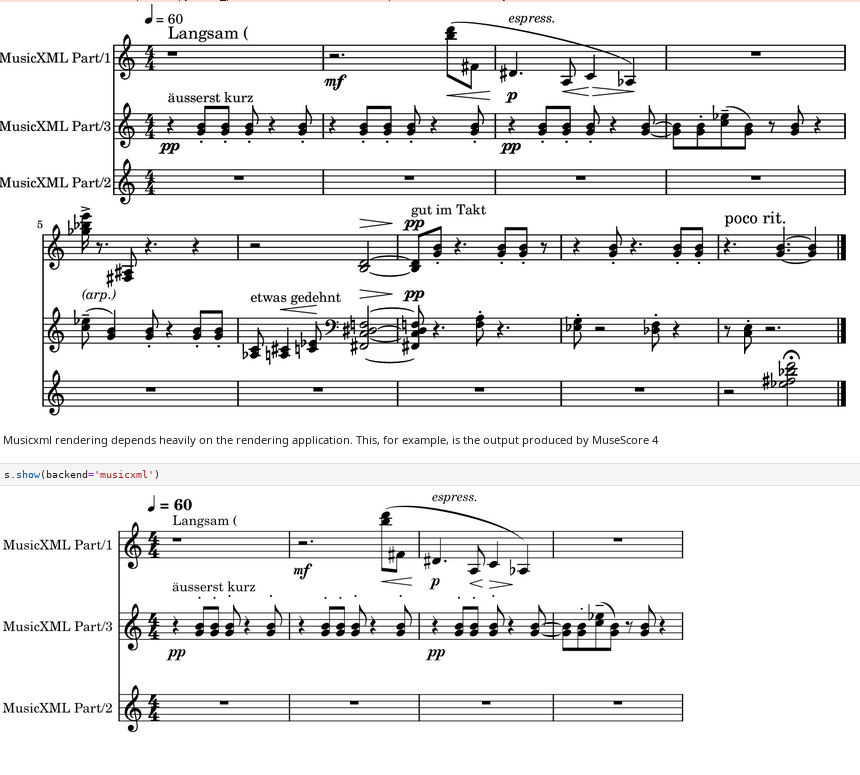

==============
Input / Output
==============

.. toctree::
    :maxdepth: 1
    :hidden:

    musicxmlio <notebooks/musicxmlio>

Musicxml
========

**maelzel.core** can input and output musicxml

Lilypond
========

Lilypond can output lilypond files for further modification or use lilypond to
render scores to pdf / png / svg.

Lilypond input, while not directly supported, can be achieved via
``lilypond -> musicxml -> maelzel``, see https://python-ly.readthedocs.io/en/latest/ly.musicxml.html

MIDI
====

A :class:`~maelzel.core.score.Score` can be written as a MIDI file:

TODO: example with screenshot

MIDI input is also
