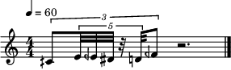
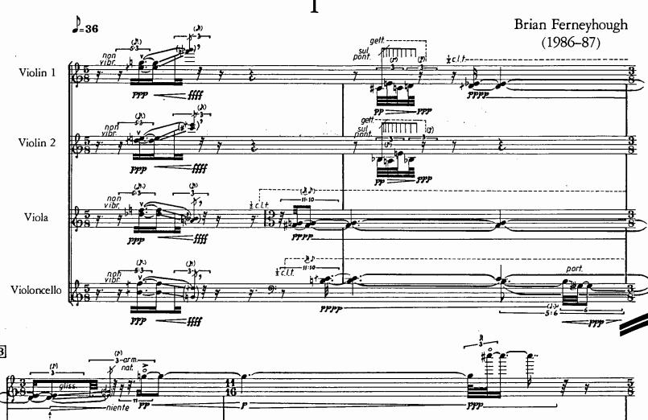
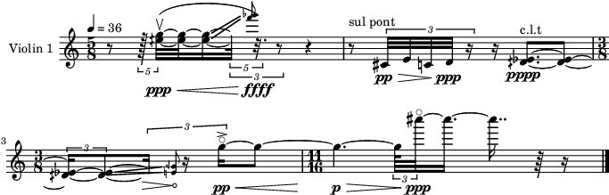
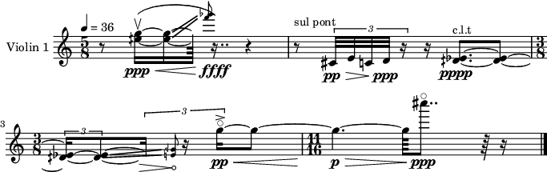
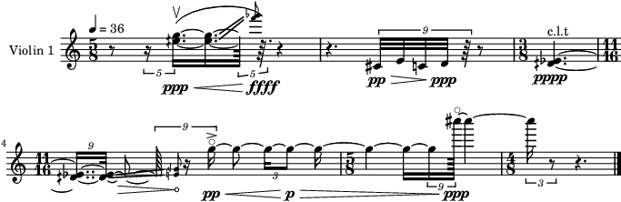
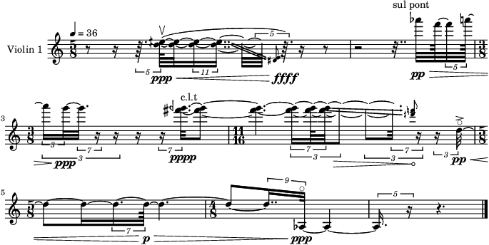
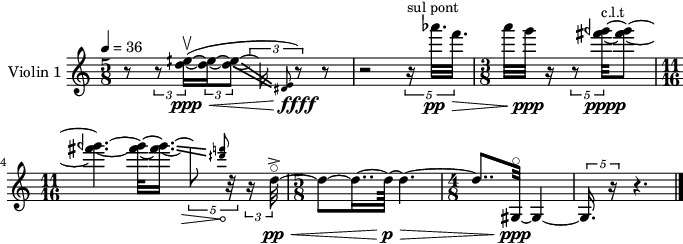

.. _demo-complex-rhythms_notebook:

Complex Rhythms
---------------

Within **maelzel.core** notes/chords have a duration in quarternotes.
There is no concept of tuplet. The notational aspect of rhythm (how a
note is represented as notation) is determined by a **quantization**
step, which, even if highly configurable, is, by design, not directly
controlled by the user

Nevertheless, it is possible to input complex rhythms and the quantizer
will try to render an accurate transcription of it. For example complex
tuplets are quantized as expected:

.. code:: python

    from maelzel.core import *
    config = getConfig()
    config['quant.complexity'] = 'highest'

.. code:: python

    v = Chain([
        Note("4C+!", dur=F(1, 3)),
    
        Note("4E",  dur=F(1, 3)*F(1, 5)),
        Note("4E-", dur=F(1, 3)*F(1, 5)),
        Note("4Eb", dur=F(1, 3)*F(1, 5)),
        Rest(dur=F(1, 3)*F(1, 5)),
        Note("4D",  dur=F(1, 3)*F(1, 5)),
        Note("4F-", dur=F(1, 3)),
    ])
    v.show()

Ferneyhough’s Third String Quartet, violin 1
--------------------------------------------

To test the quantizer, we can enter the beginning of the violin I part
of Brian Ferneyhough’s Third String Quartet

If not explicitely commanded to do so the quantizer is not able to find
irregular tuplets (tuplets where the denominator is not a power of two)
as the best rhythmical representation for most passages. In this case
the ``5:3`` tuplet in measure 1 is represented as a *64th* ``5:4``
tuplet, which is mathematically accurate. The rest of the rhythms are
recognized correctly, even when dealing with unusual time signatures
like *11/6*

.. code:: python

    resetImageCache()
    
    struct = ScoreStruct(
        title="Third String Quartet",
        score=r'''
        5/8, 36
        .
        3/8
        11/16
        5/8
        4/8
        .
    ''')
    
    conf = getConfig()
    conf['quant.debug'] = False
    conf['quant.complexity'] = 'high'
    conf['quant.debugShowNumRows'] = 20
    
    setScoreStruct(struct)
    
    
    v1 = [
        Rest(F(3,8)),
        Rest(F(3,5)/4),
        # The ! sign after the notename anchors the enharmonic representation to the notename given
        Chord("5G 5E+!", dur=F(3,8)*3/5, tied=True, dynamic='ppp').addSymbol('articulation', 'upbow'),  
        Chord("5G 5E+", dur=F(1, 4)*3/5+F(1,4)*2/3, gliss="6F 6Gb"),
        Rest(1, dynamic='ffff'),
        Rest(1/2, label='sul pont', offset=struct.beat(1, 0)),
        Note("4C#:pp", dur=1/8*F(2, 3)),
        Note("4E", dur=F(2,3)/8),
        Note("4C", dur=F(2,3)/8),
        Note("4D", dur=F(2,3)/8, dynamic='ppp'),
        Chord("4Eb 4D+", offset=struct.beat(1, 1.25), dur=1.25+F(2,3)/4, tied=True,
              dynamic='pppp', label='c.l.t'),
        Chord("4Eb 4D+", dur=F(1,3)+F(2,3)/4, gliss=True),
        Chord('4E 4G-', 0),
        # Simple attributes, like duration, dynamic and simple articulations, can be added
        # to the note as shorthand
        Note("5G~:1/6+1/2:pp:accent", offset=struct.beat(2, F(5,6)), 
             ).addSymbol('harmonic', 'sounding'),
        Note("5G", 1.5 + F(1,16)*F(2,3), dynamic='p').addSpanner(">"), 
        Note("7C#", F(2,3)/8+F(3,8)+F(7,16), dynamic='ppp').addSymbol('harmonic', 'sounding')   
    ]
    V1 = Voice(v1, 'Violin 1')
    
    # Symbols and other notational elements can also be added later
    V1[2].addSpanner('<', v1[4]).addSpanner('slur', V1[4])
    V1[6].addSpanner('>', v1[9])
    V1[11].addSpanner(symbols.Hairpin('>', niente=True), v1[12])
    V1[-3].addSpanner('<', V1[-2])
    
    # Within a jupyter notebook any object evaluated as last within a cell
    # will show html including rendered notation
    V1.show()
    

It is possible to quantize the part with a lower rhythmic complexity. In
this case only the first measure is quantized somewhat differently.

.. code:: python

    lowres = CoreConfig()
    lowres['quant.complexity'] = 'low'
    lowres['show.staffSize'] = 13
    with lowres:
        V1.show()

Rhythmic transformations
------------------------

Any ``MObj`` (a Note, Chord, Chain, Voice, etc) can be subjected to
multiple operations. For example, this returns a copy of the original
voice time stretched by a factor of 4/3. Notice that the score structure
is not modified

.. code:: python

    V1.timeScale(F(4,3)).show()

Pitch transformations are also possible.

.. code:: python

    V1.invertPitch("5F-").timeScale(11/7).show()

.. code:: python

    with lowres:
        V1.invertPitch("5F-").timeScale(11/7).show()

