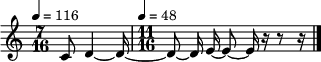

.. _getWorkspace_notebook:

The active wokspace
===================

.. code:: python

    from maelzel.core import *

There is always an active Workspace. When maelzel.core is imported a new
Workspace is created. ``getWorkspace`` returns the active Workspace

.. code:: python

    w = getWorkspace()
    w

.. parsed-literal::

    Workspace(scorestruct=ScoreStruct(tempo=60, timesig=(4, 4)), config={'A4': 443, 'show.horizontalSpacing': 'default', 'play.instr': '_piano', 'play.schedLatency': 0.08}, dynamicCurve=DynamicCurve(shape=expon(0.3), mindb=-60.0, maxdb=0.0))

Alternatively the active workspace can be accessed via the ``active``
class variable, as ``Workspace.active``

.. code:: python

    w is Workspace.active

.. parsed-literal::

    True

The active workspace contains the working environment. The most
important attributes encapsulated here are the score structure
(``.scorestruct``) and the core configuration (``.config``)

Each new ``Workspace`` contains a basic ``ScoreStruct`` (4/4,
quarter=60) and a copy of the root config

.. code:: python

    w.scorestruct

.. raw:: html

    <h5><strong>ScoreStruct<strong></strong></h5><table><thead><tr><th style="text-align:left">Meas. Index</th><th style="text-align:left">Timesig</th><th style="text-align:left">Tempo (quarter note)</th><th style="text-align:left">Label</th><th style="text-align:left">Rehearsal</th><th style="text-align:left">Barline</th></tr></thead><tbody><tr><td style="text-align:left">0</td><td style="text-align:left">4/4</td><td style="text-align:left">60</td><td style="text-align:left"></td><td style="text-align:left"></td><td style="text-align:left"></td></tr><tr><td style="text-align:left">...</td><td style="text-align:left"></td><td style="text-align:left"></td><td style="text-align:left"></td><td style="text-align:left"></td><td style="text-align:left"></td></tr></tbody></table>

.. code:: python

    w.config

.. raw:: html

    
<h4>CoreConfig: <strong>maelzel:core</strong></h4> <table><thead><tr><th style="text-align:left">Key</th><th style="text-align:left">Value</th><th style="text-align:left">Type</th><th style="text-align:left">Descr</th></tr></thead><tbody><tr><td style="text-align:left"><strong>A4</strong></td><td style="text-align:left"><code><i><b>443</b></i></code></td><td style="text-align:left;max-width:150px;">between 10 - 10000 | default: 442</td><td style="text-align:left;max-width:400px;">Freq. of the Kammerton A4. Normal values are 440, 442, 443 or 432 for old tuning, but any 'fantasy' value can be used</td></tr><tr><td style="text-align:left"><strong>splitAcceptableDeviation</strong></td><td style="text-align:left"><code>4</code></td><td style="text-align:left;max-width:150px;">type: int</td><td style="text-align:left;max-width:400px;">When splitting notes between staves, notes within this range of the split point will be grouped together if they all fit</td></tr><tr><td style="text-align:left"><strong>chordAdjustGain</strong></td><td style="text-align:left"><code>True</code></td><td style="text-align:left;max-width:150px;">type: bool</td><td style="text-align:left;max-width:400px;">Adjust the gain of a chord according to the number of notes, to prevent clipping</td></tr><tr><td style="text-align:left"><strong>reprShowFreq</strong></td><td style="text-align:left"><code>False</code></td><td style="text-align:left;max-width:150px;">type: bool</td><td style="text-align:left;max-width:400px;">Show frequency when printing a Note in the console</td></tr><tr><td style="text-align:left"><strong>semitoneDivisions</strong></td><td style="text-align:left"><code>4</code></td><td style="text-align:left;max-width:150px;">{1, 2, 4}</td><td style="text-align:left;max-width:400px;">The number of divisions per semitone (2=quarter-tones, 4=eighth-tones)</td></tr><tr><td style="text-align:left"><strong>musescorepath</strong></td><td style="text-align:left"><code></code></td><td style="text-align:left;max-width:150px;">type: str</td><td style="text-align:left;max-width:400px;">The command to use when calling MuseScore. For macOS users: it must be an absolute path pointing to the actual binary inside the .app bundle</td></tr><tr><td style="text-align:left"><strong>reprShowFractionsAsFloat</strong></td><td style="text-align:left"><code>True</code></td><td style="text-align:left;max-width:150px;">type: bool</td><td style="text-align:left;max-width:400px;">All time offsets and durations are kept as rational numbers to avoid rounding errors. If this option is True, these fractions are printed as floats in order to make them more readable. </td></tr><tr><td style="text-align:left"><strong>fixStringNotenames</strong></td><td style="text-align:left"><code>False</code></td><td style="text-align:left;max-width:150px;">type: bool</td><td style="text-align:left;max-width:400px;">If True, pitches given as string notenames are fixed at the spelling given at creation. Otherwise pitches might be respelled to match their context for better readability. Pitches given as midi notes or frequencies are always respelled</td></tr><tr><td style="text-align:left"><strong>openImagesInExternalApp</strong></td><td style="text-align:left"><code>False</code></td><td style="text-align:left;max-width:150px;">type: bool</td><td style="text-align:left;max-width:400px;">Force opening images with an external tool, even when inside a Jupyter notebook</td></tr><tr><td style="text-align:left"><strong>enharmonicSpellingHorizontalWeight</strong></td><td style="text-align:left"><code>1</code></td><td style="text-align:left;max-width:150px;">type: int</td><td style="text-align:left;max-width:400px;">The weight of the horizontal dimension (note sequences) when evaluating an enharmonic variant</td></tr><tr><td style="text-align:left"><strong>enharmonicSpellingVerticalWeight</strong></td><td style="text-align:left"><code>0.01</code></td><td style="text-align:left;max-width:150px;">type: float</td><td style="text-align:left;max-width:400px;">The weight of the vertical dimension (chords within a voice) when evaluating an enharmonic variant</td></tr><tr><td style="text-align:left"><strong>enharmonicSpellingDebug</strong></td><td style="text-align:left"><code>False</code></td><td style="text-align:left;max-width:150px;">type: bool</td><td style="text-align:left;max-width:400px;">If True, print debug information while calculating automatic enharmonic spelling</td></tr><tr><td style="text-align:left"><strong>show.arpeggiateChord</strong></td><td style="text-align:left"><code>auto</code></td><td style="text-align:left;max-width:150px;">{auto, False, True}</td><td style="text-align:left;max-width:400px;">Arpeggiate notes of a chord when showing. In auto mode, only arpeggiate when needed</td></tr><tr><td style="text-align:left"><strong>show.lastBreakpointDur</strong></td><td style="text-align:left"><code>0.125</code></td><td style="text-align:left;max-width:150px;">between 0.015625 - 1</td><td style="text-align:left;max-width:400px;">Dur of a note representing the end of a line/gliss, which has no duration per se</td></tr><tr><td style="text-align:left"><strong>show.centsDeviationAsTextAnnotation</strong></td><td style="text-align:left"><code>True</code></td><td style="text-align:left;max-width:150px;">type: bool</td><td style="text-align:left;max-width:400px;">show cents deviation as text when rendering notation</td></tr><tr><td style="text-align:left"><strong>show.centsAnnotationFontSize</strong></td><td style="text-align:left"><code>8</code></td><td style="text-align:left;max-width:150px;">type: int</td><td style="text-align:left;max-width:400px;">Font size used for cents annotations</td></tr><tr><td style="text-align:left"><strong>show.centSep</strong></td><td style="text-align:left"><code>,</code></td><td style="text-align:left;max-width:150px;">type: str</td><td style="text-align:left;max-width:400px;">Separator used when displaying multiple cents deviation (in a chord)</td></tr><tr><td style="text-align:left"><strong>show.scaleFactor</strong></td><td style="text-align:left"><code>1.0</code></td><td style="text-align:left;max-width:150px;">type: float</td><td style="text-align:left;max-width:400px;">Affects the size of the generated image when using png format</td></tr><tr><td style="text-align:left"><strong>show.staffSize</strong></td><td style="text-align:left"><code>12.0</code></td><td style="text-align:left;max-width:150px;">type: float</td><td style="text-align:left;max-width:400px;">The size of a staff, in points</td></tr><tr><td style="text-align:left"><strong>show.backend</strong></td><td style="text-align:left"><code>lilypond</code></td><td style="text-align:left;max-width:150px;">{lilypond, music21}</td><td style="text-align:left;max-width:400px;">method/backend used when rendering notation</td></tr><tr><td style="text-align:left"><strong>show.format</strong></td><td style="text-align:left"><code>png</code></td><td style="text-align:left;max-width:150px;">{pdf, png, repr}</td><td style="text-align:left;max-width:400px;">Used when no explicit format is passed to .show</td></tr><tr><td style="text-align:left"><strong>show.cacheImages</strong></td><td style="text-align:left"><code>True</code></td><td style="text-align:left;max-width:150px;">type: bool</td><td style="text-align:left;max-width:400px;">If True, cache rendered images. Set it to False for debugging. call `resetImageCache()` to reset manually</td></tr><tr><td style="text-align:left"><strong>show.arpeggioDuration</strong></td><td style="text-align:left"><code>0.5</code></td><td style="text-align:left;max-width:150px;">type: float</td><td style="text-align:left;max-width:400px;">Duration used for individual notes when rendering a chord as arpeggio</td></tr><tr><td style="text-align:left"><strong>show.labelFontSize</strong></td><td style="text-align:left"><code>10.0</code></td><td style="text-align:left;max-width:150px;">type: float</td><td style="text-align:left;max-width:400px;">Font size to use for labels</td></tr><tr><td style="text-align:left"><strong>show.pageOrientation</strong></td><td style="text-align:left"><code>portrait</code></td><td style="text-align:left;max-width:150px;">{landscape, portrait}</td><td style="text-align:left;max-width:400px;">Page orientation when rendering to pdf</td></tr><tr><td style="text-align:left"><strong>show.pageSize</strong></td><td style="text-align:left"><code>a4</code></td><td style="text-align:left;max-width:150px;">{a2, a3, a4}</td><td style="text-align:left;max-width:400px;">The page size when rendering to pdf</td></tr><tr><td style="text-align:left"><strong>show.pageMarginMillimeters</strong></td><td style="text-align:left"><code>4</code></td><td style="text-align:left;max-width:150px;">between 0 - 1000</td><td style="text-align:left;max-width:400px;">The page margin in mm</td></tr><tr><td style="text-align:left"><strong>show.glissEndStemless</strong></td><td style="text-align:left"><code>False</code></td><td style="text-align:left;max-width:150px;">type: bool</td><td style="text-align:left;max-width:400px;">When the end pitch of a gliss. is shown as gracenote, make this stemless</td></tr><tr><td style="text-align:left"><strong>show.glissHideTiedNotes</strong></td><td style="text-align:left"><code>True</code></td><td style="text-align:left;max-width:150px;">type: bool</td><td style="text-align:left;max-width:400px;">Hide tied notes which are part of a glissando</td></tr><tr><td style="text-align:left"><strong>show.glissLineThickness</strong></td><td style="text-align:left"><code>2</code></td><td style="text-align:left;max-width:150px;">{1, 2, 3, 4}</td><td style="text-align:left;max-width:400px;">Line thikness when rendering glissandi. The value is abstract and it isup to the renderer to interpret it</td></tr><tr><td style="text-align:left"><strong>show.lilypondPngStaffsizeScale</strong></td><td style="text-align:left"><code>1.5</code></td><td style="text-align:left;max-width:150px;">type: float</td><td style="text-align:left;max-width:400px;">A factor applied to the staffsize when rendering to png via lilypond. Useful if rendered images appear too small in a jupyter notebook</td></tr><tr><td style="text-align:left"><strong>show.pngResolution</strong></td><td style="text-align:left"><code>200</code></td><td style="text-align:left;max-width:150px;">{100, 200, 300, 600, 1200}</td><td style="text-align:left;max-width:400px;">DPI used when rendering to png</td></tr><tr><td style="text-align:left"><strong>show.measureAnnotationFontSize</strong></td><td style="text-align:left"><code>12</code></td><td style="text-align:left;max-width:150px;">type: int</td><td style="text-align:left;max-width:400px;">Font size used for measure annotations</td></tr><tr><td style="text-align:left"><strong>show.respellPitches</strong></td><td style="text-align:left"><code>True</code></td><td style="text-align:left;max-width:150px;">type: bool</td><td style="text-align:left;max-width:400px;">If True, try to find a suitable enharmonic representation of pitches whichhave not been fixed already by the user. Otherwise the canonical form of eachpitch is used, independent of the context</td></tr><tr><td style="text-align:left"><strong>show.horizontalSpacing</strong></td><td style="text-align:left"><code><i><b>default</b></i></code></td><td style="text-align:left;max-width:150px;">{default, large, medium, small, xlarge} | default: medium</td><td style="text-align:left;max-width:400px;">Hint for the renderer to adjust horizontal spacing. The actual result depends on the backend and the format used.</td></tr><tr><td style="text-align:left"><strong>show.fillDynamicFromAmplitude</strong></td><td style="text-align:left"><code>False</code></td><td style="text-align:left;max-width:150px;">type: bool</td><td style="text-align:left;max-width:400px;">If True, when rendering notation, if an object has an amplitude and does not have an explicit dynamic, add a dynamic according to the amplitude</td></tr><tr><td style="text-align:left"><strong>show.jupyterMaxImageWidth</strong></td><td style="text-align:left"><code>1000</code></td><td style="text-align:left;max-width:150px;">type: int</td><td style="text-align:left;max-width:400px;">A max. width in pixels for images displayed in a jupyter notebook</td></tr><tr><td style="text-align:left"><strong>show.hideRedundantDynamics</strong></td><td style="text-align:left"><code>True</code></td><td style="text-align:left;max-width:150px;">type: bool</td><td style="text-align:left;max-width:400px;">Hide redundant dynamics within a voice</td></tr><tr><td style="text-align:left"><strong>show.asoluteOffsetForDetachedObjects</strong></td><td style="text-align:left"><code>False</code></td><td style="text-align:left;max-width:150px;">type: bool</td><td style="text-align:left;max-width:400px;">When showing an object which has a parent but is shown detached from it, shouldthe absolute offset be used?</td></tr><tr><td style="text-align:left"><strong>play.gain</strong></td><td style="text-align:left"><code>1.0</code></td><td style="text-align:left;max-width:150px;">between 0 - 1</td><td style="text-align:left;max-width:400px;">Default gain used when playing/recording</td></tr><tr><td style="text-align:left"><strong>play.engineName</strong></td><td style="text-align:left"><code>maelzel.core</code></td><td style="text-align:left;max-width:150px;">type: str</td><td style="text-align:left;max-width:400px;">Name of the play engine used</td></tr><tr><td style="text-align:left"><strong>play.instr</strong></td><td style="text-align:left"><code><i><b>_piano</b></i></code></td><td style="text-align:left;max-width:150px;">type: str | default: sin</td><td style="text-align:left;max-width:400px;">Default instrument used for playback. A list of available instruments can be queried via `availableInstrs`. New instrument presets can be defined via `defPreset`</td></tr><tr><td style="text-align:left"><strong>play.fade</strong></td><td style="text-align:left"><code>0.02</code></td><td style="text-align:left;max-width:150px;">type: float</td><td style="text-align:left;max-width:400px;">default fade time</td></tr><tr><td style="text-align:left"><strong>play.fadeShape</strong></td><td style="text-align:left"><code>cos</code></td><td style="text-align:left;max-width:150px;">{cos, linear, scurve}</td><td style="text-align:left;max-width:400px;">Curve-shape used for fading in/out</td></tr><tr><td style="text-align:left"><strong>play.pitchInterpolation</strong></td><td style="text-align:left"><code>linear</code></td><td style="text-align:left;max-width:150px;">{cos, linear}</td><td style="text-align:left;max-width:400px;">Curve shape for interpolating between pitches</td></tr><tr><td style="text-align:left"><strong>play.numChannels</strong></td><td style="text-align:left"><code>2</code></td><td style="text-align:left;max-width:150px;">between 1 - 128</td><td style="text-align:left;max-width:400px;">Default number of channels (channels can be set explicitely when calling startPlayEngine</td></tr><tr><td style="text-align:left"><strong>play.unschedFadeout</strong></td><td style="text-align:left"><code>0.05</code></td><td style="text-align:left;max-width:150px;">type: float</td><td style="text-align:left;max-width:400px;">fade out when stopping a note</td></tr><tr><td style="text-align:left"><strong>play.backend</strong></td><td style="text-align:left"><code>default</code></td><td style="text-align:left;max-width:150px;">{alsa, auhal, default, jack, pa_cb, portaudio, pulse}</td><td style="text-align:left;max-width:400px;">backend used for playback</td></tr><tr><td style="text-align:left"><strong>play.presetsPath</strong></td><td style="text-align:left"><code></code></td><td style="text-align:left;max-width:150px;">type: str</td><td style="text-align:left;max-width:400px;">The path were presets are saved</td></tr><tr><td style="text-align:left"><strong>play.defaultAmplitude</strong></td><td style="text-align:left"><code>1.0</code></td><td style="text-align:left;max-width:150px;">between 0 - 1</td><td style="text-align:left;max-width:400px;">The amplitude of a Note/Chord when an amplitude is needed and the object has an undefined amplitude. This is only used if play.useDynamics if False</td></tr><tr><td style="text-align:left"><strong>play.defaultDynamic</strong></td><td style="text-align:left"><code>f</code></td><td style="text-align:left;max-width:150px;">{f, ff, fff, ffff, mf, mp, p, pp, ppp, pppp}</td><td style="text-align:left;max-width:400px;">THe dynamic of a Note/Chord when a dynamic is needed. This is only used if play.useDynamics is True. Any event with an amplitude will use that amplitude instead</td></tr><tr><td style="text-align:left"><strong>play.generalMidiSoundfont</strong></td><td style="text-align:left"><code></code></td><td style="text-align:left;max-width:150px;">type: str</td><td style="text-align:left;max-width:400px;">Path to a soundfont (sf2 file) with a general midi mapping</td></tr><tr><td style="text-align:left"><strong>play.soundfontAmpDiv</strong></td><td style="text-align:left"><code>16384</code></td><td style="text-align:left;max-width:150px;">type: int</td><td style="text-align:left;max-width:400px;">A divisor used to scale the amplitude of soundfonts to a range 0-1</td></tr><tr><td style="text-align:left"><strong>play.soundfontInterpolation</strong></td><td style="text-align:left"><code>linear</code></td><td style="text-align:left;max-width:150px;">{cubic, linear}</td><td style="text-align:left;max-width:400px;">Interpolation used when reading sample data from a soundfont.</td></tr><tr><td style="text-align:left"><strong>play.schedLatency</strong></td><td style="text-align:left"><code><i><b>0.08</b></i></code></td><td style="text-align:left;max-width:150px;">type: float | default: 0.05</td><td style="text-align:left;max-width:400px;">Added latency when scheduling events to ensure time precission</td></tr><tr><td style="text-align:left"><strong>play.verbose</strong></td><td style="text-align:left"><code>False</code></td><td style="text-align:left;max-width:150px;">type: bool</td><td style="text-align:left;max-width:400px;">If True, outputs extra debugging information regarding playback</td></tr><tr><td style="text-align:left"><strong>play.useDynamics</strong></td><td style="text-align:left"><code>True</code></td><td style="text-align:left;max-width:150px;">type: bool</td><td style="text-align:left;max-width:400px;">If True, any note/chord with a set dynamic will use that to modify its playback amplitude if no explicit amplitude is set</td></tr><tr><td style="text-align:left"><strong>play.waitAfterStart</strong></td><td style="text-align:left"><code>0.5</code></td><td style="text-align:left;max-width:150px;">type: float</td><td style="text-align:left;max-width:400px;">How much to wait for the sound engine to be operational after starting it</td></tr><tr><td style="text-align:left"><strong>rec.blocking</strong></td><td style="text-align:left"><code>True</code></td><td style="text-align:left;max-width:150px;">type: bool</td><td style="text-align:left;max-width:400px;">Should recording be blocking or should be done async?</td></tr><tr><td style="text-align:left"><strong>rec.sr</strong></td><td style="text-align:left"><code>44100</code></td><td style="text-align:left;max-width:150px;">{44100, 48000, 88200, 96000, 144000, 176400, 192000, 352800, 384000}</td><td style="text-align:left;max-width:400px;">Sample rate used when rendering offline</td></tr><tr><td style="text-align:left"><strong>rec.ksmps</strong></td><td style="text-align:left"><code>64</code></td><td style="text-align:left;max-width:150px;">{1, 16, 32, 64, 128, 256}</td><td style="text-align:left;max-width:400px;">Samples per cycle when rendering offline (passed as ksmps to csound)</td></tr><tr><td style="text-align:left"><strong>rec.numChannels</strong></td><td style="text-align:left"><code>2</code></td><td style="text-align:left;max-width:150px;">between 1 - 128</td><td style="text-align:left;max-width:400px;">The default number of channels when rendering to disk</td></tr><tr><td style="text-align:left"><strong>rec.path</strong></td><td style="text-align:left"><code></code></td><td style="text-align:left;max-width:150px;">type: str</td><td style="text-align:left;max-width:400px;">path used to save output files when rendering offline. If not given the default can be queried via `recordPath`</td></tr><tr><td style="text-align:left"><strong>rec.quiet</strong></td><td style="text-align:left"><code>True</code></td><td style="text-align:left;max-width:150px;">type: bool</td><td style="text-align:left;max-width:400px;">Supress debug output when calling csound as a subprocess</td></tr><tr><td style="text-align:left"><strong>rec.compressionBitrate</strong></td><td style="text-align:left"><code>224</code></td><td style="text-align:left;max-width:150px;">type: int</td><td style="text-align:left;max-width:400px;">default bitrate to use when encoding to ogg or mp3</td></tr><tr><td style="text-align:left"><strong>htmlTheme</strong></td><td style="text-align:left"><code>light</code></td><td style="text-align:left;max-width:150px;">{dark, light}</td><td style="text-align:left;max-width:400px;">Theme used when displaying html inside jupyter</td></tr><tr><td style="text-align:left"><strong>quant.minBeatFractionAcrossBeats</strong></td><td style="text-align:left"><code>1.0</code></td><td style="text-align:left;max-width:150px;">type: float</td><td style="text-align:left;max-width:400px;">when merging durations across beats, a mergef duration cannot be smaller than this duration. This is to prevent joining durations across beats which might result in high rhythmic complexity</td></tr><tr><td style="text-align:left"><strong>quant.nestedTuplets</strong></td><td style="text-align:left"><code>None</code></td><td style="text-align:left;max-width:150px;">{False, None, True}</td><td style="text-align:left;max-width:400px;">Are nested tuples allowed when quantizing? Not all display backends support nested tuples (musescore, used to render musicxml has no support for nested tuples). If None, this flag is determined based on the complexity preset (quant.complexity)</td></tr><tr><td style="text-align:left"><strong>quant.complexity</strong></td><td style="text-align:left"><code>high</code></td><td style="text-align:left;max-width:150px;">{high, highest, low, medium}</td><td style="text-align:left;max-width:400px;">Controls the allowed complexity in the notation. The higher the complexity, the more accurate the quantization, at the cost of a more complex notation. </td></tr><tr><td style="text-align:left"><strong>quant.divisionErrorWeight</strong></td><td style="text-align:left"><code>None</code></td><td style="text-align:left;max-width:150px;">type: NoneType</td><td style="text-align:left;max-width:400px;">A weight (between 0 and 1) applied to the penalty of complex quantization of the beat. The higher this value is, the simpler the subdivision chosen. If set to None, this value is derived from the complexity preset (quant.complexity)</td></tr><tr><td style="text-align:left"><strong>quant.gridErrorWeight</strong></td><td style="text-align:left"><code>None</code></td><td style="text-align:left;max-width:150px;">type: NoneType</td><td style="text-align:left;max-width:400px;">A weight (between 0 and 1) applied to the deviation of a quantization to the actual attack times and durations during quantization. The higher this value, the more accurate the quantization (possibly resulting in more complex subdivisions of the beat). If None, the value is derived from the complexity preset (quant.complexity)</td></tr><tr><td style="text-align:left"><strong>quant.rhythmComplexityWeight</strong></td><td style="text-align:left"><code>None</code></td><td style="text-align:left;max-width:150px;">type: NoneType</td><td style="text-align:left;max-width:400px;">A weight (between 0 and 1) applied to the penalty calculated from the complexity of the rhythm during quantization. A higher value results in more complex rhythms being considered for quantization. If None, the value is derived from the complexity (quant.complexity)</td></tr><tr><td style="text-align:left"><strong>quant.gridErrorExp</strong></td><td style="text-align:left"><code>None</code></td><td style="text-align:left;max-width:150px;">type: NoneType</td><td style="text-align:left;max-width:400px;">An exponent applied to the grid error. The grid error is a value between 0-1 which indicates how accurate the grid representation is for a given quantization (a value of 0 indicates perfect timing). An exponent betwenn 0 < exp <= 1 will make grid errors weight more dramatically as they diverge from the most accurate solution. If None, the value is derived from the complexity setting (quant.complexity)</td></tr><tr><td style="text-align:left"><strong>quant.debug</strong></td><td style="text-align:left"><code>False</code></td><td style="text-align:left;max-width:150px;">type: bool</td><td style="text-align:left;max-width:400px;">Turns on debugging for the quantization process. This will show how different divisions of the beat are being evaluated by the quantizer in terms of what is contributing more to the ranking. With this information it is possible to adjust the weights (quant.rhythmCompleityWeight, quant.divisionErrorWeight, etc)</td></tr><tr><td style="text-align:left"><strong>quant.debugShowNumRows</strong></td><td style="text-align:left"><code>50</code></td><td style="text-align:left;max-width:150px;">type: int</td><td style="text-align:left;max-width:400px;">When quantization debugging is turned on this setting limits the number of different quantization possibilities shown</td></tr><tr><td style="text-align:left"><strong>dynamicCurveShape</strong></td><td style="text-align:left"><code>expon(0.3)</code></td><td style="text-align:left;max-width:150px;">type: str</td><td style="text-align:left;max-width:400px;">The shape used to create the default dynamics curve. The most convenient shape is some variation of an exponential, given as expon(exp), where exp is the exponential used. exp < 1 will result in more resolution for soft dynamics</td></tr><tr><td style="text-align:left"><strong>dynamicCurveMindb</strong></td><td style="text-align:left"><code>-60</code></td><td style="text-align:left;max-width:150px;">between -160 - 0</td><td style="text-align:left;max-width:400px;">The amplitude (in dB) corresponding to the softest dynamic</td></tr><tr><td style="text-align:left"><strong>dynamicCurveMaxdb</strong></td><td style="text-align:left"><code>0</code></td><td style="text-align:left;max-width:150px;">between -160 - 0</td><td style="text-align:left;max-width:400px;">The amplitude (in dB) corresponding to the loudest dynamic</td></tr><tr><td style="text-align:left"><strong>dynamicCurveDynamics</strong></td><td style="text-align:left"><code>ppp pp p mp mf f ff fff</code></td><td style="text-align:left;max-width:150px;">type: str</td><td style="text-align:left;max-width:400px;">Possible dynamic steps. A string with all dynamic steps, sorted from softest to loudest</td></tr></tbody></table>

Modifying the active Workspace vs creating a new Workspace
----------------------------------------------------------

If you are not planning on working on multiple scores simultaneously,
the most convenient way to setup your own score structure or to
customize the configuration is to **modify the active workspace**. For
example, the score structure can be set via ``setScoreStruct``

.. code:: python

    # Reset the scorestruct to the default
    setScoreStruct()
    
    chain = Chain(r"""
        4C:0.5
        4D:2
        4E:1
    """)
    chain.play()
    chain

.. raw:: html

    <code style="font-size:0.8em">Chain([4C:0.5♩, 4D:2♩, 4E:1♩], dur=3.5)</code> 
            <img style="display:inline; padding:10px;
    margin-top:14px;
    width:147px"
                 src="data:image/png;base64,iVBORw0KGgoAAAANSUhEUgAAAJMAAAA+CAIAAACgBb5yAAAJLmlDQ1BJQ0MgUHJvZmlsZQAAeJyVlWdQk1kXx+/zPOmFQBJCh1BDkSolgJQQWijSq6hA6J1QRWyIuAIriog0RZBFARdclSJrRRQLi4ICFnSDLALKunEVUUFZcN8ZnfcdP7z/mXvPb/5z5t5zz/lwASCIg2XBy3tiUrrA28mOGRgUzATfKIyflsLx9HQD39W7EQCtxHu638/5rggRkWn85bi4vHL5KYJ0AKDsZdbMSk9Z4aPLTA+P/8JnV1iwXOAy31jh6H957EvOvyz6kuPrzV1+FQoAHCn6Gw7/hv9z74pUOIL02KjIbKZPclR6Vpggkpm20gkel8v0FCRHxSZEflPw/5X8HaVHZqevRG5yyiZBbHRMOvN/DjUyMDQEX2fxxutLjyFG/3/PZ0VfveR6ANhzACD7vnrhlQB07gJA+tFXT225r5R8ADru8DMEmf96qJUNDQiAAuhABigCVaAJdIERMAOWwBY4ABfgAXxBENgA+CAGJAIByAK5YAcoAEVgHzgIqkAtaABNoBWcBp3gPLgCroPb4C4YBo+BEEyCl0AE3oEFCIKwEBmiQTKQEqQO6UBGEBuyhhwgN8gbCoJCoWgoCcqAcqGdUBFUClVBdVAT9At0DroC3YQGoYfQODQD/Q19hBGYBNNhBVgD1ofZMAd2hX3h9XA0nArnwPnwXrgCrodPwh3wFfg2PAwL4ZfwHAIQIsJAlBFdhI1wEQ8kGIlCBMhWpBApR+qRVqQb6UPuIUJkFvmAwqBoKCZKF2WJckb5ofioVNRWVDGqCnUC1YHqRd1DjaNEqM9oMloerYO2QPPQgehodBa6AF2ObkS3o6+hh9GT6HcYDIaBYWHMMM6YIEwcZjOmGHMY04a5jBnETGDmsFisDFYHa4X1wIZh07EF2ErsSewl7BB2EvseR8Qp4YxwjrhgXBIuD1eOa8ZdxA3hpnALeHG8Ot4C74GPwG/Cl+Ab8N34O/hJ/AJBgsAiWBF8CXGEHYQKQivhGmGM8IZIJKoQzYlexFjidmIF8RTxBnGc+IFEJWmTuKQQUgZpL+k46TLpIekNmUzWINuSg8np5L3kJvJV8lPyezGamJ4YTyxCbJtYtViH2JDYKwqeok7hUDZQcijllDOUO5RZcby4hjhXPEx8q3i1+DnxUfE5CZqEoYSHRKJEsUSzxE2JaSqWqkF1oEZQ86nHqFepEzSEpkrj0vi0nbQG2jXaJB1DZ9F59Dh6Ef1n+gBdJEmVNJb0l8yWrJa8IClkIAwNBo+RwChhnGaMMD5KKUhxpCKl9ki1Sg1JzUvLSdtKR0oXSrdJD0t/lGHKOMjEy+yX6ZR5IouS1Zb1ks2SPSJ7TXZWji5nKceXK5Q7LfdIHpbXlveW3yx/TL5ffk5BUcFJIUWhUuGqwqwiQ9FWMU6xTPGi4owSTclaKVapTOmS0gumJJPDTGBWMHuZImV5ZWflDOU65QHlBRWWip9KnkqbyhNVgipbNUq1TLVHVaSmpOaulqvWovZIHa/OVo9RP6Tepz6vwdII0Nit0akxzZJm8Vg5rBbWmCZZ00YzVbNe874WRoutFa91WOuuNqxtoh2jXa19RwfWMdWJ1TmsM7gKvcp8VdKq+lWjuiRdjm6mbovuuB5Dz00vT69T75W+mn6w/n79Pv3PBiYGCQYNBo8NqYYuhnmG3YZ/G2kb8Y2qje6vJq92XL1tddfq18Y6xpHGR4wfmNBM3E12m/SYfDI1MxWYtprOmKmZhZrVmI2y6WxPdjH7hjna3M58m/l58w8WphbpFqct/rLUtYy3bLacXsNaE7mmYc2ElYpVmFWdldCaaR1qfdRaaKNsE2ZTb/PMVtU2wrbRdoqjxYnjnOS8sjOwE9i1281zLbhbuJftEXsn+0L7AQeqg59DlcNTRxXHaMcWR5GTidNmp8vOaGdX5/3OozwFHp/XxBO5mLlscel1Jbn6uFa5PnPTdhO4dbvD7i7uB9zH1qqvTVrb6QE8eB4HPJ54sjxTPX/1wnh5elV7Pfc29M717vOh+Wz0afZ552vnW+L72E/TL8Ovx5/iH+Lf5D8fYB9QGiAM1A/cEng7SDYoNqgrGBvsH9wYPLfOYd3BdZMhJiEFISPrWeuz19/cILshYcOFjZSNYRvPhKJDA0KbQxfDPMLqw+bCeeE14SI+l3+I/zLCNqIsYibSKrI0cirKKqo0ajraKvpA9EyMTUx5zGwsN7Yq9nWcc1xt3Hy8R/zx+KWEgIS2RFxiaOK5JGpSfFJvsmJydvJgik5KQYow1SL1YKpI4CpoTIPS1qd1pdOXP8X+DM2MXRnjmdaZ1Znvs/yzzmRLZCdl92/S3rRn01SOY85Pm1Gb+Zt7cpVzd+SOb+FsqdsKbQ3f2rNNdVv+tsntTttP7CDsiN/xW55BXmne250BO7vzFfK350/sctrVUiBWICgY3W25u/YH1A+xPwzsWb2ncs/nwojCW0UGReVFi8X84ls/Gv5Y8ePS3qi9AyWmJUf2YfYl7RvZb7P/RKlEaU7pxAH3Ax1lzLLCsrcHNx68WW5cXnuIcCjjkLDCraKrUq1yX+ViVUzVcLVddVuNfM2emvnDEYeHjtgeaa1VqC2q/Xg09uiDOqe6jnqN+vJjmGOZx543+Df0/cT+qalRtrGo8dPxpOPCE94nepvMmpqa5ZtLWuCWjJaZkyEn7/5s/3NXq25rXRujregUOJVx6sUvob+MnHY93XOGfab1rPrZmnZae2EH1LGpQ9QZ0ynsCuoaPOdyrqfbsrv9V71fj59XPl99QfJCyUXCxfyLS5dyLs1dTrk8eyX6ykTPxp7HVwOv3u/16h245nrtxnXH61f7OH2XbljdOH/T4ua5W+xbnbdNb3f0m/S3/2byW/uA6UDHHbM7XXfN73YPrhm8OGQzdOWe/b3r93n3bw+vHR4c8Rt5MBoyKnwQ8WD6YcLD148yHy083j6GHit8Iv6k/Kn80/rftX5vE5oKL4zbj/c/83n2eII/8fKPtD8WJ/Ofk5+XTylNNU0bTZ+fcZy5+2Ldi8mXKS8XZgv+lPiz5pXmq7N/2f7VLwoUTb4WvF76u/iNzJvjb43f9sx5zj19l/huYb7wvcz7Ex/YH/o+BnycWshaxC5WfNL61P3Z9fPYUuLS0j9CLJC+ERlPpwAAClVJREFUeJztnU9M0+4bwF9+kQQSwc7Dd+oFuiFwMYbWEBMTQ9ISDx6MZhveOG0kntBDu4unXbqd9Lju5o2OC4me2iWDqIlkGyFwIApjHETmoW1AMwgm+x2e+KbZ37Zj/2Sf0/rQvn3Xp+/7Pv/e0VcsFlFr4XkeIRQOh1t833+M/7W7Az1s0tNct9LTXLfS01y30tNct9LTXLfS01y30tNct9LTXLfSTZrTNC0cDrMsy/O8pmlYriiK1+sNBALZbLaN3WsxXaO5bDbrcrlomlYUJZvNer1ekMfjcZ7nRVFcWFigafryKK9rNCcIgtfrZVkWDl0uF3zgeT4YDDocDpqmvV6vIAjt62NL6Q7NaZoWi8VmZ2fhMB6Pi6KIEEqn0/v7+w6HA+QOhyMej7etl63lSmtuw/N8PB7f399HCE1PT8/MzOA/ZbPZaDRacr7b7Q4EAvgwnU7DmV6vd3l52ePxiKLocDhAjgciQkjX9SZ+jU7CrOY0TfN6vT6fz/hATV7Ismwmk8GS9fX1yclJ4wmggBrIsowQ2tvbE0VRFEWWZb1er6Ioe3t7ljrzT1E0gaqqFEUhhAiC2NvbM3MJxu/3l980HA5bagQGpSzLcMhxHEJIVVXQaCqVMsottdy9mBpzgiDAoNF1XRAEWGNMUr7wkCQJjxhIp9OQazVC07Qx9UrTdHnLDocD7BSjhwBv2GWgvoWSTqcjkQg+jMVijVjeBEGU6BLMwhLcbrfxHJqmKYqCEYYQ0jSNYRiEkMvl8vv9WK4oysLCgu2+dRl1RyWe7giCkGXZ7/dzHGd+UEuSRJIkXO73+61Otpi9vT2KojiO4ziOYRhVVUGuqirDMBzHeTweSx3rduprDj93WE4EQSBJsvkdq0wqlcKrWonc9jvRpdTXHAw4bB1gM6/JHetRB1OeOMMwRp8JIaQoygXO2D1sYEpzPp8Pf8Zjrlk96mEOU5rDQUKE0OUJ6XY4fZIklQefjCQSiampqevXryOEzs/P19bWEEJut3t0dNTSnfL5/J8/fwYHB8/Pz09OTsbGxhro9iXi+PgYITQ8PFwoFAqFAgjv3LlzhWVZHLGtyJcvX54/fw4ebiwWA+GrV6/Gx8ct9YDjuO3tbfi8uLj4+PFjq9/hcgJRi2AwGIvFJEkCYX9/f33bkmGYaDRaLBZVVSUIAiFkzysA3xm60jNNzcMwDMMwxb+xPYBhmPrrHE3TqVQKIRQIBCASHwwGbbw7iUQCIeT3+4PBYMVoVlcjimKL7e36mpudnVUUJRwOLy8vI4RIkrSaLkB/o5cMw4iiyPP8v5eLkSQJB+FaQ/2IM8uymqbhcWYvdSnLMkVRoijSNG3M+PSwTV8qlcLrXkWOjo6WlpbOzs5QWVLUJNDC/Py8ruv4XsZZ+x9gaWnJ6XTaeDhmWkYIzc3NJZPJ9fV1EE5OTtaZLU9PT1dWVkBtd+/etdez1dXVubk5sG7aSDKZhKfQITS6ZNSwanBCFagY6q0Lx3GSJMFn40pgo6kGgSRDkxqHfIX58yEDQxAEJD1SqRTOfpS3XNG2rLXO8TwPaxJJki6XS1EUGzZhOp1Op9Pg7BtToBAIvbTxT/CMdV2Px+NQ02Y1OFVVc+FwGFqHXKiiKOAbWMWoG0VRcP1W4zrr6+uTZbkkFN4tUBQFo0IQBJ7nXS5X7XhIOZU1l81mceEiGITIrhtnxDhbKorS+EP/+vVrl2pOURRBEDRNc7vdqqraaOFKxdKrUCgE66fP53M4HDA+rl69GolE7BV6/PjxIxQKnZycTE1NgeTp06cURb1+/dpGa5j379+bD8LlcjlVVZs0P6uqmsvlLDWOp58XL14sLi5Wuxb0qihKLpfDwpOTkwoR50Kh8PnzZ4TQ0NDQ9PQ0FmYymcHBweHh4cHBwf/++6+/v9/CN2tCxDmRSPT39z98+NDk+bu7u8fHx00qMcpkMsPDwza+1PHx8dbW1oMHD2q0jBCiKGp3d/fg4ACEIyMjFWw8bMNAHlxV1XLfiyAICGZasr7w5VavrYjVpjrKtsRwHOf3+2u3bDZuCZMnzoPzPG+s/QJ0XV9YWCivtjMDx3EXuDh1+0aCeDyOp01LVNAchIYhD64oCliYHo8Hwh/wjsCZkUjE/MzejIjz2NjY/v6+vReoE4CKfXvvcdUYCmxzAmuQ4zhwOxiGcbvdoijKsgwxkdpZWWMXURMizmAxRSKRLs3Uy7LMMIxVfwCooDko04PmYObE5cY0TUMFCsuyIIQEgpku4ogzTs82ztDQUDweJwiiS4ed7akSVaxm2Nra+vnzJxgUYM9g4+L79+/5fB6bZ58+fTo9PcW1DtU4Pj7e2NiYnp4uFAobGxsgNBos9sBlFvl8fnt7u243Os22PD8/Pzg4GBkZqW2lV7MtK1QzfPjw4c2bN+B3ZzIZnuefPXsGblMmkwmFQtglD4VCa2truNahGhzHvX37dnx8PJPJYM017tcnEgl8a47jbt68+fLlyxrnx2Kxb9++NX7finAcd/v27YrbXxpvGf2tZsCaczqdFbwCqFrA1rbH46EoCsdDEUL4s8fjQfVix82LOCND/a4kSQRB1O1JB3oFZlo26xU4HI5AIACxGYSQKIoulwsX7pEkiWMu6XS67lsG4WaWZWFnPpaDxOoLWA2v16vreovtFE3TYJd6e+LmNVTt8Xjw8MI1PwzDCIJQLBYFQbC6na55Y678sJwLHHPl0Ylbt261f8wB8Xg8m82yLAsvFB5zNE2rqhoOh4PBYDgcNhbR1qUk4mz+QpNY6oxtYBduSXTi8PCwxcU1daoZksnk5ubmwMDAxMQESA4ODvL5vNPpfPTo0Y0bN0zeRtf1lZWV09NTnBk/OjoaHR198uSJ7a5HIhGfzwcFu7qui6JYsUIil8vl8/lCofD79+9fv37Nzc3ZviNgrCowEggEmpH3r1bNUKeCaGZm5v79+zs7O/iFIghiYGDA6vcnCGJ+ft5yr02Ty+WcTqdRcnp6urq6urOzc3Z2du3atYmJicPDw76+vsbvtbm5WS4cGRlpUrkGftQzMzO4msTtdlteb8Dtb8J8bhlkWNhKtj0aN7bDqlwsFhcXFycmJi7kviWQJNn62t+qY07TNFEUVVW9d+8e/sGftqNpGmTny0MPxn3GsLEdgm14L/na2lojkzOG4zjjIuf3+8PhsL0IVkNUU6nRucYOWbF9Y65isqmaMQk/IoAPwdtDF7dhM5VKcRwXjUbbWGZfWXMlNotRVdFotPWaK6lCw7x7967i+RRF4QshXIAQ+sd2kZv6VQ3jVJBKpVq2K0DTNEi/JZPJipXRHz9+PDw8LA83OxwOEIqiqOs6SZLBYNBGUX1HU1Gfxi2p8JMMIIfAWG2H9wKpXXyNu1c+ZamqGo1GYUKzVyba+dSKoRAEIUmS8bl4PJ62LHLlCmuLOddRVNUcLC0kSUajUVmWJUliGMYYem4lJbaJ3+9vSzc6ir5i9f/LA46BLMuJRIJhmJJfdGox6XRakiS3282ybGuiXB1OLc316GT+D1NrMtuxb1UxAAAAAElFTkSuQmCC"/>

.. code:: python

    setScoreStruct(timesig=(3, 4), tempo=96)
    chain.play()
    chain

.. raw:: html

    <code style="font-size:0.8em">Chain([4C:0.5♩, 4D:2♩, 4E:1♩], dur=3.5)</code> 
            <img style="display:inline; padding:10px;
    margin-top:14px;
    width:196px"
                 src="data:image/png;base64,iVBORw0KGgoAAAANSUhEUgAAAMQAAAA+CAIAAAD7zSNDAAAJLmlDQ1BJQ0MgUHJvZmlsZQAAeJyVlWdQk1kXx+/zPOmFQBJCh1BDkSolgJQQWijSq6hA6J1QRWyIuAIriog0RZBFARdclSJrRRQLi4ICFnSDLALKunEVUUFZcN8ZnfcdP7z/mXvPb/5z5t5zz/lwASCIg2XBy3tiUrrA28mOGRgUzATfKIyflsLx9HQD39W7EQCtxHu638/5rggRkWn85bi4vHL5KYJ0AKDsZdbMSk9Z4aPLTA+P/8JnV1iwXOAy31jh6H957EvOvyz6kuPrzV1+FQoAHCn6Gw7/hv9z74pUOIL02KjIbKZPclR6Vpggkpm20gkel8v0FCRHxSZEflPw/5X8HaVHZqevRG5yyiZBbHRMOvN/DjUyMDQEX2fxxutLjyFG/3/PZ0VfveR6ANhzACD7vnrhlQB07gJA+tFXT225r5R8ADru8DMEmf96qJUNDQiAAuhABigCVaAJdIERMAOWwBY4ABfgAXxBENgA+CAGJAIByAK5YAcoAEVgHzgIqkAtaABNoBWcBp3gPLgCroPb4C4YBo+BEEyCl0AE3oEFCIKwEBmiQTKQEqQO6UBGEBuyhhwgN8gbCoJCoWgoCcqAcqGdUBFUClVBdVAT9At0DroC3YQGoYfQODQD/Q19hBGYBNNhBVgD1ofZMAd2hX3h9XA0nArnwPnwXrgCrodPwh3wFfg2PAwL4ZfwHAIQIsJAlBFdhI1wEQ8kGIlCBMhWpBApR+qRVqQb6UPuIUJkFvmAwqBoKCZKF2WJckb5ofioVNRWVDGqCnUC1YHqRd1DjaNEqM9oMloerYO2QPPQgehodBa6AF2ObkS3o6+hh9GT6HcYDIaBYWHMMM6YIEwcZjOmGHMY04a5jBnETGDmsFisDFYHa4X1wIZh07EF2ErsSewl7BB2EvseR8Qp4YxwjrhgXBIuD1eOa8ZdxA3hpnALeHG8Ot4C74GPwG/Cl+Ab8N34O/hJ/AJBgsAiWBF8CXGEHYQKQivhGmGM8IZIJKoQzYlexFjidmIF8RTxBnGc+IFEJWmTuKQQUgZpL+k46TLpIekNmUzWINuSg8np5L3kJvJV8lPyezGamJ4YTyxCbJtYtViH2JDYKwqeok7hUDZQcijllDOUO5RZcby4hjhXPEx8q3i1+DnxUfE5CZqEoYSHRKJEsUSzxE2JaSqWqkF1oEZQ86nHqFepEzSEpkrj0vi0nbQG2jXaJB1DZ9F59Dh6Ef1n+gBdJEmVNJb0l8yWrJa8IClkIAwNBo+RwChhnGaMMD5KKUhxpCKl9ki1Sg1JzUvLSdtKR0oXSrdJD0t/lGHKOMjEy+yX6ZR5IouS1Zb1ks2SPSJ7TXZWji5nKceXK5Q7LfdIHpbXlveW3yx/TL5ffk5BUcFJIUWhUuGqwqwiQ9FWMU6xTPGi4owSTclaKVapTOmS0gumJJPDTGBWMHuZImV5ZWflDOU65QHlBRWWip9KnkqbyhNVgipbNUq1TLVHVaSmpOaulqvWovZIHa/OVo9RP6Tepz6vwdII0Nit0akxzZJm8Vg5rBbWmCZZ00YzVbNe874WRoutFa91WOuuNqxtoh2jXa19RwfWMdWJ1TmsM7gKvcp8VdKq+lWjuiRdjm6mbovuuB5Dz00vT69T75W+mn6w/n79Pv3PBiYGCQYNBo8NqYYuhnmG3YZ/G2kb8Y2qje6vJq92XL1tddfq18Y6xpHGR4wfmNBM3E12m/SYfDI1MxWYtprOmKmZhZrVmI2y6WxPdjH7hjna3M58m/l58w8WphbpFqct/rLUtYy3bLacXsNaE7mmYc2ElYpVmFWdldCaaR1qfdRaaKNsE2ZTb/PMVtU2wrbRdoqjxYnjnOS8sjOwE9i1281zLbhbuJftEXsn+0L7AQeqg59DlcNTRxXHaMcWR5GTidNmp8vOaGdX5/3OozwFHp/XxBO5mLlscel1Jbn6uFa5PnPTdhO4dbvD7i7uB9zH1qqvTVrb6QE8eB4HPJ54sjxTPX/1wnh5elV7Pfc29M717vOh+Wz0afZ552vnW+L72E/TL8Ovx5/iH+Lf5D8fYB9QGiAM1A/cEng7SDYoNqgrGBvsH9wYPLfOYd3BdZMhJiEFISPrWeuz19/cILshYcOFjZSNYRvPhKJDA0KbQxfDPMLqw+bCeeE14SI+l3+I/zLCNqIsYibSKrI0cirKKqo0ajraKvpA9EyMTUx5zGwsN7Yq9nWcc1xt3Hy8R/zx+KWEgIS2RFxiaOK5JGpSfFJvsmJydvJgik5KQYow1SL1YKpI4CpoTIPS1qd1pdOXP8X+DM2MXRnjmdaZ1Znvs/yzzmRLZCdl92/S3rRn01SOY85Pm1Gb+Zt7cpVzd+SOb+FsqdsKbQ3f2rNNdVv+tsntTttP7CDsiN/xW55BXmne250BO7vzFfK350/sctrVUiBWICgY3W25u/YH1A+xPwzsWb2ncs/nwojCW0UGReVFi8X84ls/Gv5Y8ePS3qi9AyWmJUf2YfYl7RvZb7P/RKlEaU7pxAH3Ax1lzLLCsrcHNx68WW5cXnuIcCjjkLDCraKrUq1yX+ViVUzVcLVddVuNfM2emvnDEYeHjtgeaa1VqC2q/Xg09uiDOqe6jnqN+vJjmGOZx543+Df0/cT+qalRtrGo8dPxpOPCE94nepvMmpqa5ZtLWuCWjJaZkyEn7/5s/3NXq25rXRujregUOJVx6sUvob+MnHY93XOGfab1rPrZmnZae2EH1LGpQ9QZ0ynsCuoaPOdyrqfbsrv9V71fj59XPl99QfJCyUXCxfyLS5dyLs1dTrk8eyX6ykTPxp7HVwOv3u/16h245nrtxnXH61f7OH2XbljdOH/T4ua5W+xbnbdNb3f0m/S3/2byW/uA6UDHHbM7XXfN73YPrhm8OGQzdOWe/b3r93n3bw+vHR4c8Rt5MBoyKnwQ8WD6YcLD148yHy083j6GHit8Iv6k/Kn80/rftX5vE5oKL4zbj/c/83n2eII/8fKPtD8WJ/Ofk5+XTylNNU0bTZ+fcZy5+2Ldi8mXKS8XZgv+lPiz5pXmq7N/2f7VLwoUTb4WvF76u/iNzJvjb43f9sx5zj19l/huYb7wvcz7Ex/YH/o+BnycWshaxC5WfNL61P3Z9fPYUuLS0j9CLJC+ERlPpwAADRBJREFUeJztnV1oI1Ubx09eWmnB1IkXFteLNulu64WwOqNV/FhWZnK3IEjS7FVXwSQgKLuCkyjuVb2YCSLr3WZyI96ZLMKCvZCZYC0qKJnUohdl7WSzaGujMBPalWRdIe/F83qYd/I1X/noOr+r5szkmdPMk3PO8zz/OfG1Wi00XFKpFEKI5/khX9dj0Pxn1B3wuHfwnMnDNTxn8nANz5k8XMNzJg/X8JzJwzU8Z/JwDc+ZPFzDcyYP1zhOzsTzPMMwiUSiUqno2zVNg0OpVErTtFF1z+PYOBPDMIqiSJKUTCYZhsH+VKlUQqEQRVGSJFUqlWg0Otp+/ps5Hs5UKBSKxWI6nUYIURRFURTHcXCI47hoNMowDLwMhUIj6+W/nuPhTKVSCekcJRQKFQoFhJCmablcLhwOQ3uhUBAEYVSd9JgYzmVSqVShULh58yZCaHl5+ezZs/hQpVLJZrOG8xcWFhKJhP4lQkiWZYqi4I96vQ5/gIVoNHrt2rVIJCIIQiAQGPS/49ERs86kaVo0Gl1ZWdHfY5NvZBimXC7jlu+///7RRx/VnwA+0YNEIpHNZhOJRDKZLJVKeJUtiiJCSFEUQRAEQWAYJhqNSpJkqYcertEygaqqJEkihAiCUBTFzFsw8Xi8/aI8z1syAmSzWZZlFUVhWTYYDEILQkgURTiBZVmEkKqqNox7OMfUyMRxHAwt9Xqd4zhL6xJY3OgJBoNw1wFZlkEup4eiKIN6ThCEaDQKU5gkSbDihlnPgDfNjYr+ziTLciaTwS9zuVw6nbYdNBEEYXCvQCDQ7hOwSNL3IZlMKorC87wsy5VKBYxQFEWSpCiK4FuaptE0ba9jHi7Qd+zC8xRBEKIoxuNxlmXND335fD4YDMLb4/G41VkSQ9M0XJokyVKphNsVRSFJkmVZlmVpmvbmuBHS35mwK8At5DgO1ivDp1Qq6d3I5CGPoeFr9XugwOfzIYTwVCJJUjgcVhTFSw96GDCVtKRpGqeYAS/89mjHlDOtrKzgv3FqZ1A98ji2mHIm/YxmqNh7eGB8+Xy+vZqhp1gsPvHEEw8++CBC6O7du5ubmwihhYWF+fl5S1fa29trNBoIoenp6YceemhyctJ+r48Vh4eHCKGZmZlRd8Qd7t69e3R05Pf7JycnVVXF7W+88cYEwzC9s3zffffd+fPnIQOey+Wg8a233lpcXDR5+d9++41l2TNnzpw/f75cLl+5cuXXX3+9fPky2LzngQwtSB7uAcrlciqV4nmeJElcYkcIEQTRPzVA03Q2m221WqqqEgSBELKaGoBMVTwe178cVX5h+NA0TdP0qHvhGrBohhKW3slEUey/ZqIoChQgiUQCavX2vmS5XA7WWzAQgoLgnkEQBOcRriRJPUpVqVTKRYGNu9b+hxlPDAaDWIxmY0RRVZVlWUM5liAIq3bGmbm5uW6FAfMj0/Lyco8zodzuVm7WtjVHIxPDMJqm4dGovXDbl0AgABpthJCmaYVCgSCIe28XlIODA+dGjo6Ouh0KBALpdFovWXaCu9aACVmW8/l8jzMODg4gCkMILS8v5/P53ud349NPP0UINZvNWq02OzurKEq7WOD4omnal19+2fE/2t3dRf9sJNSbX375pdFo9D6zXq8/++yzsVhsamrKdm+dWKtWqwihXC4HQxTmxo0bfUamZrN5/fr1O3fuIIROnz6tV0haJRaLxWKxCxcuLC0t1Wo18K1hsrGxMdCL1mo150Z6jEwIoZ2dHbjQF1984fxa7lpDqOeaCWviANuzNcjZDGsmpBO1DQeQFQzI+NzcHEIIwl4DltZM3Yy0/tFH4NuB9RGKonAcZ1Uu0c1aX2yumVKpFGjigsEgTdO2oxWGYTKZTDgcNkzPhnHyHgCHKa4bAf07Vj9ns1mcHWQYJp1OW5JT97DmhK7OxPM8pChBzhYOhyFBYAOQbEOOCr9E/1/ys4HP5xufevMjjzwyOzt78+ZNJwvBxx9/3O/3txsBHT3kZQiCADm87au4a01PZ2eqVCr4+yEIAkVRDMNcu3bN3jWgrzzPQ40PPCASiXQU3Vrixo0bDi24xfT0dCwWI0kyk8nYjo8IgiBJsreR9kFIkiSrWuoe1pww0fHhkLW1NfDclZWVQCAAt//+++/PZDI2aiDhcPivv/66evXq1atXb9++PTEx8dprr8ViMefjyueff26+qlOtVlVVHdBgpqrqwcHBxYsXX3/99VdfffXy5cv6Q8icaKdarR4eHl66dKndyDvvvAPD1eLiYrspiqL6PuGjp7e13sDkqH/cCDg6OupQ6G00Gt9++y1CyO/3w5IQGsvl8vT09MzMjL1Kba1W+/vvv6enp6FSePLkSUtvb6dYLN53330vvPCCyfN3d3cPDw8HVBAsl8szMzMnT56s1Wo//fQTLo2jfz53M9fFPWw3ghDa29vb2dk5c+aMKzVy29ZUVd3a2oK+FYtF3P7ee+91iOYM0Rbkrw0WYa61FD7opf5W39sRq6YGGs3RNI0z4CBX1x8yeV19Dw1GAKsC/N7Ys2YtmoMBE6srU6mU/ukUoF6vJ5NJe4tNlmUNuk0nuBJAuUsymbRRJ+hhhOd5n8/n8/k0TYPHTZ1Ydteang7OBGMXhFqSJEFMF4lEIPHNsix+XiWTyZifccFsPB5Pp9POl97AqVOnHAZQgyAajdbrdYdlCr0RLBvSNC0UCiWTSUsrJAPuWtPTNTUAe9PAmMaybKFQiEajNE0vLCwIgiCKIoT6vYV1GPiS0TQtCEIqlYLVvXNAVeMkgBocrnQJjIBsiGVZSZJkWRZF0V5FC3DXmp4OzgTPNkEWC3wWF2UpigL1N8Mw0GgyXyCKIkmSkGXACjvn+P1+KBuP2+CEXNrcB4wwDBMMBp988kloxB++Pdy1pqdDNPfjjz/+/vvvsF7e3d29desWXjvv7e3VajUcmHzzzTfNZtMQdLRzeHi4tbW1vLzcaDS2trag0fmjt1hP3DH2aWc40Rz6JxzG/6CNaK7diKqqqqo6D4GdW+sRzXWQ7a6vr1+5cgU0J6DRfPnllyGdUy6X19bWsBxlbW1tc3MTi3q7wbLsRx99tLi4WC6XsTM5l7EWi0V8aZZlH3744UuXLvU4P5fL/fzzzwOSz7Ise+rUKVhNrq+v//HHH/hC5mW7+h4ajMDRjruA2MO2NbiJ8MnrnYkkyQ6pAZDn4pA7EomQJIkLgUhXFIxEIqifvI5l2Xw+r48qAasRaTtIVyrO5/N91XZDSw1EIhF9yG0vNWAwMj70SA102LgiEAgkEgnY3i8QCAiCkEgkQqEQ1NSCwaAsyxDby7Lc17tlWZZlGWZS/e6l+Plgi1+MzsDeUbC/pSsGzaBpmiRJpVJJr6sHksnkMI2MC90ckKbpSCSi1zngdo7jWq0Wx3FWt2sa3MjU/rIdF0em9kTuiRMnrMp2242cPn16/B89sCNBKRQKlUqFYRgYPPA3nqIoVVV5nk+n07h2axK9Mw2iRjacYQmq7oZE7v7+vqV8R0cj29vbWNR6HOkl22UYZmNj49y5c1NTU0tLS9B469Yt0N2urq6al97W6/Xr1683m00QkSGEzp07Nz8//9JLLznpPRaPwo3smPSqVqu1Wq3RaPz555+3b992nkTY2NhoL3MC5mW73Yw89thjY5jm0NNDtttns6+zZ88+88wzOzs7+GtHEMTU1FQsFrPUA4IgLly4YOktlqhWq7Ozs/qWZrP51Vdf7ezs3Llz54EHHlhaWtrf34cdXRyyvb3d3jg3N4cFWwY6flZWjYwP8/PzeHbWT9NPP/205bWLKIpjMq8j3SLJEPvoN+GEFV6r1bp48eLS0pIr1zUQDAatbmLmipFxo+uaCX5DArZcdujLLgJPSqVSqfYllz72gU04aZrGG2Zqmra5uelwVgUMq+Z4PC7LstXlmitGxo5uXqbPQ+JEUWt0I1NHJUy38A32YMUvIQuFEHLrq18qlViWzWazTgy6YmSs6OxMhiW53nuy2ezwncnwnAzmk08+6Xg+SZL4jZBZRQgNKAe4urpq+7mdd99998MPP3S3PyPE1NbN+npLqVRyS0DSF03TQK7ULfb5+uuv9/f328OfQCAAjYIg1Ov1YDDorthZzyuvvPLcc8899dRTb775psmfAdI07eOPP/7ggw8mJiZ++OGHQfRqNHR0Mf3GcLDJLrRDpWVoz7uZkUZ0TJyqqgo70Gez2SFsnKqq6srKyuTkpN/vhx9xyOfzoijijpVKJVEUOY5bXV2FIdbv97///vuD7tiQ6ZUBJwgin8/rb1UkEhnJgqndh8Yw9lFV9e233+4d3p84ceL555//7LPPRt3ZgdB1t11I0cKWFVCYy2azUEga/k8AGKTD8Xic5/kx/yWCSqWyvb29vr4+Ozv74osvUhQ15h12Tq+tm0EjLIpisVikabr9JyiGCWTqFxYWGIY59iH0PUr/fcA9PEzyXxrRUQ0D/U44AAAAAElFTkSuQmCC"/>

Or you can create an independent Workspace with its own scorestruct:

.. code:: python

    w = Workspace(scorestruct=ScoreStruct(timesig=(5, 8), tempo=112), active=True)
    chain

.. raw:: html

    <code style="font-size:0.8em">Chain([4C:0.5♩, 4D:2♩, 4E:1♩], dur=3.5)</code> 
            <img style="display:inline; padding:10px;
    margin-top:14px;
    width:196px"
                 src="data:image/png;base64,iVBORw0KGgoAAAANSUhEUgAAAMQAAAA8CAIAAAC2BYJIAAAJLmlDQ1BJQ0MgUHJvZmlsZQAAeJyVlWdQk1kXx+/zPOmFQBJCh1BDkSolgJQQWijSq6hA6J1QRWyIuAIriog0RZBFARdclSJrRRQLi4ICFnSDLALKunEVUUFZcN8ZnfcdP7z/mXvPb/5z5t5zz/lwASCIg2XBy3tiUrrA28mOGRgUzATfKIyflsLx9HQD39W7EQCtxHu638/5rggRkWn85bi4vHL5KYJ0AKDsZdbMSk9Z4aPLTA+P/8JnV1iwXOAy31jh6H957EvOvyz6kuPrzV1+FQoAHCn6Gw7/hv9z74pUOIL02KjIbKZPclR6Vpggkpm20gkel8v0FCRHxSZEflPw/5X8HaVHZqevRG5yyiZBbHRMOvN/DjUyMDQEX2fxxutLjyFG/3/PZ0VfveR6ANhzACD7vnrhlQB07gJA+tFXT225r5R8ADru8DMEmf96qJUNDQiAAuhABigCVaAJdIERMAOWwBY4ABfgAXxBENgA+CAGJAIByAK5YAcoAEVgHzgIqkAtaABNoBWcBp3gPLgCroPb4C4YBo+BEEyCl0AE3oEFCIKwEBmiQTKQEqQO6UBGEBuyhhwgN8gbCoJCoWgoCcqAcqGdUBFUClVBdVAT9At0DroC3YQGoYfQODQD/Q19hBGYBNNhBVgD1ofZMAd2hX3h9XA0nArnwPnwXrgCrodPwh3wFfg2PAwL4ZfwHAIQIsJAlBFdhI1wEQ8kGIlCBMhWpBApR+qRVqQb6UPuIUJkFvmAwqBoKCZKF2WJckb5ofioVNRWVDGqCnUC1YHqRd1DjaNEqM9oMloerYO2QPPQgehodBa6AF2ObkS3o6+hh9GT6HcYDIaBYWHMMM6YIEwcZjOmGHMY04a5jBnETGDmsFisDFYHa4X1wIZh07EF2ErsSewl7BB2EvseR8Qp4YxwjrhgXBIuD1eOa8ZdxA3hpnALeHG8Ot4C74GPwG/Cl+Ab8N34O/hJ/AJBgsAiWBF8CXGEHYQKQivhGmGM8IZIJKoQzYlexFjidmIF8RTxBnGc+IFEJWmTuKQQUgZpL+k46TLpIekNmUzWINuSg8np5L3kJvJV8lPyezGamJ4YTyxCbJtYtViH2JDYKwqeok7hUDZQcijllDOUO5RZcby4hjhXPEx8q3i1+DnxUfE5CZqEoYSHRKJEsUSzxE2JaSqWqkF1oEZQ86nHqFepEzSEpkrj0vi0nbQG2jXaJB1DZ9F59Dh6Ef1n+gBdJEmVNJb0l8yWrJa8IClkIAwNBo+RwChhnGaMMD5KKUhxpCKl9ki1Sg1JzUvLSdtKR0oXSrdJD0t/lGHKOMjEy+yX6ZR5IouS1Zb1ks2SPSJ7TXZWji5nKceXK5Q7LfdIHpbXlveW3yx/TL5ffk5BUcFJIUWhUuGqwqwiQ9FWMU6xTPGi4owSTclaKVapTOmS0gumJJPDTGBWMHuZImV5ZWflDOU65QHlBRWWip9KnkqbyhNVgipbNUq1TLVHVaSmpOaulqvWovZIHa/OVo9RP6Tepz6vwdII0Nit0akxzZJm8Vg5rBbWmCZZ00YzVbNe874WRoutFa91WOuuNqxtoh2jXa19RwfWMdWJ1TmsM7gKvcp8VdKq+lWjuiRdjm6mbovuuB5Dz00vT69T75W+mn6w/n79Pv3PBiYGCQYNBo8NqYYuhnmG3YZ/G2kb8Y2qje6vJq92XL1tddfq18Y6xpHGR4wfmNBM3E12m/SYfDI1MxWYtprOmKmZhZrVmI2y6WxPdjH7hjna3M58m/l58w8WphbpFqct/rLUtYy3bLacXsNaE7mmYc2ElYpVmFWdldCaaR1qfdRaaKNsE2ZTb/PMVtU2wrbRdoqjxYnjnOS8sjOwE9i1281zLbhbuJftEXsn+0L7AQeqg59DlcNTRxXHaMcWR5GTidNmp8vOaGdX5/3OozwFHp/XxBO5mLlscel1Jbn6uFa5PnPTdhO4dbvD7i7uB9zH1qqvTVrb6QE8eB4HPJ54sjxTPX/1wnh5elV7Pfc29M717vOh+Wz0afZ552vnW+L72E/TL8Ovx5/iH+Lf5D8fYB9QGiAM1A/cEng7SDYoNqgrGBvsH9wYPLfOYd3BdZMhJiEFISPrWeuz19/cILshYcOFjZSNYRvPhKJDA0KbQxfDPMLqw+bCeeE14SI+l3+I/zLCNqIsYibSKrI0cirKKqo0ajraKvpA9EyMTUx5zGwsN7Yq9nWcc1xt3Hy8R/zx+KWEgIS2RFxiaOK5JGpSfFJvsmJydvJgik5KQYow1SL1YKpI4CpoTIPS1qd1pdOXP8X+DM2MXRnjmdaZ1Znvs/yzzmRLZCdl92/S3rRn01SOY85Pm1Gb+Zt7cpVzd+SOb+FsqdsKbQ3f2rNNdVv+tsntTttP7CDsiN/xW55BXmne250BO7vzFfK350/sctrVUiBWICgY3W25u/YH1A+xPwzsWb2ncs/nwojCW0UGReVFi8X84ls/Gv5Y8ePS3qi9AyWmJUf2YfYl7RvZb7P/RKlEaU7pxAH3Ax1lzLLCsrcHNx68WW5cXnuIcCjjkLDCraKrUq1yX+ViVUzVcLVddVuNfM2emvnDEYeHjtgeaa1VqC2q/Xg09uiDOqe6jnqN+vJjmGOZx543+Df0/cT+qalRtrGo8dPxpOPCE94nepvMmpqa5ZtLWuCWjJaZkyEn7/5s/3NXq25rXRujregUOJVx6sUvob+MnHY93XOGfab1rPrZmnZae2EH1LGpQ9QZ0ynsCuoaPOdyrqfbsrv9V71fj59XPl99QfJCyUXCxfyLS5dyLs1dTrk8eyX6ykTPxp7HVwOv3u/16h245nrtxnXH61f7OH2XbljdOH/T4ua5W+xbnbdNb3f0m/S3/2byW/uA6UDHHbM7XXfN73YPrhm8OGQzdOWe/b3r93n3bw+vHR4c8Rt5MBoyKnwQ8WD6YcLD148yHy083j6GHit8Iv6k/Kn80/rftX5vE5oKL4zbj/c/83n2eII/8fKPtD8WJ/Ofk5+XTylNNU0bTZ+fcZy5+2Ldi8mXKS8XZgv+lPiz5pXmq7N/2f7VLwoUTb4WvF76u/iNzJvjb43f9sx5zj19l/huYb7wvcz7Ex/YH/o+BnycWshaxC5WfNL61P3Z9fPYUuLS0j9CLJC+ERlPpwAACpZJREFUeJztnb1P284bwC8/URWGFoclKQzBCS10QCpxVXVqkewUqd2qvPAPxPkP7Ox8hzhTlyLZ2TqVhLWTHQkqIZUoDqAuCJEQBkTpYEcFqalaKb/hUU9WXh3nhQb8mZKTfXdOntw9rxdHrVZDw4XneYSQIAhDHtdm0Pzvuidgc3Owhcmmb9jCZNM3bGGy6Ru2MNn0DVuYbPqGLUw2fcMWJpu+YQuTTd8YMWEqlUqhUMhMu67rgiAwDMOyrKIow5rgrWZkhEmSJIqifD5fqVQy0x4KhRiGURQlFouFQiFJkoY739vIyAgTy7KqqnIc53Q6O7YrilIqlaCFoiiKohKJxLBnfPsYkjDxPO/1eh0Oh8Ph2NraGvRwTqfz5OTEFqAhM2byOl3XQ6FQOBxmWbarAXRdZximUCjgllwut7CwgN+WSiVRFOvu8vl83Q5khKKofD4PK5OqqtlsluM4y73ZmMSUMGGBUFWVYRiv12t+AJ7njZIEVKtVY+eqqprv0CQURUHnLMtGo1E742UY1Exg/FlHo1Ezt2AIgqgbkSTJrnqomwlN0ybbNU3z+/2JRMLycDZd0XllUlU1mUzit6lUKh6Pd7U4GSEIIpPJ1PUP6XJGKIrqcS2BfRm8AwghsOx66dCmI52FCSs0IAfpdFoURfPftCRJPM+fnJwQBBEKhRoF0el0wpZkxOfzmey/FTzPBwIBhJCiKLqu19mANgOh49pFkiRCiCCIfD5fq9USiUQv+5RlRFGkaRomQ9M0x3Ft2hs1+qabo01/cdQ65YA7HA6EkCzLsF8oihIIBIrFouWdzuamYsrPRNM0SBLG1j9sGjElTOFwGL+WZRkhVCwWBzUjm5HFlDAZd7S6EJiNDWZMVdV0Ot3+olQqBQtStVrd3NxECO3u7jba8zaNVCqVSqUyOzt73RPpJ9++fUMIud1ueDponJub6+wauHv3Ln795csXeOHxeMyPXalU9vf33W73+Pg4biyXy7OzszfsU25kf38/l8vdsGDO9vY2QigSicDTQePCwkJn1wBN06Io1mo1TdPAnd2tawBWtTpomtY0zZoJOkKAGF33LPoMTdPgajH+SGia7qwzQdAUIcSyLKxp8Xi8F7kOBoPpdFpRFNuReMPoLEyBQEBRFEEQQFsiSdJCPD8YDMqyLMtyrVbLZDJNsyVvOYqigEuvd3iev5ZkwM46E8Mwuq7j1agusmYSr9db56myGRzxeJxhGMgKHOa4Yx0zQI6Ojv78+QOvw+GwruvdeiwLhUK5XH7z5s35+fnV1dX5+fmLFy9WV1cfPHhgfeIjQrlcRuZ8vJCo0y9v8OvXr5eXl9fX1wfxIWuahhBSFAWeDri8vHRA4LbVbb9//87lcpB+ND09/fjxYwtj//jx4/j4eHFx8c6dOwihr1+/fv/+fWxs7NmzZxMTExY67CPZbHZpaWlqampA/R8fH5+entI03fFKTdP29vbMXGmSbDZ77969paUl+Nj7CMi93++Hp4NGj8fTztCAfCDcBQR6ewcbd92mRg0ChBBocgPCvDUHH0u/xsW+w2AwiBuLxWIikejdiLZizeEkSZIkaZq2vAKXSiWe5xtvt53pA6JUKuH8983NTV3X4TXDMPF4vJd86Pa0FCZBEFKpFPqbxhQIBMBBYAGGYZLJZCAQ6KP0MAxju+CboqoqRVE4VVoUxaG5YJoLk1G0oTCNYRhwDVgAfhmN+bu92BrHx8eW773BQLY+uAMJghBF0bgOKYqSSCQG5zVoLkw8z8OEOI4DnxBFUQRBWNvp4HkEQYCAMWznfr+/x8RciBDZtKJxR/N6vTzPD3ChamPK2diYx+l0NjEfsIoOZo6maY1xSlhCTSr/IK/RaLRYLObzeY7jSJLs0Tb0eDyTk5O99ACgm2jNwQc+uNBnK2uuyezB1YGTpqPRaCthxInYbcCOAOOzcRxnNFktAGkL5gW6FTdSmGq1WjQaNfPtWKML10A2m0V/sysVRQGbDqKzIEBYvJLJZEctCguT0ZSDeF/7G81gF4DXIQgC1ODrui5J0pAjdC1dA6B3gyhwHAfRWZqmfT6fJEmyLIN1Zl7lYhgGa9zpdLrHWO/MzIzL5To5ObEdBEYg0IEQ0nXd6/XGYrFBVEu3ookwQdkQLtRHhn8ToCgKsr+xZHT0F8RiMRC7SqUCRXOCIEAaQi/znpiYiEQifr8/mUzazk8MlApyHKcoiqqqsix3TKPtI01icxA7A82pLrR0dnZ2cXGBYyw7OzvVarVjbOvs7Ozw8NDY0nvMqFAo3L9/f2ZmJpfLTU1NLS4uWuvn5sXmdnZ25ubmXC5Xj/20oVVsboxhmDrHw6dPn969ewc5J4VCgef5t2/fPnr0CN6ura3hdJS1tbXPnz+vrq4aQ3h1HB0dra2tvX//fm9v7+PHj1dXVwihy8vL8/Pz9fV1y8/DcdzDhw+j0ej29vZ///336tWrNnNoQzabbT//HkmlUqenp2bSCQuFwt7eXo+Jh9CPqqptzKbeAb07Ho/D00Gjy+VqYj5Aei42lILBoN/vx7YYMthlwWAQdTJAcNZvrcHL0IsZZSzqpWnacsy4x2l05FqsucHZcUAX1pzT6WRZNpFIQBhEkiSv14urnUiSxDqdmV9ANpvF9zqdTkEQ8Az6pRvGYjFrKXv/ArquZzKZpgcPWea6zg9qbs1B6INlWTjyIZPJ4C/e6/VirdyYgdkKv99fpyCDkogQ6lfuZSgUqlQqI6eG67rO8/zU1FQ4HE4mkzfALG3pGshkMqVSCZ9Eg1cXiqI0TRMEIR6P43BbGyRJSiQSRq8S6Pscx/U3qXS0hAkissazioDReoo6HPl8vo31uLW1dXBwMD4+Pj8/Dy2np6cXFxcul2tlZcXtdpsZo1Kp7O7uVv9CEMT8/LzxJEILbGxsuFyu5eVleJtMJlmWbUxMaEq5XL64uPj58+fCwsKHDx/C4fDgyve2traa1s1Be+P15p/iGtnY2EAIRSIR41MsLCx0KChYXl5+/vz54eEhLtwkCGJ8fDwSiZgfmyCIlZUVK7M2B864aH9ZtVrd3t4+PDz89evX5OTk/Pz87u7u4GYFPHnypKmkHhwcNDZ6PJ5/X5IQQi9fvoQXxqebm5vr2nyQZflfOOuo7ogmv9/f/nqcgkwQBD6YEAyogVpzrWj8hkiSLBaLw59JH2m5MkFwR9O0p0+f/iNlblAYk8/nsQoP4LOj2pBIJAqFAk3TYJyiv/ovx3HXUoPFcZxRYYIjXEe+KrWVlBn9eOl0Grdfy8rUmAYzPT2NV6ZgMNjxN02SpNH7kk6nYUO5xsUAsnFEURz1BQnTXJjqVHKj9MCxf8OaXq3WUCSDYVnWfCd4H9Q0DXytyFwKjY15TJ0Dblx+8/n80OpEVVXVdT2VSjV16EEasclNyul0giNHkqRKpUKS5EDrNG4pTUXMeDAcQRBYRYVIy9A0VjPzN5kfp2maKIqwrfSrANCmjpYHpDIMo6oqlKZgz2QoFLJQHm4ZWJnq1G2EkNvtTiaTUPhsH2HwD9FKykBTIUlSFEVIi6Fp2hjxHRp1qnc0Gr0NBzuNIu2ObgbvgCzL2WyWpune/zXAMnBWos/n6/afW2yGyf8BQSIXqI+MBEkAAAAASUVORK5CYII="/>

Deactivating the active Workspace activates the previous workspace
(there should always be an active Workspace)

.. code:: python

    w.deactivate()
    chain

.. raw:: html

    <code style="font-size:0.8em">Chain([4C:0.5♩, 4D:2♩, 4E:1♩], dur=3.5)</code> 
            <img style="display:inline; padding:10px;
    margin-top:14px;
    width:196px"
                 src="data:image/png;base64,iVBORw0KGgoAAAANSUhEUgAAAMQAAAA+CAIAAAD7zSNDAAAJLmlDQ1BJQ0MgUHJvZmlsZQAAeJyVlWdQk1kXx+/zPOmFQBJCh1BDkSolgJQQWijSq6hA6J1QRWyIuAIriog0RZBFARdclSJrRRQLi4ICFnSDLALKunEVUUFZcN8ZnfcdP7z/mXvPb/5z5t5zz/lwASCIg2XBy3tiUrrA28mOGRgUzATfKIyflsLx9HQD39W7EQCtxHu638/5rggRkWn85bi4vHL5KYJ0AKDsZdbMSk9Z4aPLTA+P/8JnV1iwXOAy31jh6H957EvOvyz6kuPrzV1+FQoAHCn6Gw7/hv9z74pUOIL02KjIbKZPclR6Vpggkpm20gkel8v0FCRHxSZEflPw/5X8HaVHZqevRG5yyiZBbHRMOvN/DjUyMDQEX2fxxutLjyFG/3/PZ0VfveR6ANhzACD7vnrhlQB07gJA+tFXT225r5R8ADru8DMEmf96qJUNDQiAAuhABigCVaAJdIERMAOWwBY4ABfgAXxBENgA+CAGJAIByAK5YAcoAEVgHzgIqkAtaABNoBWcBp3gPLgCroPb4C4YBo+BEEyCl0AE3oEFCIKwEBmiQTKQEqQO6UBGEBuyhhwgN8gbCoJCoWgoCcqAcqGdUBFUClVBdVAT9At0DroC3YQGoYfQODQD/Q19hBGYBNNhBVgD1ofZMAd2hX3h9XA0nArnwPnwXrgCrodPwh3wFfg2PAwL4ZfwHAIQIsJAlBFdhI1wEQ8kGIlCBMhWpBApR+qRVqQb6UPuIUJkFvmAwqBoKCZKF2WJckb5ofioVNRWVDGqCnUC1YHqRd1DjaNEqM9oMloerYO2QPPQgehodBa6AF2ObkS3o6+hh9GT6HcYDIaBYWHMMM6YIEwcZjOmGHMY04a5jBnETGDmsFisDFYHa4X1wIZh07EF2ErsSewl7BB2EvseR8Qp4YxwjrhgXBIuD1eOa8ZdxA3hpnALeHG8Ot4C74GPwG/Cl+Ab8N34O/hJ/AJBgsAiWBF8CXGEHYQKQivhGmGM8IZIJKoQzYlexFjidmIF8RTxBnGc+IFEJWmTuKQQUgZpL+k46TLpIekNmUzWINuSg8np5L3kJvJV8lPyezGamJ4YTyxCbJtYtViH2JDYKwqeok7hUDZQcijllDOUO5RZcby4hjhXPEx8q3i1+DnxUfE5CZqEoYSHRKJEsUSzxE2JaSqWqkF1oEZQ86nHqFepEzSEpkrj0vi0nbQG2jXaJB1DZ9F59Dh6Ef1n+gBdJEmVNJb0l8yWrJa8IClkIAwNBo+RwChhnGaMMD5KKUhxpCKl9ki1Sg1JzUvLSdtKR0oXSrdJD0t/lGHKOMjEy+yX6ZR5IouS1Zb1ks2SPSJ7TXZWji5nKceXK5Q7LfdIHpbXlveW3yx/TL5ffk5BUcFJIUWhUuGqwqwiQ9FWMU6xTPGi4owSTclaKVapTOmS0gumJJPDTGBWMHuZImV5ZWflDOU65QHlBRWWip9KnkqbyhNVgipbNUq1TLVHVaSmpOaulqvWovZIHa/OVo9RP6Tepz6vwdII0Nit0akxzZJm8Vg5rBbWmCZZ00YzVbNe874WRoutFa91WOuuNqxtoh2jXa19RwfWMdWJ1TmsM7gKvcp8VdKq+lWjuiRdjm6mbovuuB5Dz00vT69T75W+mn6w/n79Pv3PBiYGCQYNBo8NqYYuhnmG3YZ/G2kb8Y2qje6vJq92XL1tddfq18Y6xpHGR4wfmNBM3E12m/SYfDI1MxWYtprOmKmZhZrVmI2y6WxPdjH7hjna3M58m/l58w8WphbpFqct/rLUtYy3bLacXsNaE7mmYc2ElYpVmFWdldCaaR1qfdRaaKNsE2ZTb/PMVtU2wrbRdoqjxYnjnOS8sjOwE9i1281zLbhbuJftEXsn+0L7AQeqg59DlcNTRxXHaMcWR5GTidNmp8vOaGdX5/3OozwFHp/XxBO5mLlscel1Jbn6uFa5PnPTdhO4dbvD7i7uB9zH1qqvTVrb6QE8eB4HPJ54sjxTPX/1wnh5elV7Pfc29M717vOh+Wz0afZ552vnW+L72E/TL8Ovx5/iH+Lf5D8fYB9QGiAM1A/cEng7SDYoNqgrGBvsH9wYPLfOYd3BdZMhJiEFISPrWeuz19/cILshYcOFjZSNYRvPhKJDA0KbQxfDPMLqw+bCeeE14SI+l3+I/zLCNqIsYibSKrI0cirKKqo0ajraKvpA9EyMTUx5zGwsN7Yq9nWcc1xt3Hy8R/zx+KWEgIS2RFxiaOK5JGpSfFJvsmJydvJgik5KQYow1SL1YKpI4CpoTIPS1qd1pdOXP8X+DM2MXRnjmdaZ1Znvs/yzzmRLZCdl92/S3rRn01SOY85Pm1Gb+Zt7cpVzd+SOb+FsqdsKbQ3f2rNNdVv+tsntTttP7CDsiN/xW55BXmne250BO7vzFfK350/sctrVUiBWICgY3W25u/YH1A+xPwzsWb2ncs/nwojCW0UGReVFi8X84ls/Gv5Y8ePS3qi9AyWmJUf2YfYl7RvZb7P/RKlEaU7pxAH3Ax1lzLLCsrcHNx68WW5cXnuIcCjjkLDCraKrUq1yX+ViVUzVcLVddVuNfM2emvnDEYeHjtgeaa1VqC2q/Xg09uiDOqe6jnqN+vJjmGOZx543+Df0/cT+qalRtrGo8dPxpOPCE94nepvMmpqa5ZtLWuCWjJaZkyEn7/5s/3NXq25rXRujregUOJVx6sUvob+MnHY93XOGfab1rPrZmnZae2EH1LGpQ9QZ0ynsCuoaPOdyrqfbsrv9V71fj59XPl99QfJCyUXCxfyLS5dyLs1dTrk8eyX6ykTPxp7HVwOv3u/16h245nrtxnXH61f7OH2XbljdOH/T4ua5W+xbnbdNb3f0m/S3/2byW/uA6UDHHbM7XXfN73YPrhm8OGQzdOWe/b3r93n3bw+vHR4c8Rt5MBoyKnwQ8WD6YcLD148yHy083j6GHit8Iv6k/Kn80/rftX5vE5oKL4zbj/c/83n2eII/8fKPtD8WJ/Ofk5+XTylNNU0bTZ+fcZy5+2Ldi8mXKS8XZgv+lPiz5pXmq7N/2f7VLwoUTb4WvF76u/iNzJvjb43f9sx5zj19l/huYb7wvcz7Ex/YH/o+BnycWshaxC5WfNL61P3Z9fPYUuLS0j9CLJC+ERlPpwAADRBJREFUeJztnV1oI1Ubx09eWmnB1IkXFteLNulu64WwOqNV/FhWZnK3IEjS7FVXwSQgKLuCkyjuVb2YCSLr3WZyI96ZLMKCvZCZYC0qKJnUohdl7WSzaGujMBPalWRdIe/F83qYd/I1X/noOr+r5szkmdPMk3PO8zz/OfG1Wi00XFKpFEKI5/khX9dj0Pxn1B3wuHfwnMnDNTxn8nANz5k8XMNzJg/X8JzJwzU8Z/JwDc+ZPFzDcyYP1zhOzsTzPMMwiUSiUqno2zVNg0OpVErTtFF1z+PYOBPDMIqiSJKUTCYZhsH+VKlUQqEQRVGSJFUqlWg0Otp+/ps5Hs5UKBSKxWI6nUYIURRFURTHcXCI47hoNMowDLwMhUIj6+W/nuPhTKVSCekcJRQKFQoFhJCmablcLhwOQ3uhUBAEYVSd9JgYzmVSqVShULh58yZCaHl5+ezZs/hQpVLJZrOG8xcWFhKJhP4lQkiWZYqi4I96vQ5/gIVoNHrt2rVIJCIIQiAQGPS/49ERs86kaVo0Gl1ZWdHfY5NvZBimXC7jlu+///7RRx/VnwA+0YNEIpHNZhOJRDKZLJVKeJUtiiJCSFEUQRAEQWAYJhqNSpJkqYcertEygaqqJEkihAiCUBTFzFsw8Xi8/aI8z1syAmSzWZZlFUVhWTYYDEILQkgURTiBZVmEkKqqNox7OMfUyMRxHAwt9Xqd4zhL6xJY3OgJBoNw1wFZlkEup4eiKIN6ThCEaDQKU5gkSbDihlnPgDfNjYr+ziTLciaTwS9zuVw6nbYdNBEEYXCvQCDQ7hOwSNL3IZlMKorC87wsy5VKBYxQFEWSpCiK4FuaptE0ba9jHi7Qd+zC8xRBEKIoxuNxlmXND335fD4YDMLb4/G41VkSQ9M0XJokyVKphNsVRSFJkmVZlmVpmvbmuBHS35mwK8At5DgO1ivDp1Qq6d3I5CGPoeFr9XugwOfzIYTwVCJJUjgcVhTFSw96GDCVtKRpGqeYAS/89mjHlDOtrKzgv3FqZ1A98ji2mHIm/YxmqNh7eGB8+Xy+vZqhp1gsPvHEEw8++CBC6O7du5ubmwihhYWF+fl5S1fa29trNBoIoenp6YceemhyctJ+r48Vh4eHCKGZmZlRd8Qd7t69e3R05Pf7JycnVVXF7W+88cYEwzC9s3zffffd+fPnIQOey+Wg8a233lpcXDR5+d9++41l2TNnzpw/f75cLl+5cuXXX3+9fPky2LzngQwtSB7uAcrlciqV4nmeJElcYkcIEQTRPzVA03Q2m221WqqqEgSBELKaGoBMVTwe178cVX5h+NA0TdP0qHvhGrBohhKW3slEUey/ZqIoChQgiUQCavX2vmS5XA7WWzAQgoLgnkEQBOcRriRJPUpVqVTKRYGNu9b+hxlPDAaDWIxmY0RRVZVlWUM5liAIq3bGmbm5uW6FAfMj0/Lyco8zodzuVm7WtjVHIxPDMJqm4dGovXDbl0AgABpthJCmaYVCgSCIe28XlIODA+dGjo6Ouh0KBALpdFovWXaCu9aACVmW8/l8jzMODg4gCkMILS8v5/P53ud349NPP0UINZvNWq02OzurKEq7WOD4omnal19+2fE/2t3dRf9sJNSbX375pdFo9D6zXq8/++yzsVhsamrKdm+dWKtWqwihXC4HQxTmxo0bfUamZrN5/fr1O3fuIIROnz6tV0haJRaLxWKxCxcuLC0t1Wo18K1hsrGxMdCL1mo150Z6jEwIoZ2dHbjQF1984fxa7lpDqOeaCWviANuzNcjZDGsmpBO1DQeQFQzI+NzcHEIIwl4DltZM3Yy0/tFH4NuB9RGKonAcZ1Uu0c1aX2yumVKpFGjigsEgTdO2oxWGYTKZTDgcNkzPhnHyHgCHKa4bAf07Vj9ns1mcHWQYJp1OW5JT97DmhK7OxPM8pChBzhYOhyFBYAOQbEOOCr9E/1/ys4HP5xufevMjjzwyOzt78+ZNJwvBxx9/3O/3txsBHT3kZQiCADm87au4a01PZ2eqVCr4+yEIAkVRDMNcu3bN3jWgrzzPQ40PPCASiXQU3Vrixo0bDi24xfT0dCwWI0kyk8nYjo8IgiBJsreR9kFIkiSrWuoe1pww0fHhkLW1NfDclZWVQCAAt//+++/PZDI2aiDhcPivv/66evXq1atXb9++PTEx8dprr8ViMefjyueff26+qlOtVlVVHdBgpqrqwcHBxYsXX3/99VdfffXy5cv6Q8icaKdarR4eHl66dKndyDvvvAPD1eLiYrspiqL6PuGjp7e13sDkqH/cCDg6OupQ6G00Gt9++y1CyO/3w5IQGsvl8vT09MzMjL1Kba1W+/vvv6enp6FSePLkSUtvb6dYLN53330vvPCCyfN3d3cPDw8HVBAsl8szMzMnT56s1Wo//fQTLo2jfz53M9fFPWw3ghDa29vb2dk5c+aMKzVy29ZUVd3a2oK+FYtF3P7ee+91iOYM0Rbkrw0WYa61FD7opf5W39sRq6YGGs3RNI0z4CBX1x8yeV19Dw1GAKsC/N7Ys2YtmoMBE6srU6mU/ukUoF6vJ5NJe4tNlmUNuk0nuBJAuUsymbRRJ+hhhOd5n8/n8/k0TYPHTZ1Ydteang7OBGMXhFqSJEFMF4lEIPHNsix+XiWTyZifccFsPB5Pp9POl97AqVOnHAZQgyAajdbrdYdlCr0RLBvSNC0UCiWTSUsrJAPuWtPTNTUAe9PAmMaybKFQiEajNE0vLCwIgiCKIoT6vYV1GPiS0TQtCEIqlYLVvXNAVeMkgBocrnQJjIBsiGVZSZJkWRZF0V5FC3DXmp4OzgTPNkEWC3wWF2UpigL1N8Mw0GgyXyCKIkmSkGXACjvn+P1+KBuP2+CEXNrcB4wwDBMMBp988kloxB++Pdy1pqdDNPfjjz/+/vvvsF7e3d29desWXjvv7e3VajUcmHzzzTfNZtMQdLRzeHi4tbW1vLzcaDS2trag0fmjt1hP3DH2aWc40Rz6JxzG/6CNaK7diKqqqqo6D4GdW+sRzXWQ7a6vr1+5cgU0J6DRfPnllyGdUy6X19bWsBxlbW1tc3MTi3q7wbLsRx99tLi4WC6XsTM5l7EWi0V8aZZlH3744UuXLvU4P5fL/fzzzwOSz7Ise+rUKVhNrq+v//HHH/hC5mW7+h4ajMDRjruA2MO2NbiJ8MnrnYkkyQ6pAZDn4pA7EomQJIkLgUhXFIxEIqifvI5l2Xw+r48qAasRaTtIVyrO5/N91XZDSw1EIhF9yG0vNWAwMj70SA102LgiEAgkEgnY3i8QCAiCkEgkQqEQ1NSCwaAsyxDby7Lc17tlWZZlGWZS/e6l+Plgi1+MzsDeUbC/pSsGzaBpmiRJpVJJr6sHksnkMI2MC90ckKbpSCSi1zngdo7jWq0Wx3FWt2sa3MjU/rIdF0em9kTuiRMnrMp2242cPn16/B89sCNBKRQKlUqFYRgYPPA3nqIoVVV5nk+n07h2axK9Mw2iRjacYQmq7oZE7v7+vqV8R0cj29vbWNR6HOkl22UYZmNj49y5c1NTU0tLS9B469Yt0N2urq6al97W6/Xr1683m00QkSGEzp07Nz8//9JLLznpPRaPwo3smPSqVqu1Wq3RaPz555+3b992nkTY2NhoL3MC5mW73Yw89thjY5jm0NNDtttns6+zZ88+88wzOzs7+GtHEMTU1FQsFrPUA4IgLly4YOktlqhWq7Ozs/qWZrP51Vdf7ezs3Llz54EHHlhaWtrf34cdXRyyvb3d3jg3N4cFWwY6flZWjYwP8/PzeHbWT9NPP/205bWLKIpjMq8j3SLJEPvoN+GEFV6r1bp48eLS0pIr1zUQDAatbmLmipFxo+uaCX5DArZcdujLLgJPSqVSqfYllz72gU04aZrGG2Zqmra5uelwVgUMq+Z4PC7LstXlmitGxo5uXqbPQ+JEUWt0I1NHJUy38A32YMUvIQuFEHLrq18qlViWzWazTgy6YmSs6OxMhiW53nuy2ezwncnwnAzmk08+6Xg+SZL4jZBZRQgNKAe4urpq+7mdd99998MPP3S3PyPE1NbN+npLqVRyS0DSF03TQK7ULfb5+uuv9/f328OfQCAAjYIg1Ov1YDDorthZzyuvvPLcc8899dRTb775psmfAdI07eOPP/7ggw8mJiZ++OGHQfRqNHR0Mf3GcLDJLrRDpWVoz7uZkUZ0TJyqqgo70Gez2SFsnKqq6srKyuTkpN/vhx9xyOfzoijijpVKJVEUOY5bXV2FIdbv97///vuD7tiQ6ZUBJwgin8/rb1UkEhnJgqndh8Yw9lFV9e233+4d3p84ceL555//7LPPRt3ZgdB1t11I0cKWFVCYy2azUEga/k8AGKTD8Xic5/kx/yWCSqWyvb29vr4+Ozv74osvUhQ15h12Tq+tm0EjLIpisVikabr9JyiGCWTqFxYWGIY59iH0PUr/fcA9PEzyXxrRUQ0D/U44AAAAAElFTkSuQmCC"/>

As a side note, if you just want to test something under a different
scorestruct, you can do use a ``ScoreStruct`` as a **context manager**.
This clones the active Workspace with the given ``ScoreStruct`` and
activates this newly created Workspace, to deactivate it when to context
is exited.

.. code:: python

    with ScoreStruct(r'''
        7/16, 116
        11/16, 48
    '''):
        chain.play()
        chain.show()

The same is valid for the configuration. You can modify the active
Workspace by changing its config, either via ``setConfig`` or by
directly assigning to ``.config``:

.. code:: python

    Note("+15", 1)

.. raw:: html

    <code style="font-size:0.8em">4C+15:1♩</code> 
            <img style="display:inline; padding:10px;
    margin-top:14px;
    width:116px"
                 src="data:image/png;base64,iVBORw0KGgoAAAANSUhEUgAAAHQAAABGCAIAAACSSifWAAAJLmlDQ1BJQ0MgUHJvZmlsZQAAeJyVlWdQk1kXx+/zPOmFQBJCh1BDkSolgJQQWijSq6hA6J1QRWyIuAIriog0RZBFARdclSJrRRQLi4ICFnSDLALKunEVUUFZcN8ZnfcdP7z/mXvPb/5z5t5zz/lwASCIg2XBy3tiUrrA28mOGRgUzATfKIyflsLx9HQD39W7EQCtxHu638/5rggRkWn85bi4vHL5KYJ0AKDsZdbMSk9Z4aPLTA+P/8JnV1iwXOAy31jh6H957EvOvyz6kuPrzV1+FQoAHCn6Gw7/hv9z74pUOIL02KjIbKZPclR6Vpggkpm20gkel8v0FCRHxSZEflPw/5X8HaVHZqevRG5yyiZBbHRMOvN/DjUyMDQEX2fxxutLjyFG/3/PZ0VfveR6ANhzACD7vnrhlQB07gJA+tFXT225r5R8ADru8DMEmf96qJUNDQiAAuhABigCVaAJdIERMAOWwBY4ABfgAXxBENgA+CAGJAIByAK5YAcoAEVgHzgIqkAtaABNoBWcBp3gPLgCroPb4C4YBo+BEEyCl0AE3oEFCIKwEBmiQTKQEqQO6UBGEBuyhhwgN8gbCoJCoWgoCcqAcqGdUBFUClVBdVAT9At0DroC3YQGoYfQODQD/Q19hBGYBNNhBVgD1ofZMAd2hX3h9XA0nArnwPnwXrgCrodPwh3wFfg2PAwL4ZfwHAIQIsJAlBFdhI1wEQ8kGIlCBMhWpBApR+qRVqQb6UPuIUJkFvmAwqBoKCZKF2WJckb5ofioVNRWVDGqCnUC1YHqRd1DjaNEqM9oMloerYO2QPPQgehodBa6AF2ObkS3o6+hh9GT6HcYDIaBYWHMMM6YIEwcZjOmGHMY04a5jBnETGDmsFisDFYHa4X1wIZh07EF2ErsSewl7BB2EvseR8Qp4YxwjrhgXBIuD1eOa8ZdxA3hpnALeHG8Ot4C74GPwG/Cl+Ab8N34O/hJ/AJBgsAiWBF8CXGEHYQKQivhGmGM8IZIJKoQzYlexFjidmIF8RTxBnGc+IFEJWmTuKQQUgZpL+k46TLpIekNmUzWINuSg8np5L3kJvJV8lPyezGamJ4YTyxCbJtYtViH2JDYKwqeok7hUDZQcijllDOUO5RZcby4hjhXPEx8q3i1+DnxUfE5CZqEoYSHRKJEsUSzxE2JaSqWqkF1oEZQ86nHqFepEzSEpkrj0vi0nbQG2jXaJB1DZ9F59Dh6Ef1n+gBdJEmVNJb0l8yWrJa8IClkIAwNBo+RwChhnGaMMD5KKUhxpCKl9ki1Sg1JzUvLSdtKR0oXSrdJD0t/lGHKOMjEy+yX6ZR5IouS1Zb1ks2SPSJ7TXZWji5nKceXK5Q7LfdIHpbXlveW3yx/TL5ffk5BUcFJIUWhUuGqwqwiQ9FWMU6xTPGi4owSTclaKVapTOmS0gumJJPDTGBWMHuZImV5ZWflDOU65QHlBRWWip9KnkqbyhNVgipbNUq1TLVHVaSmpOaulqvWovZIHa/OVo9RP6Tepz6vwdII0Nit0akxzZJm8Vg5rBbWmCZZ00YzVbNe874WRoutFa91WOuuNqxtoh2jXa19RwfWMdWJ1TmsM7gKvcp8VdKq+lWjuiRdjm6mbovuuB5Dz00vT69T75W+mn6w/n79Pv3PBiYGCQYNBo8NqYYuhnmG3YZ/G2kb8Y2qje6vJq92XL1tddfq18Y6xpHGR4wfmNBM3E12m/SYfDI1MxWYtprOmKmZhZrVmI2y6WxPdjH7hjna3M58m/l58w8WphbpFqct/rLUtYy3bLacXsNaE7mmYc2ElYpVmFWdldCaaR1qfdRaaKNsE2ZTb/PMVtU2wrbRdoqjxYnjnOS8sjOwE9i1281zLbhbuJftEXsn+0L7AQeqg59DlcNTRxXHaMcWR5GTidNmp8vOaGdX5/3OozwFHp/XxBO5mLlscel1Jbn6uFa5PnPTdhO4dbvD7i7uB9zH1qqvTVrb6QE8eB4HPJ54sjxTPX/1wnh5elV7Pfc29M717vOh+Wz0afZ552vnW+L72E/TL8Ovx5/iH+Lf5D8fYB9QGiAM1A/cEng7SDYoNqgrGBvsH9wYPLfOYd3BdZMhJiEFISPrWeuz19/cILshYcOFjZSNYRvPhKJDA0KbQxfDPMLqw+bCeeE14SI+l3+I/zLCNqIsYibSKrI0cirKKqo0ajraKvpA9EyMTUx5zGwsN7Yq9nWcc1xt3Hy8R/zx+KWEgIS2RFxiaOK5JGpSfFJvsmJydvJgik5KQYow1SL1YKpI4CpoTIPS1qd1pdOXP8X+DM2MXRnjmdaZ1Znvs/yzzmRLZCdl92/S3rRn01SOY85Pm1Gb+Zt7cpVzd+SOb+FsqdsKbQ3f2rNNdVv+tsntTttP7CDsiN/xW55BXmne250BO7vzFfK350/sctrVUiBWICgY3W25u/YH1A+xPwzsWb2ncs/nwojCW0UGReVFi8X84ls/Gv5Y8ePS3qi9AyWmJUf2YfYl7RvZb7P/RKlEaU7pxAH3Ax1lzLLCsrcHNx68WW5cXnuIcCjjkLDCraKrUq1yX+ViVUzVcLVddVuNfM2emvnDEYeHjtgeaa1VqC2q/Xg09uiDOqe6jnqN+vJjmGOZx543+Df0/cT+qalRtrGo8dPxpOPCE94nepvMmpqa5ZtLWuCWjJaZkyEn7/5s/3NXq25rXRujregUOJVx6sUvob+MnHY93XOGfab1rPrZmnZae2EH1LGpQ9QZ0ynsCuoaPOdyrqfbsrv9V71fj59XPl99QfJCyUXCxfyLS5dyLs1dTrk8eyX6ykTPxp7HVwOv3u/16h245nrtxnXH61f7OH2XbljdOH/T4ua5W+xbnbdNb3f0m/S3/2byW/uA6UDHHbM7XXfN73YPrhm8OGQzdOWe/b3r93n3bw+vHR4c8Rt5MBoyKnwQ8WD6YcLD148yHy083j6GHit8Iv6k/Kn80/rftX5vE5oKL4zbj/c/83n2eII/8fKPtD8WJ/Ofk5+XTylNNU0bTZ+fcZy5+2Ldi8mXKS8XZgv+lPiz5pXmq7N/2f7VLwoUTb4WvF76u/iNzJvjb43f9sx5zj19l/huYb7wvcz7Ex/YH/o+BnycWshaxC5WfNL61P3Z9fPYUuLS0j9CLJC+ERlPpwAACMpJREFUeJztnL9v004bwJ+86gBLZZehCAkFu6UqAxLYooxFsrshscSFjYWk/8E5EowMbjfGOAtiQbK7MNsdukEVt0hdEDQpDIjCYIdmIFCkfodHnO7ND8d268Sp+hmq5Or4Hj9+/Nxzz3Pn3PHxMQwXXdcBYHV1dcj9Dp//jVqAs8y5clPkXLkpcq7cFDlXboqcKzdFzpWbIufKTZFz5abIOCk3CILV1VVVVXVdD4KAtruuq2laqVRqNBojFK+bsVFuo9EQRVGWZdd1G42GpmnYbtu2ruumaa6srMiynCn9jo1yDcPQNE1VVfwqiiJ+0HW9XC7zPC/LsqZphmGMTsZOxkO5QRBUq9WlpSX8atu2aZoA4Hne/v4+z/PYzvO8bdsjk7KLiYjHBUGgadry8nKpVErQja7rtm3v7+8DwMLCwr179+i/Go1GpVLpOH5mZobtyPM8PFLTtPX19UKhYJomz/PYTs0ZAJrNZgLxUiKScoMgUFV1e3vb8zxVVekjGeu3tGVra2t+fp49AHUUguM4AFCv103TNE1TVVVN01zXrdfr0SUZAccRIITQ44vFYpSfUIrFYnenjuPEOgmaNv0VyuP7Piq9Vqux7bHOnCqDLdfzvLW1Nfq1Wq2Wy+XoxtvtBAVBYB9kz/Mwfc4iyzKbTZdlufvMPM+jGGxYJklSRMGGwOABjTpEjuMcxykWi90uMjocx3WoGwf6DmZmZthjZFmWJAntFACCIFAUBQBEUSwWi7Tddd2VlZXEsp0+A21bEAQA4DgOnz7DMARBiP5oWJZFz1AsFuv1erJHrF6vS5JECCGEKIri+z62+76vKAohpFAoEEKSnTwlBisX7wH1d3RsSVmw3tRqNephO9pHJVIIkZSrKAr9isqtVCppSnVGiDSJWF5epp+p5Z6yezqLRFIuGxtkavKecSaixPB0CtBqtdbX1wHA933XdVOXbpyRZTlnWVZ4aLW5uXnz5s2pqSkA2Nvb+/LlCwDcuXNncnIyVmffv3//+/fvxYsXj46OWq3W7OzsSUTPDoeHh3t7e7Ozs5OTk+xEVNf1wQOaoig4fPm+z3EcAMQKxdjz0I7P0niIgxBGU6zSHccZ7HNlWa7VagBQKpUwLVIul09yqwkh7AztLBPlzgiCQPOkycyW3tVisYhPQLKTZJAQy42U5kBvgPSM4QdiWRb8i5cxlZPgJNkkRLmREjf0MyGkZw5lII7jSJJkmqYsy6zXP9sMiBaOjo62trba7TYAXLly5caNGwn6ODw83NnZWVhY+PXr187ODjay49tY4/v+zs7O7du3p6amNjY2aPuzZ88mVFWlZZIOWq2WruuoWQB4+vTp3Nxcgu4JIS9evJibm9ve3qbKPeGomB3woh49eiRJEqtcSZLCfB/NcwuCoCiKYRgJXBIhxLIs1j0hCU6VKvV63TAMmmyLTpIBjYYHmGw0DKNQKCQQWmFgM9nYkuCEHRBCBubD2AG5A2oxmBdNcI2xlVuv16lAaHcY6sbtuKccp2u5EKFoFPJQ0xRwGsrtPYnQdR3nC4QQXH4hyzLHcSfMJ7DKzVpqwnVdwzCwYn9aTHieh0EopdlsYnZmenoa/u0PaTabx8fHT548mZ6e5jhufn7+woUL0btpNptv3rxpt9v5fB5b7t+/f+3atQcPHpz8GqrVKnvbYvHu3Tu2gpdgTcnnz597yvDx48cece779+/xw+LiIgC02+23b99ubW0BwM+fPzFxs7m5ubi4eOvWrYgScBx39+7ddrvNcVy73T44OHj48GHcy0gMW70eKt1OBCNQOtr0rI0jsWpWKSVuIH6h/nSJ53MxWMPqg+u61WoVAAqFAnoPQghV99raWgLXGSVxk6lVScnpvhXYjhEfPlDUQmn60XEcDCeiD6942iiJG4xVIoacMF6Wi0EJTtswsUDXZ8iyjNUzVVWxEYe+gaAlKopimiYNRfphGEaz2czUesVk9CjzXL16dX9/H5/3S5cuARM2/fnzZ3NzE1cbiqJ4+fLlg4ODtbW1getcXr58ef369cePH8/NzX369An6h2KtVuv169cA8OrVK7qsMZzRZoKw924ZWq1Wj8TN169fP3z4gOMPZiVoUcf3/d3dXYwiAGB3d/fHjx+YswjpPlbihlaSACCfzw+sBm1sbAwUIFVCEjc9fC76RDqgFwoFSZKoB4R/7hj/BRHmWoqiYBZ44Ayto2IfxfPCePlcnudLpZJhGLjAzTRNURRpdV0QBOpGPM8LCdQQXddxQX0UKzAMo1Kp+L6P2i+Xy+PtefvdEEVRCoUCNRyaHKHpMcMwOI4bmDRJlrgJEaz7yMxabt9r8H1fkiRcW8i241I4NKi4c4HoiZuzody+ZR5cFK/ruqZpPM/T3TOu625vb0uSVKvV4pZ8OhI3Z78GfJLFtueE8Pz589h5VcdxTiXJHQ78cwtRcrWjdQsh9F0UgtsVcRfO8G43g6qquVxuaWkpa5nf6PT1uewWHMuyqM8dGmxA3kEQBK7r1mq1iFO4kdHTnjvS56wfqFQqw3ELhJBKpdIRrvi+352czaxbiLQPja29JwgSkoGJIfY2d29pQ759+zYEeZLQU+XsNBQ38WA7zoyHYClUMEVRHMfB8mg4ydZZpUpvyxVFUVEUz/NwARKd+5ZKJVmWhx+fiqKIK0t+//7d8a98Po8Vo1j7OodEP63jDE0QhEql4jiOZVk4f02wbCIB8P+WSxs7EAQhg5t4KGFxru/7hmHQktowd3kBgGVZhBDWC3UMZVjUGJpICcgdD/1djlHI5XL0s+M41BHhQoCZmZm4+7tHQtRXAowESZI6Ng/h5tVRyROXjL7MAod+z/PGSJXdZFS5VKcd8zRd11lvkMvl8O0r7Mb1DDFqpz8A6JqAsfNDujg1m2Ta54Zj2zbus4asvuo468olhPSLCnA6g4n8bKbes67cEJO0bdv3/dXVVZ7ns+lzMzqg9UPX9UajgX9FUZyamrJtG98cNWrRepDRScTZ4D/Kb8a2fg8J+wAAAABJRU5ErkJggg=="/>

.. code:: python

    setScoreStruct()
    
    chain = Chain(r'''
      C4+15:1
      4Eb-19:0.5
      3B+:1.5
    ''')
    chain

.. raw:: html

    <code style="font-size:0.8em">Chain([4C+15:1♩, 4Eb-19:0.5♩, 3B+:1.5♩], dur=3)</code> 
            <img style="display:inline; padding:10px;
    margin-top:14px;
    width:160px"
                 src="data:image/png;base64,iVBORw0KGgoAAAANSUhEUgAAAKAAAABGCAIAAADEsAjlAAAJLmlDQ1BJQ0MgUHJvZmlsZQAAeJyVlWdQk1kXx+/zPOmFQBJCh1BDkSolgJQQWijSq6hA6J1QRWyIuAIriog0RZBFARdclSJrRRQLi4ICFnSDLALKunEVUUFZcN8ZnfcdP7z/mXvPb/5z5t5zz/lwASCIg2XBy3tiUrrA28mOGRgUzATfKIyflsLx9HQD39W7EQCtxHu638/5rggRkWn85bi4vHL5KYJ0AKDsZdbMSk9Z4aPLTA+P/8JnV1iwXOAy31jh6H957EvOvyz6kuPrzV1+FQoAHCn6Gw7/hv9z74pUOIL02KjIbKZPclR6Vpggkpm20gkel8v0FCRHxSZEflPw/5X8HaVHZqevRG5yyiZBbHRMOvN/DjUyMDQEX2fxxutLjyFG/3/PZ0VfveR6ANhzACD7vnrhlQB07gJA+tFXT225r5R8ADru8DMEmf96qJUNDQiAAuhABigCVaAJdIERMAOWwBY4ABfgAXxBENgA+CAGJAIByAK5YAcoAEVgHzgIqkAtaABNoBWcBp3gPLgCroPb4C4YBo+BEEyCl0AE3oEFCIKwEBmiQTKQEqQO6UBGEBuyhhwgN8gbCoJCoWgoCcqAcqGdUBFUClVBdVAT9At0DroC3YQGoYfQODQD/Q19hBGYBNNhBVgD1ofZMAd2hX3h9XA0nArnwPnwXrgCrodPwh3wFfg2PAwL4ZfwHAIQIsJAlBFdhI1wEQ8kGIlCBMhWpBApR+qRVqQb6UPuIUJkFvmAwqBoKCZKF2WJckb5ofioVNRWVDGqCnUC1YHqRd1DjaNEqM9oMloerYO2QPPQgehodBa6AF2ObkS3o6+hh9GT6HcYDIaBYWHMMM6YIEwcZjOmGHMY04a5jBnETGDmsFisDFYHa4X1wIZh07EF2ErsSewl7BB2EvseR8Qp4YxwjrhgXBIuD1eOa8ZdxA3hpnALeHG8Ot4C74GPwG/Cl+Ab8N34O/hJ/AJBgsAiWBF8CXGEHYQKQivhGmGM8IZIJKoQzYlexFjidmIF8RTxBnGc+IFEJWmTuKQQUgZpL+k46TLpIekNmUzWINuSg8np5L3kJvJV8lPyezGamJ4YTyxCbJtYtViH2JDYKwqeok7hUDZQcijllDOUO5RZcby4hjhXPEx8q3i1+DnxUfE5CZqEoYSHRKJEsUSzxE2JaSqWqkF1oEZQ86nHqFepEzSEpkrj0vi0nbQG2jXaJB1DZ9F59Dh6Ef1n+gBdJEmVNJb0l8yWrJa8IClkIAwNBo+RwChhnGaMMD5KKUhxpCKl9ki1Sg1JzUvLSdtKR0oXSrdJD0t/lGHKOMjEy+yX6ZR5IouS1Zb1ks2SPSJ7TXZWji5nKceXK5Q7LfdIHpbXlveW3yx/TL5ffk5BUcFJIUWhUuGqwqwiQ9FWMU6xTPGi4owSTclaKVapTOmS0gumJJPDTGBWMHuZImV5ZWflDOU65QHlBRWWip9KnkqbyhNVgipbNUq1TLVHVaSmpOaulqvWovZIHa/OVo9RP6Tepz6vwdII0Nit0akxzZJm8Vg5rBbWmCZZ00YzVbNe874WRoutFa91WOuuNqxtoh2jXa19RwfWMdWJ1TmsM7gKvcp8VdKq+lWjuiRdjm6mbovuuB5Dz00vT69T75W+mn6w/n79Pv3PBiYGCQYNBo8NqYYuhnmG3YZ/G2kb8Y2qje6vJq92XL1tddfq18Y6xpHGR4wfmNBM3E12m/SYfDI1MxWYtprOmKmZhZrVmI2y6WxPdjH7hjna3M58m/l58w8WphbpFqct/rLUtYy3bLacXsNaE7mmYc2ElYpVmFWdldCaaR1qfdRaaKNsE2ZTb/PMVtU2wrbRdoqjxYnjnOS8sjOwE9i1281zLbhbuJftEXsn+0L7AQeqg59DlcNTRxXHaMcWR5GTidNmp8vOaGdX5/3OozwFHp/XxBO5mLlscel1Jbn6uFa5PnPTdhO4dbvD7i7uB9zH1qqvTVrb6QE8eB4HPJ54sjxTPX/1wnh5elV7Pfc29M717vOh+Wz0afZ552vnW+L72E/TL8Ovx5/iH+Lf5D8fYB9QGiAM1A/cEng7SDYoNqgrGBvsH9wYPLfOYd3BdZMhJiEFISPrWeuz19/cILshYcOFjZSNYRvPhKJDA0KbQxfDPMLqw+bCeeE14SI+l3+I/zLCNqIsYibSKrI0cirKKqo0ajraKvpA9EyMTUx5zGwsN7Yq9nWcc1xt3Hy8R/zx+KWEgIS2RFxiaOK5JGpSfFJvsmJydvJgik5KQYow1SL1YKpI4CpoTIPS1qd1pdOXP8X+DM2MXRnjmdaZ1Znvs/yzzmRLZCdl92/S3rRn01SOY85Pm1Gb+Zt7cpVzd+SOb+FsqdsKbQ3f2rNNdVv+tsntTttP7CDsiN/xW55BXmne250BO7vzFfK350/sctrVUiBWICgY3W25u/YH1A+xPwzsWb2ncs/nwojCW0UGReVFi8X84ls/Gv5Y8ePS3qi9AyWmJUf2YfYl7RvZb7P/RKlEaU7pxAH3Ax1lzLLCsrcHNx68WW5cXnuIcCjjkLDCraKrUq1yX+ViVUzVcLVddVuNfM2emvnDEYeHjtgeaa1VqC2q/Xg09uiDOqe6jnqN+vJjmGOZx543+Df0/cT+qalRtrGo8dPxpOPCE94nepvMmpqa5ZtLWuCWjJaZkyEn7/5s/3NXq25rXRujregUOJVx6sUvob+MnHY93XOGfab1rPrZmnZae2EH1LGpQ9QZ0ynsCuoaPOdyrqfbsrv9V71fj59XPl99QfJCyUXCxfyLS5dyLs1dTrk8eyX6ykTPxp7HVwOv3u/16h245nrtxnXH61f7OH2XbljdOH/T4ua5W+xbnbdNb3f0m/S3/2byW/uA6UDHHbM7XXfN73YPrhm8OGQzdOWe/b3r93n3bw+vHR4c8Rt5MBoyKnwQ8WD6YcLD148yHy083j6GHit8Iv6k/Kn80/rftX5vE5oKL4zbj/c/83n2eII/8fKPtD8WJ/Ofk5+XTylNNU0bTZ+fcZy5+2Ldi8mXKS8XZgv+lPiz5pXmq7N/2f7VLwoUTb4WvF76u/iNzJvjb43f9sx5zj19l/huYb7wvcz7Ex/YH/o+BnycWshaxC5WfNL61P3Z9fPYUuLS0j9CLJC+ERlPpwAADJhJREFUeJztnL2P2+QfwJ/81KLe0GIfw1VFKGdfezoGJGqXVrAUyb5OSCxxEEKCBTsbo22Jf8DOBKOdpWJBim9hxY7U29DpfIfUBYmLcwxXWgY71wwEWikM3x+PHpw4dpzXS/OZcs/55bG/fp7v6/MUer0emi2apiGETNOc8X1fTf437w6smC4rAS85KwEvOSsBLzkrAS85KwEvOSsBLzkrAS85KwEvORdJwFEUmaYpiqKmaVEU4XbP8yRJUhQlCII5dm8xuTACDoKAZVme5z3PC4JAkiRodxxH0zTbtiuVCs/zKxnHuDACNgxDkiRRFOFPlmXhh6Zpuq7TNM3zvCRJhmHMr4+LyMUQcBRFtVptd3cX/nQcx7ZthJDv+61Wi6ZpaKdp2nGcufVyIbmU8bgoiiRJKpfLiqLkuI2maY7jtFothNDdu3c//PBD/K8gCCzLih2/tbVF3sj3fThSkqS9vb1SqWTbNk3T0I6HNUKo3W7n6N4Sk0nAURSJonh0dOT7viiKeHoc6VzccnBwsLOzQx4AchqC67oIoWazadu2bduiKEqS5Hles9nM3pNXlF4GVFXFx8uynOUUjCzL/Td1XXeki8AQx2dBf8IwBMEfHh6S7SNdeelJH8G+71erVfxnrVbTdT37IO5XigzDkJOq7/tQAkDC8zxZEcDzfP+VaZqGbpAuE8dxGTv2ipBuZGEFSVGU67qyLPerzOxQFBUTORjAMba2tshjeJ7nOA7GK0IoiiJBEBBCLMvKsozbPc+rVCq5+7acpI5xhmEQQhRFwUxoGAbDMNmniHq9jq8gy3Kz2cw31TSbTY7jVFVVVVUQhDAMoT0MQ0EQVFUtlUqqqua7+BKTLmD4DrD+w/bOlDs2mMPDQ6xxY+3z6tKCk8kPFgSB1JoIIc/zJjyTZAMm8IHtI9n2rw6ZBFwul/FvPIKn1aMVEyWTgMnBsQr2XiwuZYkz4DBFp9PZ29tDCIVhOK9ZekV2aJou1Ov14W7P/v7+O++8s76+jhA6OTn57bffEELvvffetWvXRrrZs2fPXr58uba29uLFi06nc/PmzXG6viLGyckJQujmzZtnZ2fPnj2Dxlu3bqVb0YIgWJbV6/XCMKQoCiE0kptEXgf3Bi64YoIIgiAIQu+/YUdBENJ1MM/zh4eHCCFFUSCUr+v6ON+aqqoxm3zF9EgX8O7urud5pmmC9mUYJl9CqdFoIIRkWdZ1faCrswIqFyZ80SzDH2ZmYGCcIZV6vY4QgjkE0g85LrL0hGHIcVy+N5x/iiZtbFVV8w0+13U5jrNtm+f5Wq2W4wqvAjRN67ouiuIEfdEUK/rFixcHBwfdbhchdOPGjbfffjvHPZ4/f358fHz37t0///zz+PgYGkmba+6cnJysra29+eab8+4IQgg1Go2rV6/evn378uXL2c8CV5bjOOzpIISKxeIlURRxyUuMTqejaRpIFyH09ddfb29v5+ixqqrffvvt9vb20dERFvCYltpk+eyzz+7duzcwdT1j9vf3G41Gp9NBI74imJl1Xa/ValjAGxsbw3QhfmCGYQRBMAwjh25QVbVer8NvnNdDC6aDi8Xi559/Pu9e/D9jhl8RzphlIUkHJyb8TdMEZQkZXM/zwFkaFd/3fd8HLUBm5sFTGj8cpmlapVIZP9OAv/p5AeVQuKbMsqykmXU0kj4lbDnD+APpjvmFTmMEo9ELgPopFouvv/76JLqTExxEQghRFJUjEDSaFa1pGnxKqqpCiTnP8xRFjTngSAEvWij7/Px88j5oLnRdzxdpGMgl3/fBScW0222IaWxsbKB/90xpt9u9Xu/LL7/c2NigKGpnZ+fKlSvZb9Nut3/44Ydut1ssFqHlo48+2tzc/Pjjj8d/hlqtRn46OQDdoarqmGnQ09PTzc3NfOc+ePAABPHkyZP+IrVUIBatadqjR49w49nZ2QAd/PPPP8OP+/fvI4S63e5PP/10cHCAEDo/Pwddtb+/f//+/XfffTfj7SmKunfvXrfbpSiq2+0+ffr0k08+GfUZpsfVq1dfvnx5fn7+6NEjsmZ7JE5PT+v1OjlDjsTm5uaDBw9+/PHHfKcnMnA2R/9GnXoJda/ASDVQU0o2oEnoYEEQvvrqK7Bgc5f+wCwyZk9kWc5XWTaCDoagMVRxeJ4HtnSpVIIJRFVVLPJqtZpDlWZJNsx+BcqVK1ccx6EoKsf0OD6maRYKhUKhEEURFPdP6sqJoUqwreCrVFXVcRxJkgRB2Nrasm3bdV2w+rKX0GZPNgRBoCgK6VPNBpZlbdve29ubvQEYhiH8iKKIZdlKpZJahZGRAQKGKldwwuA2uAad53kwQ0RRhEYwx1KBESkIgm3b2ERPwjCMdrs9l3WC8BHHrM4ZAOvqVFX1PM/3fdd1J9WHASU7b731VqvVgq/4jTfeQIRL8/fff+/v70NvWJa9fv3606dPq9Vq6nqChw8f3rp164svvtje3v71119RspvU6XS+//57hNB3332HlxMOh1z4lI8wDE9PT6FL77///jfffEPWGWYEupF79F+/fv21117Dp0OWNvvpMAd4nnd6eoobO53OgGTD2dnZL7/8AjZRGIbHx8e4QCcMw8ePH4N1jRB6/PjxH3/8cfv2bSjoSWKkZEMsVp5a2dNoNIZ34Pnz55cvX15bWxtykaOjo2vXruF7NRqNDz74YPgp/cC7yp1ECcMwDMPclUxJyYYBVh9EVbChWyqVOI7DcVFExEhLpRLKYDcKggA5ztRIVswNpSgqNR6LEqzoZrMJ58JiiNQeksckXXM441vR46zMGMGKpmlaURTDMMDMsW2bZVkc7GUYBk/pvu+nZmAgVpwxi2wYhmVZMNv0ej1d13NrYsuyxtHicymjn8YOvIOTDaZp+r6vKAqss3YcB6egWZaFsLhpmlEUpaa0Rko2xNyDuXgs8KRLs04i0U0CoYqiCDLAD8zzfBiGpmnqum6aZuqL8AjILxRaJvEI6QxcoZqE53nLtAY1MV0IGyRomiZJEk3TeFcbz/OOjo6gdGjU8p1YsmHatZXgTzuO0263G41GxgnQdd2lKvocZ7HvigVnZ2dnZKvPdV0cpp4e6F9zNNWaRYMsXvyEFEUxDBPbdiIMw1hK4MaNG8Mt2DAMU2PUE4lFT5xEHQzbysHuONP6wIYiimKhUBjV3wcoioL15rAxD1kaAZvCkJtSIISePHkyfCUOmJyjdmMRSNTB5NY49Xod6+CZAbHrgURRBCVESaGuKIrAquqvejEMY2Dk69NPPx2js4vL4BHsOA75Fkg9PbPlo6qqWpYVM2hBcuvr6+VyuVqtZoxlkgxM1AiCkMUvsm37wq2ezbQ+mBwHOYznfJimqShK6uyKEPr999+TLhJFESTgsPz68xwMw6Sm54IgaDQalUrl4tmkAzUzGTKEzXWgHaKY4yfYU8EdEwTBdd0sBZ2xFR+yLENaLPakMfNKluXUaChEZAHLslJrNjiOm8Y7ycdgHcyyrCAIvu/DYhP8+SuKwvP87N1ElmWhev6vv/6K/atYLEL1DznH0jRNjlSGYXDEzTTNcrlcr9e3trYy7toHKVGKomzbliQJR2rJYiaMqqp37tzJ8YzTIknysBCKYRjLsiA9KQgCmXWYKui/Ixg3xmAYZqD3Av8FQzp3EQyGYZhSqRRzDuH99HcJ96fZbBqGMZvXNYRhflsYhoZh4BKtWe5ChRCCAjZSI2SfXclts7Jkk1Lp9/6TJmosYFAQpVJpzFuPycI55gD5ykiVf3h4CNZ1atgByzVVwKqq4j0Lms2mLMvwbZHH9AuYXFKLIY9ZEAEv9H7RHMfF3iPsYakoygSzPWTKxLKs3d1dcPpjER7Ych43plrjnucZhjH3YvoFFTCYxL7vj++SVSqVkZbpQU4ziiJsusOO1q1Wq9Vq4cZ+feH7PvnZsSyradpk1heNQdYNwWcMlmuj0SDFA6FTHG0oFAocx0E1ZNKrjI11MvAJ+6CS/9V1XdO0ZrMZRRHeEJXneRivDMPgWq0c1vhcWFABJwGVCPjP/hgq7EyPJ0bP8yzLyh5OD4KgXC6Logh7jkMjSJfjuFh1YtK+igvFBRMwieM4sDcpIopdYFDiwVetVmOxp34nXtO0IAigtCgIAtd1fd8vl8t4UBqGQdP07GtpJ8N8bbxUYEEY2YItVVxWVyqVSEubXIqZb0uvfmaTJJ0GC2pkYYZUBTmOA2V1NE2T1V5QNAi/F2qjiLlQ6A2KEC0sYGRJkgSLO8B1qdfrMS0bRdH6+jrDMJNK/kDSYmEtqSFcMAFnBzJR0yhEvVj8A633ss90PDl5AAAAAElFTkSuQmCC"/>

.. code:: python

    config = CoreConfig()
    config['show.centsDeviationAsTextAnnotation'] = False
    
    setConfig(config)
    chain

.. raw:: html

    <code style="font-size:0.8em">Chain([4C+15:1♩, 4Eb-19:0.5♩, 3B+:1.5♩], dur=3)</code> 
            <img style="display:inline; padding:10px;
    margin-top:14px;
    width:160px"
                 src="data:image/png;base64,iVBORw0KGgoAAAANSUhEUgAAAKAAAABFCAIAAABCJHpLAAAJLmlDQ1BJQ0MgUHJvZmlsZQAAeJyVlWdQk1kXx+/zPOmFQBJCh1BDkSolgJQQWijSq6hA6J1QRWyIuAIriog0RZBFARdclSJrRRQLi4ICFnSDLALKunEVUUFZcN8ZnfcdP7z/mXvPb/5z5t5zz/lwASCIg2XBy3tiUrrA28mOGRgUzATfKIyflsLx9HQD39W7EQCtxHu638/5rggRkWn85bi4vHL5KYJ0AKDsZdbMSk9Z4aPLTA+P/8JnV1iwXOAy31jh6H957EvOvyz6kuPrzV1+FQoAHCn6Gw7/hv9z74pUOIL02KjIbKZPclR6Vpggkpm20gkel8v0FCRHxSZEflPw/5X8HaVHZqevRG5yyiZBbHRMOvN/DjUyMDQEX2fxxutLjyFG/3/PZ0VfveR6ANhzACD7vnrhlQB07gJA+tFXT225r5R8ADru8DMEmf96qJUNDQiAAuhABigCVaAJdIERMAOWwBY4ABfgAXxBENgA+CAGJAIByAK5YAcoAEVgHzgIqkAtaABNoBWcBp3gPLgCroPb4C4YBo+BEEyCl0AE3oEFCIKwEBmiQTKQEqQO6UBGEBuyhhwgN8gbCoJCoWgoCcqAcqGdUBFUClVBdVAT9At0DroC3YQGoYfQODQD/Q19hBGYBNNhBVgD1ofZMAd2hX3h9XA0nArnwPnwXrgCrodPwh3wFfg2PAwL4ZfwHAIQIsJAlBFdhI1wEQ8kGIlCBMhWpBApR+qRVqQb6UPuIUJkFvmAwqBoKCZKF2WJckb5ofioVNRWVDGqCnUC1YHqRd1DjaNEqM9oMloerYO2QPPQgehodBa6AF2ObkS3o6+hh9GT6HcYDIaBYWHMMM6YIEwcZjOmGHMY04a5jBnETGDmsFisDFYHa4X1wIZh07EF2ErsSewl7BB2EvseR8Qp4YxwjrhgXBIuD1eOa8ZdxA3hpnALeHG8Ot4C74GPwG/Cl+Ab8N34O/hJ/AJBgsAiWBF8CXGEHYQKQivhGmGM8IZIJKoQzYlexFjidmIF8RTxBnGc+IFEJWmTuKQQUgZpL+k46TLpIekNmUzWINuSg8np5L3kJvJV8lPyezGamJ4YTyxCbJtYtViH2JDYKwqeok7hUDZQcijllDOUO5RZcby4hjhXPEx8q3i1+DnxUfE5CZqEoYSHRKJEsUSzxE2JaSqWqkF1oEZQ86nHqFepEzSEpkrj0vi0nbQG2jXaJB1DZ9F59Dh6Ef1n+gBdJEmVNJb0l8yWrJa8IClkIAwNBo+RwChhnGaMMD5KKUhxpCKl9ki1Sg1JzUvLSdtKR0oXSrdJD0t/lGHKOMjEy+yX6ZR5IouS1Zb1ks2SPSJ7TXZWji5nKceXK5Q7LfdIHpbXlveW3yx/TL5ffk5BUcFJIUWhUuGqwqwiQ9FWMU6xTPGi4owSTclaKVapTOmS0gumJJPDTGBWMHuZImV5ZWflDOU65QHlBRWWip9KnkqbyhNVgipbNUq1TLVHVaSmpOaulqvWovZIHa/OVo9RP6Tepz6vwdII0Nit0akxzZJm8Vg5rBbWmCZZ00YzVbNe874WRoutFa91WOuuNqxtoh2jXa19RwfWMdWJ1TmsM7gKvcp8VdKq+lWjuiRdjm6mbovuuB5Dz00vT69T75W+mn6w/n79Pv3PBiYGCQYNBo8NqYYuhnmG3YZ/G2kb8Y2qje6vJq92XL1tddfq18Y6xpHGR4wfmNBM3E12m/SYfDI1MxWYtprOmKmZhZrVmI2y6WxPdjH7hjna3M58m/l58w8WphbpFqct/rLUtYy3bLacXsNaE7mmYc2ElYpVmFWdldCaaR1qfdRaaKNsE2ZTb/PMVtU2wrbRdoqjxYnjnOS8sjOwE9i1281zLbhbuJftEXsn+0L7AQeqg59DlcNTRxXHaMcWR5GTidNmp8vOaGdX5/3OozwFHp/XxBO5mLlscel1Jbn6uFa5PnPTdhO4dbvD7i7uB9zH1qqvTVrb6QE8eB4HPJ54sjxTPX/1wnh5elV7Pfc29M717vOh+Wz0afZ552vnW+L72E/TL8Ovx5/iH+Lf5D8fYB9QGiAM1A/cEng7SDYoNqgrGBvsH9wYPLfOYd3BdZMhJiEFISPrWeuz19/cILshYcOFjZSNYRvPhKJDA0KbQxfDPMLqw+bCeeE14SI+l3+I/zLCNqIsYibSKrI0cirKKqo0ajraKvpA9EyMTUx5zGwsN7Yq9nWcc1xt3Hy8R/zx+KWEgIS2RFxiaOK5JGpSfFJvsmJydvJgik5KQYow1SL1YKpI4CpoTIPS1qd1pdOXP8X+DM2MXRnjmdaZ1Znvs/yzzmRLZCdl92/S3rRn01SOY85Pm1Gb+Zt7cpVzd+SOb+FsqdsKbQ3f2rNNdVv+tsntTttP7CDsiN/xW55BXmne250BO7vzFfK350/sctrVUiBWICgY3W25u/YH1A+xPwzsWb2ncs/nwojCW0UGReVFi8X84ls/Gv5Y8ePS3qi9AyWmJUf2YfYl7RvZb7P/RKlEaU7pxAH3Ax1lzLLCsrcHNx68WW5cXnuIcCjjkLDCraKrUq1yX+ViVUzVcLVddVuNfM2emvnDEYeHjtgeaa1VqC2q/Xg09uiDOqe6jnqN+vJjmGOZx543+Df0/cT+qalRtrGo8dPxpOPCE94nepvMmpqa5ZtLWuCWjJaZkyEn7/5s/3NXq25rXRujregUOJVx6sUvob+MnHY93XOGfab1rPrZmnZae2EH1LGpQ9QZ0ynsCuoaPOdyrqfbsrv9V71fj59XPl99QfJCyUXCxfyLS5dyLs1dTrk8eyX6ykTPxp7HVwOv3u/16h245nrtxnXH61f7OH2XbljdOH/T4ua5W+xbnbdNb3f0m/S3/2byW/uA6UDHHbM7XXfN73YPrhm8OGQzdOWe/b3r93n3bw+vHR4c8Rt5MBoyKnwQ8WD6YcLD148yHy083j6GHit8Iv6k/Kn80/rftX5vE5oKL4zbj/c/83n2eII/8fKPtD8WJ/Ofk5+XTylNNU0bTZ+fcZy5+2Ldi8mXKS8XZgv+lPiz5pXmq7N/2f7VLwoUTb4WvF76u/iNzJvjb43f9sx5zj19l/huYb7wvcz7Ex/YH/o+BnycWshaxC5WfNL61P3Z9fPYUuLS0j9CLJC+ERlPpwAAC+dJREFUeJztnctr21gXwI8/WsaBtiN1URdmkUguTXelUskMs+gEpNJFF8OA5cxqurINXZTSheQsShfdSP4LxspfUCmbLAfJ4CmlNMHKMNBFCrWbLkKbjeSQRdwH5Fsc5iJs2ZbkV+L6t5Jv9DjSuY9zzzn3JnF8fAzjRVEUANA0bczP/Tb536QFmDFaZgqecmYKnnJmCp5yZgqecmYKnnJmCp5yZgqecmYKnnJOk4I9z9M0TRRFRVE8zyPltm1LkpTP5xuNxgTFO5mcGgU3Gg2WZXmet2270WhIkoTlpmkqiqLreqFQ4Hl+puM2To2CVVWVJEkURfzJsiweKIpSLBZpmuZ5XpIkVVUnJ+NJ5HQo2PO8tbW127dv40/TNHVdBwDHcd69e0fTNJbTNG2a5sSkPJGcGc9jFEUxTfPdu3cAsLS0tLy8TP7UaDTK5XLb+el0Op/Pk5+O4+CZkiStr69nMhld12maxnLSrAGg2WyO8DVOIWEV7HmeJEnZbNb/3UNeKIri9vY2Kdna2rp27Zr/BNRTDyzLAoB6va7ruq7roihKkmTbdr1ejyTMt8hxCFzX5TgOACiKqtfrYS4h5HK5zodqmhbpJtjELcvCn7IsA4Druqj4Wq3mL49056knVAtWVRWbYLPZVFUVx7+QdA6KDMOgJhDHcTAFwA/P8/6MAJ7nO+9M0zSaWv4pE1bEGYT+RpbjOKVSifxcW1sbZCpCUVSbytEAbiOdTvvP4Xme4zhsrwDgeZ4gCADAsmwulyPltm0XCoXYsk0nfds46WMpirIsK5fLybIcvoswDINhGLw8l8tF7eEJ9Xqd4zhZlmVZFgTBdV0sd11XEARZljOZTCTBvhH6K5ioB4c6VVUZhhm9YMHUajUy4raVx646001/BWPzJQYOMWhHLNiM4RDK0SEIgn+uCQC2bQ9xmJgxOkIpOJvNkmPSgkcl0YyhEkrBxPELADNv/ukiYRhGp6fQT6VSuXHjxsWLFwHgy5cvz58/B4B0Or2wsBDpSfv7+1+/fp2bm/vy5cvh4eGVK1cGEHtGO3t7ewDwww8/uK7rui4WLi4unhFFkTjrA9nc3Pz999/RgbC2toaFjx49unr1aiQJZFl+/fo1Hj98+PDu3btR32FGD9B3VCwW19bWDMPAwlQqdYam6TYDqo0ff/yRoihRFNEdDQAMw9y/fz+qBNgHoCiFQsHf7c8YHPy8oigStw8AnD9/vv8YzPN8rVYDgHw+j7GaYrEYQ4JKpQIAuVyuWCwGuh5nYObCkG/adyJlWRbDMCSQHs/LgZ2GIAjH/7nGYtxk6sGgTqAnpy+CIODn9fv5BUEI9aEpiiLXxHt8LpfjOA7djSEr1reJYRgxQnbH3RV8xnEcMiYH8vHjx6OjIzxeWloyDKP3+YF3ePbs2b1791ZXV0lguDOCNANpNps///zzyspKMpkMf9Xbt28BQFGUarVKCvf29vqMwa1Wa2Nj49OnTwBw/fp1fyZGeP7++++VlRV/N3DS+PPPP/3fZYLs7OwAwP7+/l9//TWcO/Zo9STOj8TrnGVZNgwDj/0GXoxbjY75+fk//vhj0lIc+4cwACARszB07aJ76F5RFOxRGYZhWda27RjWr+M4juOgL8Ufmce52cnxab9//36yAjiOI4oiySkrl8u9/RNh6VYjiNmMgUJVVTOZzIA1dBQtGHyRrtjMz89///33wxAnJq7rkiGMoqhyuRz1Dt1acPAY3Gg0iIJ1Xed5XhTF9fX1ASuTX8Enp+0iBwcHw5+DxqJYLEbNbOzBmcCkxqdPn2Jfkc1maZpGZZw7d65UKsVLevrw4cPTp08PDw9v3LiBJb/99hvHcY8fPx5IfAAA8KdsxgOnCU+ePJmgf211dRVnFlevXo1R+9H/bNv27u4uKTw8PAwINhwdHb18+RIAzp8/v7S0RAq3t7fn5uYuXLgwNzd36dKls2fPRpJgRMEGfywkNrVa7ejo6PPnz/Pz87EFc133n3/+wWSxeOzt7e3s7Ny6dSvqt4X/ajnHcW/fviX2xPz8fMBYSDpxHNtc1/V360iMccL/5jHGmG7AMMZgQRAePHiAnVPsZBUcgAaUJGrKGyHCGIw9NsniUBTFn1WJNJvNQqEQz1khy3Lv8AYEJduOmmQyaZomRVET8cBompZIJBKJhOd5mNw/rDsHKBijApjFYds2hggzmQw6sGRZJnmWpVIp/GgRPtjQaDTy+bx/TjUeWJbVdX19fX38BiCJ4Hqex7JsoVDou9ojJF09WRgZxG5HlmXTNCVJEgQhnU7rum5ZFpr1vZMFCNgiBUHQdV1RlN4riFRVxQz7CO8xJPAdo/piBwfX1cmybNu24ziWZQ1LhgAFY54szrKxHpFFBjzPYzaWKIpYGHLuZFkWx3E44yJZA4F4noe1YVLrBAuFwvgfLYoiwzA3b94kP4e21WPIJjjjNELTdIDVhyrH47bVXdgzkzMzmQyEMGIFQcA79PVktSVrUhTV1x/bTYB6vY7X4mKIvhL6zwnzUp0MbkUPsjIjghUtSRJFUWjIiaKYyWSIyYPO0jbzp7dJrCgKbq4Qpsapqloul9HiOD4+LhaLsUficrk8yCg+EY/HKHbgDQg20DSdz+dxywSapnVdz+fzLMuiXhmGQbc4ADiOE7g61E+kYEPb9GAiMxbMC56alLFgK1rTNJZlseHivgjEamdZllhenuf1zc+yffhrKJYM6S36ELhCtRu2bU/TGtSu0yTTNBuNhiiKqAZSo3med11X07RisYj1IPzDxhxswPm0ruuVSqXTV9MNy7L6+mFOEYlardZjylWtVv/9999kMrm4uIgl79+/39/fT6VSd+7cuXz5csjHNJvNjY2NVqtFgmIfP35cWFj49ddfA88vlUqd/tFuZ2az2bYs/Gq1+ubNm4ODA1KSSqXu3bvnP6fVau3u7qIYm5ubqVQK81U2NjZ++eWXGPknu7u7hmGEFHvoPHv2DABWVlaq1erW1hYWXrt2rc8K/+Xl5Z9++mlnZ4e4JiiKSiaTKysrkR5PUVTb9w3J7u5u1CUUAEDe8LvvvksmkwsLC3fu3CF/bbVar169IudsbW2dO3culUrhz8A612q1/LXzBEI0sry8TDKr0ul0ZLPesiw0x0cKYMonAPSbsQSeQFEUrjfHSIl/+tGWh0TI5/M9nhLmrYcSbBg6XVswer1d17158ybZVm6coO86EM/zbNuu1Wpk56zOE9Cq6sx6IfuNtDGtWZ5dFezf+8gwjPHrWJbldDrd5mjzPE9VVWIxhTedCIGBGkEQwliLuIPT6ZpBBVvRpmn6q7n/K49t+aimafl83t8EccutTqV++PCh2008z8OuiGilM87BMEzf8Fyj0ahUKoVC4dR5dkNto+T/yrVabfwri7DhVqvVwN71xYsXr1+/xh0r/ZfYtk1qA9GrLMv+KpLL5TRN652/iNvr4XE6nW5bKkCs8bm5OQBQFGVSg1owgSOz3yeMm+tgOSb/DZ5B0RcimCAIlmXh6rfe+NO228xdhmH8OSS1Wk2W5XK5HDJ5g3wHTPDuOxHiOG6oH2Mgulp9giDgK/m/QiaTGYMJfdyhYFLYBsMwgUoiKsnlcrGTYAgMw3S+eDdrnMhTr9dVVY2UvD4KuioYXwDrPsafBUHgOG48EgMAOg38HUZb08FZUODl/m2zwkST+tI5TerWjomCMaw+eDL5gHQdgzFbVtd1wzAqlYogCG3bC44a/84viKZp2WzWMIx0Ot3bmtU0bdTTnkGs8XHSy8iiaVpRlAlOEDmOazPacaPDiQiDW85rmoYGVF9r3LZt0zSHmMIek8l2IN0gFpN/DI4E6ZlJ5D829XodUxsAgPT24ceLyZI4Hvu/l41EIpGIF94Z4j+xpWka2yvDMKZpki4E50t9x4vJMqYd38cG7hRDukrbtsvl8oBJdKhdjuPaUlknOF6EZ9oUjJsTk92IS6XS4L4nVVVpmh5/Lu1wmPQY0QdZlqOuJfEvxRzWxrjjiaGNgpP+X1eiJo3AfzlleBxvx6dp4qQbWfHwPO/ixYsMwwwrNIJBixNrSfXg/7pxDCRuazekAAAAAElFTkSuQmCC"/>

Reset the config to the root config

.. code:: python

    setConfig(rootConfig)
    chain

.. raw:: html

    <code style="font-size:0.8em">Chain([4C+15:1♩, 4Eb-19:0.5♩, 3B+:1.5♩], dur=3)</code> 
            <img style="display:inline; padding:10px;
    margin-top:14px;
    width:160px"
                 src="data:image/png;base64,iVBORw0KGgoAAAANSUhEUgAAAKAAAABGCAIAAADEsAjlAAAJLmlDQ1BJQ0MgUHJvZmlsZQAAeJyVlWdQk1kXx+/zPOmFQBJCh1BDkSolgJQQWijSq6hA6J1QRWyIuAIriog0RZBFARdclSJrRRQLi4ICFnSDLALKunEVUUFZcN8ZnfcdP7z/mXvPb/5z5t5zz/lwASCIg2XBy3tiUrrA28mOGRgUzATfKIyflsLx9HQD39W7EQCtxHu638/5rggRkWn85bi4vHL5KYJ0AKDsZdbMSk9Z4aPLTA+P/8JnV1iwXOAy31jh6H957EvOvyz6kuPrzV1+FQoAHCn6Gw7/hv9z74pUOIL02KjIbKZPclR6Vpggkpm20gkel8v0FCRHxSZEflPw/5X8HaVHZqevRG5yyiZBbHRMOvN/DjUyMDQEX2fxxutLjyFG/3/PZ0VfveR6ANhzACD7vnrhlQB07gJA+tFXT225r5R8ADru8DMEmf96qJUNDQiAAuhABigCVaAJdIERMAOWwBY4ABfgAXxBENgA+CAGJAIByAK5YAcoAEVgHzgIqkAtaABNoBWcBp3gPLgCroPb4C4YBo+BEEyCl0AE3oEFCIKwEBmiQTKQEqQO6UBGEBuyhhwgN8gbCoJCoWgoCcqAcqGdUBFUClVBdVAT9At0DroC3YQGoYfQODQD/Q19hBGYBNNhBVgD1ofZMAd2hX3h9XA0nArnwPnwXrgCrodPwh3wFfg2PAwL4ZfwHAIQIsJAlBFdhI1wEQ8kGIlCBMhWpBApR+qRVqQb6UPuIUJkFvmAwqBoKCZKF2WJckb5ofioVNRWVDGqCnUC1YHqRd1DjaNEqM9oMloerYO2QPPQgehodBa6AF2ObkS3o6+hh9GT6HcYDIaBYWHMMM6YIEwcZjOmGHMY04a5jBnETGDmsFisDFYHa4X1wIZh07EF2ErsSewl7BB2EvseR8Qp4YxwjrhgXBIuD1eOa8ZdxA3hpnALeHG8Ot4C74GPwG/Cl+Ab8N34O/hJ/AJBgsAiWBF8CXGEHYQKQivhGmGM8IZIJKoQzYlexFjidmIF8RTxBnGc+IFEJWmTuKQQUgZpL+k46TLpIekNmUzWINuSg8np5L3kJvJV8lPyezGamJ4YTyxCbJtYtViH2JDYKwqeok7hUDZQcijllDOUO5RZcby4hjhXPEx8q3i1+DnxUfE5CZqEoYSHRKJEsUSzxE2JaSqWqkF1oEZQ86nHqFepEzSEpkrj0vi0nbQG2jXaJB1DZ9F59Dh6Ef1n+gBdJEmVNJb0l8yWrJa8IClkIAwNBo+RwChhnGaMMD5KKUhxpCKl9ki1Sg1JzUvLSdtKR0oXSrdJD0t/lGHKOMjEy+yX6ZR5IouS1Zb1ks2SPSJ7TXZWji5nKceXK5Q7LfdIHpbXlveW3yx/TL5ffk5BUcFJIUWhUuGqwqwiQ9FWMU6xTPGi4owSTclaKVapTOmS0gumJJPDTGBWMHuZImV5ZWflDOU65QHlBRWWip9KnkqbyhNVgipbNUq1TLVHVaSmpOaulqvWovZIHa/OVo9RP6Tepz6vwdII0Nit0akxzZJm8Vg5rBbWmCZZ00YzVbNe874WRoutFa91WOuuNqxtoh2jXa19RwfWMdWJ1TmsM7gKvcp8VdKq+lWjuiRdjm6mbovuuB5Dz00vT69T75W+mn6w/n79Pv3PBiYGCQYNBo8NqYYuhnmG3YZ/G2kb8Y2qje6vJq92XL1tddfq18Y6xpHGR4wfmNBM3E12m/SYfDI1MxWYtprOmKmZhZrVmI2y6WxPdjH7hjna3M58m/l58w8WphbpFqct/rLUtYy3bLacXsNaE7mmYc2ElYpVmFWdldCaaR1qfdRaaKNsE2ZTb/PMVtU2wrbRdoqjxYnjnOS8sjOwE9i1281zLbhbuJftEXsn+0L7AQeqg59DlcNTRxXHaMcWR5GTidNmp8vOaGdX5/3OozwFHp/XxBO5mLlscel1Jbn6uFa5PnPTdhO4dbvD7i7uB9zH1qqvTVrb6QE8eB4HPJ54sjxTPX/1wnh5elV7Pfc29M717vOh+Wz0afZ552vnW+L72E/TL8Ovx5/iH+Lf5D8fYB9QGiAM1A/cEng7SDYoNqgrGBvsH9wYPLfOYd3BdZMhJiEFISPrWeuz19/cILshYcOFjZSNYRvPhKJDA0KbQxfDPMLqw+bCeeE14SI+l3+I/zLCNqIsYibSKrI0cirKKqo0ajraKvpA9EyMTUx5zGwsN7Yq9nWcc1xt3Hy8R/zx+KWEgIS2RFxiaOK5JGpSfFJvsmJydvJgik5KQYow1SL1YKpI4CpoTIPS1qd1pdOXP8X+DM2MXRnjmdaZ1Znvs/yzzmRLZCdl92/S3rRn01SOY85Pm1Gb+Zt7cpVzd+SOb+FsqdsKbQ3f2rNNdVv+tsntTttP7CDsiN/xW55BXmne250BO7vzFfK350/sctrVUiBWICgY3W25u/YH1A+xPwzsWb2ncs/nwojCW0UGReVFi8X84ls/Gv5Y8ePS3qi9AyWmJUf2YfYl7RvZb7P/RKlEaU7pxAH3Ax1lzLLCsrcHNx68WW5cXnuIcCjjkLDCraKrUq1yX+ViVUzVcLVddVuNfM2emvnDEYeHjtgeaa1VqC2q/Xg09uiDOqe6jnqN+vJjmGOZx543+Df0/cT+qalRtrGo8dPxpOPCE94nepvMmpqa5ZtLWuCWjJaZkyEn7/5s/3NXq25rXRujregUOJVx6sUvob+MnHY93XOGfab1rPrZmnZae2EH1LGpQ9QZ0ynsCuoaPOdyrqfbsrv9V71fj59XPl99QfJCyUXCxfyLS5dyLs1dTrk8eyX6ykTPxp7HVwOv3u/16h245nrtxnXH61f7OH2XbljdOH/T4ua5W+xbnbdNb3f0m/S3/2byW/uA6UDHHbM7XXfN73YPrhm8OGQzdOWe/b3r93n3bw+vHR4c8Rt5MBoyKnwQ8WD6YcLD148yHy083j6GHit8Iv6k/Kn80/rftX5vE5oKL4zbj/c/83n2eII/8fKPtD8WJ/Ofk5+XTylNNU0bTZ+fcZy5+2Ldi8mXKS8XZgv+lPiz5pXmq7N/2f7VLwoUTb4WvF76u/iNzJvjb43f9sx5zj19l/huYb7wvcz7Ex/YH/o+BnycWshaxC5WfNL61P3Z9fPYUuLS0j9CLJC+ERlPpwAADJhJREFUeJztnL2P2+QfwJ/81KLe0GIfw1VFKGdfezoGJGqXVrAUyb5OSCxxEEKCBTsbo22Jf8DOBKOdpWJBim9hxY7U29DpfIfUBYmLcwxXWgY71wwEWikM3x+PHpw4dpzXS/OZcs/55bG/fp7v6/MUer0emi2apiGETNOc8X1fTf437w6smC4rAS85KwEvOSsBLzkrAS85KwEvOSsBLzkrAS85KwEvORdJwFEUmaYpiqKmaVEU4XbP8yRJUhQlCII5dm8xuTACDoKAZVme5z3PC4JAkiRodxxH0zTbtiuVCs/zKxnHuDACNgxDkiRRFOFPlmXhh6Zpuq7TNM3zvCRJhmHMr4+LyMUQcBRFtVptd3cX/nQcx7ZthJDv+61Wi6ZpaKdp2nGcufVyIbmU8bgoiiRJKpfLiqLkuI2maY7jtFothNDdu3c//PBD/K8gCCzLih2/tbVF3sj3fThSkqS9vb1SqWTbNk3T0I6HNUKo3W7n6N4Sk0nAURSJonh0dOT7viiKeHoc6VzccnBwsLOzQx4AchqC67oIoWazadu2bduiKEqS5Hles9nM3pNXlF4GVFXFx8uynOUUjCzL/Td1XXeki8AQx2dBf8IwBMEfHh6S7SNdeelJH8G+71erVfxnrVbTdT37IO5XigzDkJOq7/tQAkDC8zxZEcDzfP+VaZqGbpAuE8dxGTv2ipBuZGEFSVGU67qyLPerzOxQFBUTORjAMba2tshjeJ7nOA7GK0IoiiJBEBBCLMvKsozbPc+rVCq5+7acpI5xhmEQQhRFwUxoGAbDMNmniHq9jq8gy3Kz2cw31TSbTY7jVFVVVVUQhDAMoT0MQ0EQVFUtlUqqqua7+BKTLmD4DrD+w/bOlDs2mMPDQ6xxY+3z6tKCk8kPFgSB1JoIIc/zJjyTZAMm8IHtI9n2rw6ZBFwul/FvPIKn1aMVEyWTgMnBsQr2XiwuZYkz4DBFp9PZ29tDCIVhOK9ZekV2aJou1Ov14W7P/v7+O++8s76+jhA6OTn57bffEELvvffetWvXRrrZs2fPXr58uba29uLFi06nc/PmzXG6viLGyckJQujmzZtnZ2fPnj2Dxlu3bqVb0YIgWJbV6/XCMKQoCiE0kptEXgf3Bi64YoIIgiAIQu+/YUdBENJ1MM/zh4eHCCFFUSCUr+v6ON+aqqoxm3zF9EgX8O7urud5pmmC9mUYJl9CqdFoIIRkWdZ1faCrswIqFyZ80SzDH2ZmYGCcIZV6vY4QgjkE0g85LrL0hGHIcVy+N5x/iiZtbFVV8w0+13U5jrNtm+f5Wq2W4wqvAjRN67ouiuIEfdEUK/rFixcHBwfdbhchdOPGjbfffjvHPZ4/f358fHz37t0///zz+PgYGkmba+6cnJysra29+eab8+4IQgg1Go2rV6/evn378uXL2c8CV5bjOOzpIISKxeIlURRxyUuMTqejaRpIFyH09ddfb29v5+ixqqrffvvt9vb20dERFvCYltpk+eyzz+7duzcwdT1j9vf3G41Gp9NBI74imJl1Xa/ValjAGxsbw3QhfmCGYQRBMAwjh25QVbVer8NvnNdDC6aDi8Xi559/Pu9e/D9jhl8RzphlIUkHJyb8TdMEZQkZXM/zwFkaFd/3fd8HLUBm5sFTGj8cpmlapVIZP9OAv/p5AeVQuKbMsqykmXU0kj4lbDnD+APpjvmFTmMEo9ELgPopFouvv/76JLqTExxEQghRFJUjEDSaFa1pGnxKqqpCiTnP8xRFjTngSAEvWij7/Px88j5oLnRdzxdpGMgl3/fBScW0222IaWxsbKB/90xpt9u9Xu/LL7/c2NigKGpnZ+fKlSvZb9Nut3/44Ydut1ssFqHlo48+2tzc/Pjjj8d/hlqtRn46OQDdoarqmGnQ09PTzc3NfOc+ePAABPHkyZP+IrVUIBatadqjR49w49nZ2QAd/PPPP8OP+/fvI4S63e5PP/10cHCAEDo/Pwddtb+/f//+/XfffTfj7SmKunfvXrfbpSiq2+0+ffr0k08+GfUZpsfVq1dfvnx5fn7+6NEjsmZ7JE5PT+v1OjlDjsTm5uaDBw9+/PHHfKcnMnA2R/9GnXoJda/ASDVQU0o2oEnoYEEQvvrqK7Bgc5f+wCwyZk9kWc5XWTaCDoagMVRxeJ4HtnSpVIIJRFVVLPJqtZpDlWZJNsx+BcqVK1ccx6EoKsf0OD6maRYKhUKhEEURFPdP6sqJoUqwreCrVFXVcRxJkgRB2Nrasm3bdV2w+rKX0GZPNgRBoCgK6VPNBpZlbdve29ubvQEYhiH8iKKIZdlKpZJahZGRAQKGKldwwuA2uAad53kwQ0RRhEYwx1KBESkIgm3b2ERPwjCMdrs9l3WC8BHHrM4ZAOvqVFX1PM/3fdd1J9WHASU7b731VqvVgq/4jTfeQIRL8/fff+/v70NvWJa9fv3606dPq9Vq6nqChw8f3rp164svvtje3v71119RspvU6XS+//57hNB3332HlxMOh1z4lI8wDE9PT6FL77///jfffEPWGWYEupF79F+/fv21117Dp0OWNvvpMAd4nnd6eoobO53OgGTD2dnZL7/8AjZRGIbHx8e4QCcMw8ePH4N1jRB6/PjxH3/8cfv2bSjoSWKkZEMsVp5a2dNoNIZ34Pnz55cvX15bWxtykaOjo2vXruF7NRqNDz74YPgp/cC7yp1ECcMwDMPclUxJyYYBVh9EVbChWyqVOI7DcVFExEhLpRLKYDcKggA5ztRIVswNpSgqNR6LEqzoZrMJ58JiiNQeksckXXM441vR46zMGMGKpmlaURTDMMDMsW2bZVkc7GUYBk/pvu+nZmAgVpwxi2wYhmVZMNv0ej1d13NrYsuyxtHicymjn8YOvIOTDaZp+r6vKAqss3YcB6egWZaFsLhpmlEUpaa0Rko2xNyDuXgs8KRLs04i0U0CoYqiCDLAD8zzfBiGpmnqum6aZuqL8AjILxRaJvEI6QxcoZqE53nLtAY1MV0IGyRomiZJEk3TeFcbz/OOjo6gdGjU8p1YsmHatZXgTzuO0263G41GxgnQdd2lKvocZ7HvigVnZ2dnZKvPdV0cpp4e6F9zNNWaRYMsXvyEFEUxDBPbdiIMw1hK4MaNG8Mt2DAMU2PUE4lFT5xEHQzbysHuONP6wIYiimKhUBjV3wcoioL15rAxD1kaAZvCkJtSIISePHkyfCUOmJyjdmMRSNTB5NY49Xod6+CZAbHrgURRBCVESaGuKIrAquqvejEMY2Dk69NPPx2js4vL4BHsOA75Fkg9PbPlo6qqWpYVM2hBcuvr6+VyuVqtZoxlkgxM1AiCkMUvsm37wq2ezbQ+mBwHOYznfJimqShK6uyKEPr999+TLhJFESTgsPz68xwMw6Sm54IgaDQalUrl4tmkAzUzGTKEzXWgHaKY4yfYU8EdEwTBdd0sBZ2xFR+yLENaLPakMfNKluXUaChEZAHLslJrNjiOm8Y7ycdgHcyyrCAIvu/DYhP8+SuKwvP87N1ElmWhev6vv/6K/atYLEL1DznH0jRNjlSGYXDEzTTNcrlcr9e3trYy7toHKVGKomzbliQJR2rJYiaMqqp37tzJ8YzTIknysBCKYRjLsiA9KQgCmXWYKui/Ixg3xmAYZqD3Av8FQzp3EQyGYZhSqRRzDuH99HcJ96fZbBqGMZvXNYRhflsYhoZh4BKtWe5ChRCCAjZSI2SfXclts7Jkk1Lp9/6TJmosYFAQpVJpzFuPycI55gD5ykiVf3h4CNZ1atgByzVVwKqq4j0Lms2mLMvwbZHH9AuYXFKLIY9ZEAEv9H7RHMfF3iPsYakoygSzPWTKxLKs3d1dcPpjER7Ych43plrjnucZhjH3YvoFFTCYxL7vj++SVSqVkZbpQU4ziiJsusOO1q1Wq9Vq4cZ+feH7PvnZsSyradpk1heNQdYNwWcMlmuj0SDFA6FTHG0oFAocx0E1ZNKrjI11MvAJ+6CS/9V1XdO0ZrMZRRHeEJXneRivDMPgWq0c1vhcWFABJwGVCPjP/hgq7EyPJ0bP8yzLyh5OD4KgXC6Logh7jkMjSJfjuFh1YtK+igvFBRMwieM4sDcpIopdYFDiwVetVmOxp34nXtO0IAigtCgIAtd1fd8vl8t4UBqGQdP07GtpJ8N8bbxUYEEY2YItVVxWVyqVSEubXIqZb0uvfmaTJJ0GC2pkYYZUBTmOA2V1NE2T1V5QNAi/F2qjiLlQ6A2KEC0sYGRJkgSLO8B1qdfrMS0bRdH6+jrDMJNK/kDSYmEtqSFcMAFnBzJR0yhEvVj8A633ss90PDl5AAAAAElFTkSuQmCC"/>

