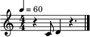

.. _mevent:

Musical Events
==============

All individual events inherit from :class:`~maelzel.core.event.MEvent`. Such an event can be a
a :class:`~maelzel.core.event.Note`, a :class:`~maelzel.core.event.Chord`, a media
:class:`~maelzel.core.clip.Clip` or anything derived from those clases.

1. Musical Events
    - :class:`~maelzel.core.event.Note`: a one-pitch event, can represent any
      microtonal pitch.

    - :class:`~maelzel.core.event.Chord`: a Chord is a collection of one or more Notes with
      a shared duration

2. Media Events

    - :class:`~maelzel.core.clip.Clip`: an Event representing a soundfile

Within a a :class:`~maelzel.core.chain.Chain` / :class:`~maelzel.core.chain.Voice` events
can be combined (with ties or glissandi) to produce lines of any complexity.
When an event is added to a container that container becomes its
:attr:`~maelzel.core.mobj.MObj.parent`.

Absolute / Relative Offset
~~~~~~~~~~~~~~~~~~~~~~~~~~

The :attr:`~maelzel.core.event.MEvent.offset` attribute of an event determines its
start time **relative** to the parent container. This offset can be ``None``,
in which case it is resolved based on the context of the event
(is the object part of a Chain / Voice, which events precede it, etc).
The resolved offset can be queried via :meth:`~maelzel.core.mobj.MObj.resolveOffset`,
the absolute offset via :meth:`~maelzel.core.mobj.MObj.absoluteOffset`

**Example**

In the following example the 2nd note (``4D``), which has an unset offset (offset is ``None``),
has a *resolved offset* of **0.5** since it is placed after the first note (``4C``), which
has a duration of **0.5**. Since the chain itself has an offset of **1**, the resulting
*absolute offset* of the 2nd note is ``1 + 0.5 = 2.5``

.. code-block:: python

    >>> from maelzel.core import *
    # We create a chain with two notes. The chain itself has an offset
    >>> chain = Chain(["4C:0.5", "4D:1"], offset=1)
    >>> chain.dump(forcetext=True)
    Chain -- beat: 1, offset: 1, dur: 1.5
      beat   offset  dur    item
      1      0       0.5    4C:0.5♩
      1.5    0.5     1      4D:1♩
    >>> chain[1].offset is None
    True
    >>> chain[1].resolvedOffset()
    0.5
    >>> chain[1].absoluteOffset()
    1.5

Real-Time / Quarternote-Time
~~~~~~~~~~~~~~~~~~~~~~~~~~~~

All time attributes (*offset*, *dur*, *end*) are expressed in *quarternote* beats.
To map a beat (measured in quarternotes) to its corresponding *real-time* (measured in
seconds) a score structure (:class:`~maelzel.scorestruct.ScoreStruct`) is needed. Such a
score structure defines the overall structure of a score (measures, time-signatures, etc)
, providing information about the tempo and tempo changes along the timeline.

-------------------------

.. automodapi:: maelzel.core.event
    :no-main-docstr:
    :no-heading:

