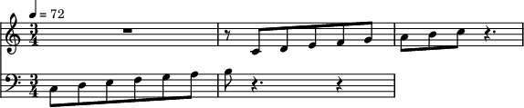

.. _playargs_notebook:

Extra sustain time (``extrasustain``)
-------------------------------------

.. code:: python

    from maelzel.core import*

.. parsed-literal::

    csoundengine.magic extension loaded
    Magics available: %csound, %%csound, %%definstr

.. code:: python

    n = Note("4A", dur=1).setPlay(instr='piano', extrasustain=20)

.. code:: python

    n.play()

.. parsed-literal::

    -------- {'delay': 0, 'chan': None, 'gain': 1.0, 'fade': 0.02, 'instr': 'piano', 'pitchinterpol': 'linear', 'fadeshape': 'cos', 'params': None, 'priority': 1, 'position': -1, 'extrasustain': 20, 'tiednext': False}

.. parsed-literal::

    
    
    --Csound version 6.18 (double samples) May 25 2022
    [commit: 91bdd78bd0a19aacb1ae2f9e08849f79302ff919]
    libsndfile-1.0.31
    sr = 48000.0, kr = 750.000, ksmps = 64
    0dBFS level = 1.0, A4 tuning = 442.0
    audio buffered in 512 sample-frame blocks
    reading 2048-byte blks of shorts from adc:Built-in Audio Analog Stereo: (RAW)
    writing 1024 sample blks of 64-bit floats to dac:Built-in Audio Analog Stereo:
    SECTION 1:

.. parsed-literal::

    Button(description='Stop', style=ButtonStyle())

.. parsed-literal::

    Output()

.. raw:: html

    <small>SynthGroup - start: 0.157, dur: 21.000</small>
    
instr: <strong style="color:MediumSeaGreen">preset.piano</strong> - <b>1</b> synths

    <table><thead><tr><th style="text-align:left">p1</th><th style="text-align:left">start</th><th style="text-align:left">dur</th><th style="text-align:left">4</th><th style="text-align:left">5:idataidx_</th><th style="text-align:left">6:inumbps</th><th style="text-align:left">7:ibplen</th><th style="text-align:left">8:igain_</th><th style="text-align:left">9:ichan_</th><th style="text-align:left">10:ipos</th><th style="text-align:left">11:ifade0</th><th style="text-align:left">12:ifade1</th><th style="text-align:left">13:ipchintrp_</th><th style="text-align:left">14:ifadekind_</th><th style="text-align:left">15</th><th style="text-align:left">16</th><th style="text-align:left">...</th><th style="text-align:left">17</th><th style="text-align:left">...</th><th style="text-align:left">18</th><th style="text-align:left">...</th><th style="text-align:left">19</th><th style="text-align:left">...</th><th style="text-align:left">20</th><th style="text-align:left">...</th><th style="text-align:left">21</th><th style="text-align:left">...</th><th style="text-align:left">22</th><th style="text-align:left">...</th><th style="text-align:left">23</th></tr></thead><tbody><tr><td style="text-align:left">1001.0002 <b>𝍪</b></td><td style="text-align:left">0.157</td><td style="text-align:left">21.000</td><td style="text-align:left">0</td><td style="text-align:left">15</td><td style="text-align:left">3</td><td style="text-align:left">3</td><td style="text-align:left">1</td><td style="text-align:left">1</td><td style="text-align:left">-1</td><td style="text-align:left">0.02</td><td style="text-align:left">0.02</td><td style="text-align:left">0</td><td style="text-align:left">1</td><td style="text-align:left">0</td><td style="text-align:left">...</td></tr></tbody></table>

.. code:: python

    from maelzel.core import *
    from maelzel.music.scale import *
    
    scale = Chain([Note(m, 0.5) for m in pitchscale('3C', steps='major', endpitch='5C')])
    with ScoreStruct(timesig=(3, 4), quarterTempo=72):
        scale.show()
        scale.play(instr='piano')

.. code:: python

    scale.play()

.. parsed-literal::

    Button(description='Stop', style=ButtonStyle())

.. parsed-literal::

    Output()

.. raw:: html

    <small>SynthGroup - start: 0.157, dur: 7.500</small>
    
instr: <strong style="color:MediumSeaGreen">preset.sin</strong> - <b>15</b> synths

    <table><thead><tr><th style="text-align:left">p1</th><th style="text-align:left">start</th><th style="text-align:left">dur</th><th style="text-align:left">4</th><th style="text-align:left">5:idataidx_</th><th style="text-align:left">6:inumbps</th><th style="text-align:left">7:ibplen</th><th style="text-align:left">8:igain_</th><th style="text-align:left">9:ichan_</th><th style="text-align:left">10:ipos</th><th style="text-align:left">11:ifade0</th><th style="text-align:left">12:ifade1</th><th style="text-align:left">13:ipchintrp_</th><th style="text-align:left">14:ifadekind_</th><th style="text-align:left">15</th><th style="text-align:left">16</th><th style="text-align:left">...</th><th style="text-align:left">17</th><th style="text-align:left">...</th><th style="text-align:left">18</th><th style="text-align:left">...</th><th style="text-align:left">19</th><th style="text-align:left">...</th><th style="text-align:left">20</th></tr></thead><tbody><tr><td style="text-align:left">1002.0002 <b>𝍪</b></td><td style="text-align:left">0.157</td><td style="text-align:left">0.500</td><td style="text-align:left">0</td><td style="text-align:left">15</td><td style="text-align:left">2</td><td style="text-align:left">3</td><td style="text-align:left">1</td><td style="text-align:left">1</td><td style="text-align:left">-1</td><td style="text-align:left">0.02</td><td style="text-align:left">0.02</td><td style="text-align:left">0</td><td style="text-align:left">1</td><td style="text-align:left">0</td><td style="text-align:left">...</td></tr><tr><td style="text-align:left">1002.0003 <b>𝍪</b></td><td style="text-align:left">0.657</td><td style="text-align:left">0.500</td><td style="text-align:left">0</td><td style="text-align:left">15</td><td style="text-align:left">2</td><td style="text-align:left">3</td><td style="text-align:left">1</td><td style="text-align:left">1</td><td style="text-align:left">-1</td><td style="text-align:left">0.02</td><td style="text-align:left">0.02</td><td style="text-align:left">0</td><td style="text-align:left">1</td><td style="text-align:left">0</td><td style="text-align:left">...</td></tr><tr><td style="text-align:left">1002.0004 <b>𝍪</b></td><td style="text-align:left">1.157</td><td style="text-align:left">0.500</td><td style="text-align:left">0</td><td style="text-align:left">15</td><td style="text-align:left">2</td><td style="text-align:left">3</td><td style="text-align:left">1</td><td style="text-align:left">1</td><td style="text-align:left">-1</td><td style="text-align:left">0.02</td><td style="text-align:left">0.02</td><td style="text-align:left">0</td><td style="text-align:left">1</td><td style="text-align:left">0</td><td style="text-align:left">...</td></tr><tr><td style="text-align:left">1002.0005 <b>𝍪</b></td><td style="text-align:left">1.657</td><td style="text-align:left">0.500</td><td style="text-align:left">0</td><td style="text-align:left">15</td><td style="text-align:left">2</td><td style="text-align:left">3</td><td style="text-align:left">1</td><td style="text-align:left">1</td><td style="text-align:left">-1</td><td style="text-align:left">0.02</td><td style="text-align:left">0.02</td><td style="text-align:left">0</td><td style="text-align:left">1</td><td style="text-align:left">0</td><td style="text-align:left">...</td></tr><tr><td style="text-align:left">...</td></tr></tbody></table>

.. code:: python

    from maelzel.core import *

.. parsed-literal::

    csoundengine.magic extension loaded
    Magics available: %csound, %%csound, %%definstr

.. code:: python

    play.getPlayEngine().testAudio()

.. parsed-literal::

    
    
    --Csound version 6.18 (double samples) May 25 2022
    [commit: 91bdd78bd0a19aacb1ae2f9e08849f79302ff919]
    libsndfile-1.0.31
    sr = 48000.0, kr = 750.000, ksmps = 64
    0dBFS level = 1.0, A4 tuning = 442.0
    audio buffered in 512 sample-frame blocks
    reading 2048-byte blks of shorts from adc:Built-in Audio Analog Stereo: (RAW)
    writing 1024 sample blks of 64-bit floats to dac:Built-in Audio Analog Stereo:
    SECTION 1:

.. parsed-literal::

    523.0002

.. parsed-literal::

    
    Testaudio: pink noise mode
    Channel: 1 / 2
    Channel: 2 / 2
    Channel: 1 / 2
    Channel: 2 / 2

.. code:: python

    from maelzel.music.scale import *
    
    scale = Chain([Note(m, 0.5) for m in pitchscale('3C', steps='major', endpitch='5C')])
    scale.play(instr='piano')

.. parsed-literal::

    Button(description='Stop', style=ButtonStyle())

.. parsed-literal::

    Output()

.. raw:: html

    <small>SynthGroup - start: 0.179, dur: 7.500</small>
    
instr: <strong style="color:MediumSeaGreen">preset.piano</strong> - <b>15</b> synths

    <table><thead><tr><th style="text-align:left">p1</th><th style="text-align:left">start</th><th style="text-align:left">dur</th><th style="text-align:left">4</th><th style="text-align:left">5:idataidx_</th><th style="text-align:left">6:inumbps</th><th style="text-align:left">7:ibplen</th><th style="text-align:left">8:igain_</th><th style="text-align:left">9:ichan_</th><th style="text-align:left">10:ipos</th><th style="text-align:left">11:ifade0</th><th style="text-align:left">12:ifade1</th><th style="text-align:left">13:ipchintrp_</th><th style="text-align:left">14:ifadekind_</th><th style="text-align:left">15</th><th style="text-align:left">16</th><th style="text-align:left">...</th><th style="text-align:left">17</th><th style="text-align:left">...</th><th style="text-align:left">18</th><th style="text-align:left">...</th><th style="text-align:left">19</th><th style="text-align:left">...</th><th style="text-align:left">20</th></tr></thead><tbody><tr><td style="text-align:left">1001.0017 <b>𝍪</b></td><td style="text-align:left">0.179</td><td style="text-align:left">0.500</td><td style="text-align:left">0</td><td style="text-align:left">15</td><td style="text-align:left">2</td><td style="text-align:left">3</td><td style="text-align:left">1</td><td style="text-align:left">1</td><td style="text-align:left">-1</td><td style="text-align:left">0.02</td><td style="text-align:left">0.02</td><td style="text-align:left">0</td><td style="text-align:left">1</td><td style="text-align:left">0</td><td style="text-align:left">...</td></tr><tr><td style="text-align:left">1001.0018 <b>𝍪</b></td><td style="text-align:left">0.679</td><td style="text-align:left">0.500</td><td style="text-align:left">0</td><td style="text-align:left">15</td><td style="text-align:left">2</td><td style="text-align:left">3</td><td style="text-align:left">1</td><td style="text-align:left">1</td><td style="text-align:left">-1</td><td style="text-align:left">0.02</td><td style="text-align:left">0.02</td><td style="text-align:left">0</td><td style="text-align:left">1</td><td style="text-align:left">0</td><td style="text-align:left">...</td></tr><tr><td style="text-align:left">1001.0019 <b>𝍪</b></td><td style="text-align:left">1.179</td><td style="text-align:left">0.500</td><td style="text-align:left">0</td><td style="text-align:left">15</td><td style="text-align:left">2</td><td style="text-align:left">3</td><td style="text-align:left">1</td><td style="text-align:left">1</td><td style="text-align:left">-1</td><td style="text-align:left">0.02</td><td style="text-align:left">0.02</td><td style="text-align:left">0</td><td style="text-align:left">1</td><td style="text-align:left">0</td><td style="text-align:left">...</td></tr><tr><td style="text-align:left">1001.002 <b>𝍪</b></td><td style="text-align:left">1.679</td><td style="text-align:left">0.500</td><td style="text-align:left">0</td><td style="text-align:left">15</td><td style="text-align:left">2</td><td style="text-align:left">3</td><td style="text-align:left">1</td><td style="text-align:left">1</td><td style="text-align:left">-1</td><td style="text-align:left">0.02</td><td style="text-align:left">0.02</td><td style="text-align:left">0</td><td style="text-align:left">1</td><td style="text-align:left">0</td><td style="text-align:left">...</td></tr><tr><td style="text-align:left">...</td></tr></tbody></table>

.. code:: python

    Note(60, amp=0.1, dur=8).play()

.. parsed-literal::

    Button(description='Stop', style=ButtonStyle())

.. parsed-literal::

    Output()

.. raw:: html

    <small>SynthGroup - start: 0.189, dur: 8.000</small>
    
instr: <strong style="color:MediumSeaGreen">preset.sin</strong> - <b>1</b> synths

    <table><thead><tr><th style="text-align:left">p1</th><th style="text-align:left">start</th><th style="text-align:left">dur</th><th style="text-align:left">4</th><th style="text-align:left">5:idataidx_</th><th style="text-align:left">6:inumbps</th><th style="text-align:left">7:ibplen</th><th style="text-align:left">8:igain_</th><th style="text-align:left">9:ichan_</th><th style="text-align:left">10:ipos</th><th style="text-align:left">11:ifade0</th><th style="text-align:left">12:ifade1</th><th style="text-align:left">13:ipchintrp_</th><th style="text-align:left">14:ifadekind_</th><th style="text-align:left">15</th><th style="text-align:left">16</th><th style="text-align:left">...</th><th style="text-align:left">17</th><th style="text-align:left">...</th><th style="text-align:left">18</th><th style="text-align:left">...</th><th style="text-align:left">19</th><th style="text-align:left">...</th><th style="text-align:left">20</th></tr></thead><tbody><tr><td style="text-align:left">1002.0006 <b>𝍪</b></td><td style="text-align:left">0.189</td><td style="text-align:left">8.000</td><td style="text-align:left">0</td><td style="text-align:left">15</td><td style="text-align:left">2</td><td style="text-align:left">3</td><td style="text-align:left">1</td><td style="text-align:left">1</td><td style="text-align:left">-1</td><td style="text-align:left">0.02</td><td style="text-align:left">0.02</td><td style="text-align:left">0</td><td style="text-align:left">1</td><td style="text-align:left">0</td><td style="text-align:left">...</td></tr></tbody></table>

