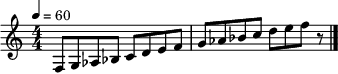
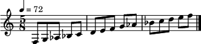

.. py:currentmodule:: maelzel.scorestruct

Score Structure
===============

This module defines a Score Structure class (:class:`ScoreStruct`)

A :class:`ScoreStruct` holds the structure of a score
(its skeleton): it is a list of measure definitions (see :meth:`~ScoreStruct.addMeasure`),
where each measure definition includes a time-signature, tempo and optional annotations.
A :class:`ScoreStruct` provides utilities to convert between score locations,
quarternote time and absolute time position.

Key Concepts
------------

Structure ≠ Contents
    A :class:`~maelzel.scorestruct.ScoreStruct` does not hold any actual
    content (notes, chords, silences, etc), it just provides a skeleton
    to organize such content within the given structure

Beat time vs Real time
    *Real time* is the actual clock time, measured in seconds. *Beat time* refers to a
    symbolic time, measured in quarternotes. For example, an event (a note) starting at
    ``beat=2.5`` with a duration of ``0.5`` beats means that the event starts ``2+1/2``
    quarternotes after the beginning and has a duration of an eighth note. The exact
    location in *Real time* depends on the tempo and on any tempo changes before
    and during the event.

    To convert between *beat time* and *real time* see :meth:`~ScoreStruct.beatToTime` and
    :meth:`~ScoreStruct.timeToBeat`.

Score Location
    As mentioned above, *beat time* is measured in quarternotes since the beginning.
    Within a score with time-signature changes there is a more convenient way to indicate
    time: a :class:`ScoreLocation`, which is basically a tuple ``(measure index, beat offset)``.
    See :meth:`~ScoreStruct.locationToTime`, :meth:`~ScoreStruct.timeToLocation`

    .. note::
        Measure indexes start at 0

Rational Numbers
    To avoid rounding errors, any variable or attribute dealing with time
    (in beats, seconds, tempo, etc) is represented as a rational number

ScoreStruct and maelzel.core
----------------------------

The :class:`ScoreStruct` class is used extensively in **maelzel.core**. Within
this context a :class:`ScoreStruct` can be used as a context
manager to set a temporary score structure:

.. code-block:: python

    from maelzel.core import *
    from maelzel.music.scale import *

    scale = Chain([Note(m, 0.5) for m in pitchscale('3F', steps='minor-harmonic', endpitch='5F')])
    scale.show()

.. code-block:: python

    with ScoreStruct(timesig=(5, 8), tempo=72):
        scale.show()
        scale.play()

.. toctree::
    :maxdepth: 1

    clicktrack

.. automodapi:: maelzel.scorestruct
    :no-inheritance-diagram:
    :no-heading:
    :skip: asF
