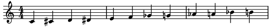
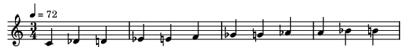
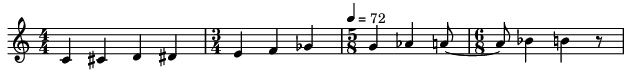

.. _workspace_mod:

The Workspace Model
===================

Workspace
---------

maelzel.core is organized on the idea of a :class:`~maelzel.core.workspace.Workspace`.
A workspace contains the current state: the *active config*, the *active scorestrucutre*,
a playback engine, etc. Many actions, like note playback, notation rendering, etc.,
use the active workspace to determine tempo, score structure, default playback instrument,
etc.

At any moment there is always an active workspace. This can be accessed via
:func:`~maelzel.core.workspace.getWorkspace`.
At the start of a session a workspace (the *'root'* workspace) is created, based on the root
config and a default score structure.

config: Active Configuration
~~~~~~~~~~~~~~~~~~~~~~~~~~~~

The active configuration determines many aspects of **maelzel**, like the default
instrument used for playback, the audio backend used, the quantization complexity used
when rendering a score, etc.

At module initialization a ``rootConfig`` is created. This is an instance of
:class:`~maelzel.core.config.CoreConfig`, updated with any customizations persisted
from previous sessions (see :meth:`CoreConfig.save() <maelzel.core.config.CoreConfig.save>`).

.. admonition:: See Also

    - :func:`~maelzel.core.workspace.makeConfig`
    - :ref:`config`

Example
~~~~~~~

A simple chromatic scale. The default Workspace includes a default ScoreStruct with a time signature
of ``4/4`` and a tempo of ``quarternote=60``

.. code-block:: python

    from maelzel.core import *
    notes = Chain([Note(m, start=i) for i, m in enumerate(range(60, 72))])
    notes.show()

You can either modify the current Workspace, for example, by setting a new ScoreStruct via
:func:`~maelzel.core.workspace.setScoreStruct` or setting its ``scorestruct`` attribute:

.. code-block:: python

    setScoreStruct(ScoreStruct.fromTimesig((3, 4), quarterTempo=72))
    # The same can be achieved by:
    w = getWorkspace()
    w.scorestruct = ScoreStruct.fromTimesig((3, 4), quarterTempo=72)
    notes

For specific tasks it might be useful to create a Workspace with custom settings.
In the following example we create a new Workpsace using the current ScoreStruct and a modified
configuration.

.. code-block:: python

    w = Workspace(updates={'play.instr': 'piano'},
                  scorestruct=getScoreStruct(),
                  active=True)
    notes.play()
    # Deactivate will set the previous Workspace as active
    w.deactivate()

A temporary Workpsace can be created as a context manager.
In this case an ad-hoc score struct and a copy of the
active config are used:

.. code-block:: python

    scorestruct = ScoreStruct(r'''
    4/4, 60
    3/4
    5/8, 72
    6/8
    ''')
    with Workspace(scorestruct=scorestruct, config=getConfig()) as w:
        notes.show()

Example Notebooks
-----------------

.. toctree::
    :maxdepth: 1

    The active Workspace <getWorkspace>
    setTempo: modify the tempo of the active ScoreStruct <setTempo>

-----------------

.. automodapi:: maelzel.core.workspace
    :allowed-package-names: maelzel.core.workspace,maelzel.core.config,maelzel.music.dynamics
    :no-inheritance-diagram:

